# ai-portfolio

[](https://github.com/MarcBittner/ai-portfolio/actions/workflows/projects-ci.yml)
[](https://github.com/MarcBittner/ai-portfolio/actions/workflows/ci.yml)
[](LICENSE)
[](https://www.python.org/)
[](https://github.com/astral-sh/ruff)
[](https://fastapi.tiangolo.com/)
[](ROADMAP.md)
[](#live-demos)
[](#live-demos)

Production-grade AI engineering projects. Each project is self-contained,
source-available (proprietary), and runnable with **zero paid accounts** — offline fallbacks
(in-memory vector store, deterministic mock LLM) are first-class, and real
providers (Ollama, MongoDB Atlas, OpenAI, OpenRouter) switch on via
environment variables. All seventeen services run as free
**[live demos on Render](#live-demos)**; the core nine also deploy to Kubernetes
via Argo CD.

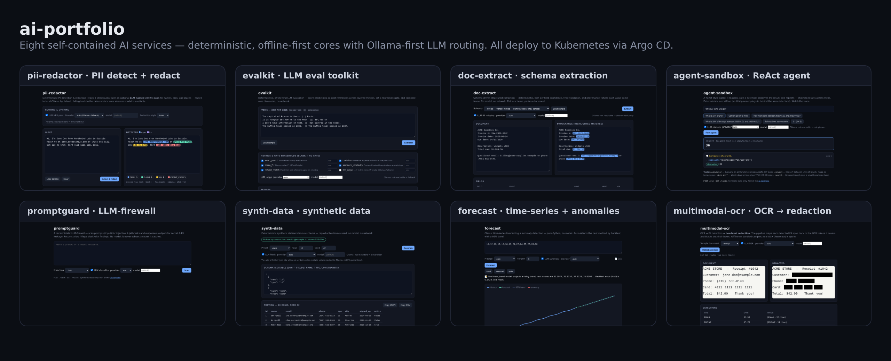

## Live demos

All seventeen services run as **free live demos on Render**, in offline mode (mock LLM
+ in-memory stores — no keys, no cost). Free instances sleep after ~15 min idle,
so the **first request cold-starts in ~30–60s** (a heavier app like persona-twin
toward the upper end); just reload if it stalls. Each **Live** link opens the
app's UI.

| # | Project | What it is | Stack | Live | Docs |
|---|---|---|---|---|---|
| 1 | **persona-twin** | RAG digital-twins: chunking/embedding/rerank, eval, streaming chat, observability | FastAPI · Mongo Atlas · Vite | [open ↗](https://persona-twin-usu4.onrender.com) | [README](projects/persona-twin/README.md) |
| 2 | **tanglement-showcase** | P2P multi-provider LLM routing network (proprietary showcase) | spec · Next.js | — | [README](projects/tanglement-showcase/README.md) |
| 3 | **pii-redactor** | PII detect/redact — regex+checksum core + LLM NER | FastAPI · UI | [open ↗](https://pii-redactor-lk6x.onrender.com) | [README](projects/pii-redactor/README.md) |
| 4 | **evalkit** | Offline-first LLM eval toolkit + LLM-judge + regression gate | FastAPI · UI | [open ↗](https://evalkit-2ptv.onrender.com) | [README](projects/evalkit/README.md) |
| 5 | **doc-extract** | Schema-driven extraction + provenance + LLM fill | FastAPI · UI | [open ↗](https://doc-extract-oyuj.onrender.com) | [README](projects/doc-extract/README.md) |
| 6 | **agent-sandbox** | ReAct agent over safe tools — rule or LLM planner | FastAPI · UI | [open ↗](https://agent-sandbox-jp4b.onrender.com) | [README](projects/agent-sandbox/README.md) |
| 7 | **promptguard** | LLM-firewall: injection/secret/PII + LLM classifier | FastAPI · UI | [open ↗](https://promptguard-oiqr.onrender.com) | [README](projects/promptguard/README.md) |
| 8 | **synth-data** | Deterministic PII-free synthetic data + LLM fields | FastAPI · UI | [open ↗](https://synth-data.onrender.com) | [README](projects/synth-data/README.md) |
| 9 | **forecast** | Classic-ML forecasting + anomalies (no-LLM core) | FastAPI · UI | [open ↗](https://forecast-h6uf.onrender.com) | [README](projects/forecast/README.md) |
| 10 | **multimodal-ocr** | OCR → PII → box-level redaction + LLM NER | FastAPI · UI | [open ↗](https://multimodal-ocr-x2g3.onrender.com) | [README](projects/multimodal-ocr/README.md) |
| 11 | **reconcile** | Document line-item reconciliation — extract → diff vs baseline + market → recoverable $ → review queue | FastAPI · UI | [open ↗](https://reconcile-gfuj.onrender.com) | [README](projects/reconcile/README.md) |
| 12 | **llm-gateway** | Provider-agnostic LLM gateway — firewall + PII/secret redaction + routing + tamper-evident audit | FastAPI · UI | [open ↗](https://llm-gateway-jwsq.onrender.com) | [README](projects/llm-gateway/README.md) |
| 13 | **slo-kit** | Instrumented SRE reference — RED metrics, SLOs + error budgets, traces, incident-burn demo | FastAPI · UI | [open ↗](https://slo-kit.onrender.com) | [README](projects/slo-kit/README.md) |
| 14 | **field-vault** | Field-level de-identification + least-privilege access + tamper-evident audit for regulated records | FastAPI · UI | [open ↗](https://field-vault.onrender.com) | [README](projects/field-vault/README.md) |
| 15 | **rtc-guard** | Scoped WebRTC access tokens + adversarial test suite + AV-pipeline threat model | FastAPI · UI | [open ↗](https://rtc-guard.onrender.com) | [README](projects/rtc-guard/README.md) |
| 16 | **rate-atlas** | Normalize inconsistent price-transparency files → one model; compare negotiated rates across payers | FastAPI · SQLite · UI | [open ↗](https://rate-atlas.onrender.com) | [README](projects/rate-atlas/README.md) |
| 17 | **attack-surface** | CT-log enumeration → service fingerprint → SOC 2 / ISO 27001 control-mapped exposure report | FastAPI · UI | [open ↗](https://attack-surface.onrender.com) | [README](projects/attack-surface/README.md) |
| 18 | **txn-ledger** | High-volume contributions store — partitioned schema, query-plan tuning, FEC rollups, surge load test | FastAPI · SQLite · UI | [open ↗](https://txn-ledger.onrender.com) | [README](projects/txn-ledger/README.md) |

> Verify a deployment's contract any time with the smoke suite:
> `cd projects/<name> && ./run.sh smoke --url <live-url>` (see [CONV-5](docs/spec/spec.md)).

See **[ROADMAP.md](ROADMAP.md)** for what's next per project.

## Projects

### [persona-twin](projects/persona-twin/) — v0.14.1

Query AI **digital twins** of synthetic personas, grounded in retrieved
data with citations.

- **RAG as an architecture** — swappable chunking (fixed / semantic /
  content-aware), embeddings, vector search (MongoDB Atlas
  `$vectorSearch` + in-memory fallback), and reranking stages
- **Persona layer** — personas profiled on the HEXACO personality
  framework; style from the profile, facts from retrieval
- **Multi-provider LLM routing** — OpenAI + Anthropic behind one
  interface: structured outputs, error fallback, cost/latency-aware
  selection from a declarative model registry
- **Layered evaluation** — retrieval hit-rate, grounding/faithfulness,
  and answer quality measured separately, with a write-up on why a single
  "fidelity %" hides what matters
- **Data governance** — deterministic PII redaction at ingest; synthetic,
  clearly-fictional data only

```sh
cd projects/persona-twin
./run.sh setup && ./run.sh demo   # runs fully offline, no .env required
```

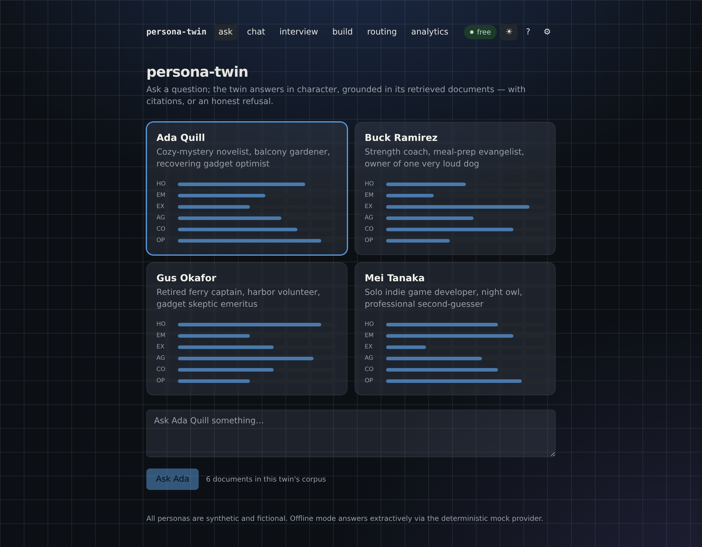

### [tanglement-showcase](projects/tanglement-showcase/) — work showcase

Curated public showcase of **Tanglement.ai** — a decentralized, peer-to-peer,
multi-provider **LLM routing network** (founding-engineer work by Marc
Bittner). Client-side routing picks the best provider per request and calls it
directly with the user's own keys (no proxy, no stored credentials); nodes
share routing intelligence over a Chord DHT + gossip mesh.

- **`docs/spec/`** — the multi-section technical specification (architecture,
  routing, security, protocols, DHT/NAT-traversal, ops, dev plan)
- **`demo-site/`** — the public teaser site (Next.js)
- **`code/git-encrypt/`** — a self-contained, stdlib-only Go CLI sample
  (transparent git file encryption, ECDH/ECDSA)
- **Pitch deck** — PDF (viewable) + PPTX source

> ⚠️ **Proprietary — all rights reserved.** This directory is published for viewing only
> and carries its own [LICENSE](projects/tanglement-showcase/LICENSE)
> (all rights reserved). The production backend is private.

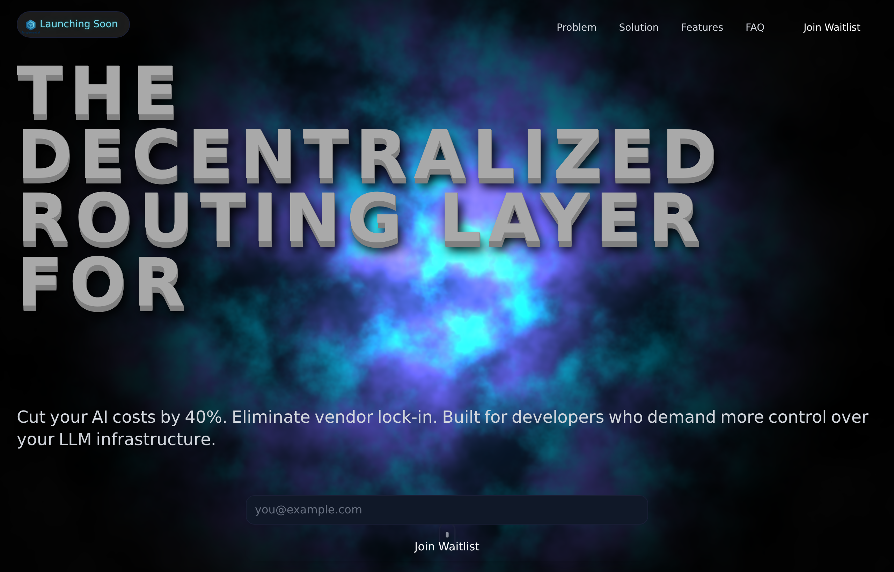

### [pii-redactor](projects/pii-redactor/) — v0.1.0

Deterministic **PII detection & redaction** — a small FastAPI service plus a
zero-build web UI. Regex detectors confirmed by checksums (Luhn for cards,
mod-97 for IBANs) and range checks (IPv4), so a random run of digits isn't
blindly flagged.

- **Validated detection** — EMAIL / PHONE / SSN / CREDIT_CARD / IP / IBAN /
  STREET_ADDRESS, with non-overlapping priority-resolved spans
- **Five redaction styles** — token, label, mask, partial (keep last 4), and
  deterministic hash; same value → same placeholder (coreference preserved)
- **Live UI** — paste text, see PII highlighted by type with counts, switch
  style, copy the result; no model, no network, no secrets

```sh
cd projects/pii-redactor
./run.sh setup && ./run.sh serve   # API + UI at http://localhost:8001
```

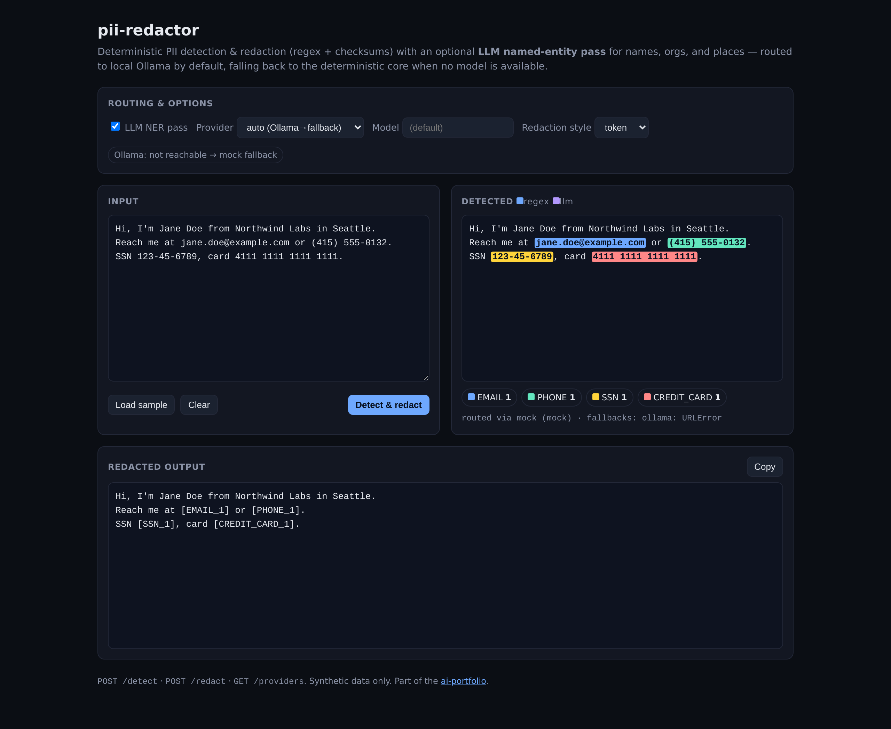

### [evalkit](projects/evalkit/) — v0.1.0

A deterministic, **offline-first LLM evaluation toolkit** — library + FastAPI
service + web UI. Score predictions against references across layered metrics,
gate releases on per-metric thresholds, and compare runs (model A vs B).

- **Layered metrics** — exact-match, contains, token-F1, deterministic semantic
  similarity (hashed-embedding cosine), refusal agreement; each scores a pair
  in [0,1] so they compose into one report
- **Regression gate + run compare** — pass/fail thresholds for CI, and
  per-metric `{baseline, candidate, delta}` diffs
- **Live UI** — paste `prediction ||| reference` lines, pick metrics, set
  thresholds, see aggregate bars, a gate badge, and a per-item table; no model

```sh
cd projects/evalkit
./run.sh setup && ./run.sh serve   # API + UI at http://localhost:8002
```

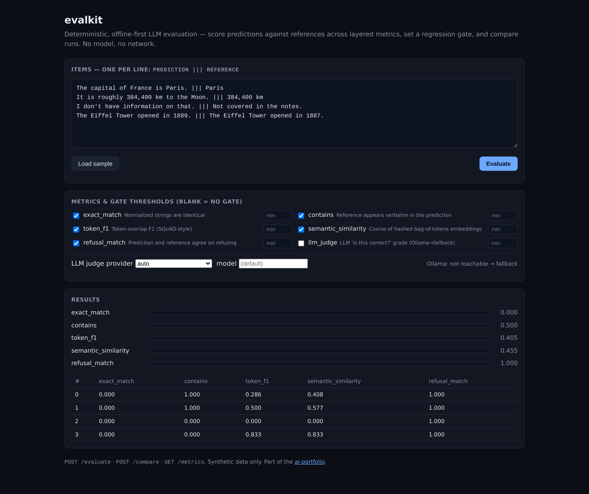

### [doc-extract](projects/doc-extract/) — v0.1.0

**Schema-driven structured extraction** — pull typed fields from documents
(invoices, resumes, contact blocks) with per-field confidence, type
validation/normalization, and provenance spans. Deterministic; no model.

- **Two strategies** — label-anchored capture, then global-pattern fallback;
  values are type-validated (date → ISO, money → number, email/phone/url regex)
- **Provenance** — every value carries the `[start,end)` span it came from, so
  matches are highlightable and auditable
- **Live UI** — paste a document, pick a schema, see highlighted matches, a
  confidence-scored fields table, and clean JSON output

```sh
cd projects/doc-extract
./run.sh setup && ./run.sh serve   # API + UI at http://localhost:8003
```

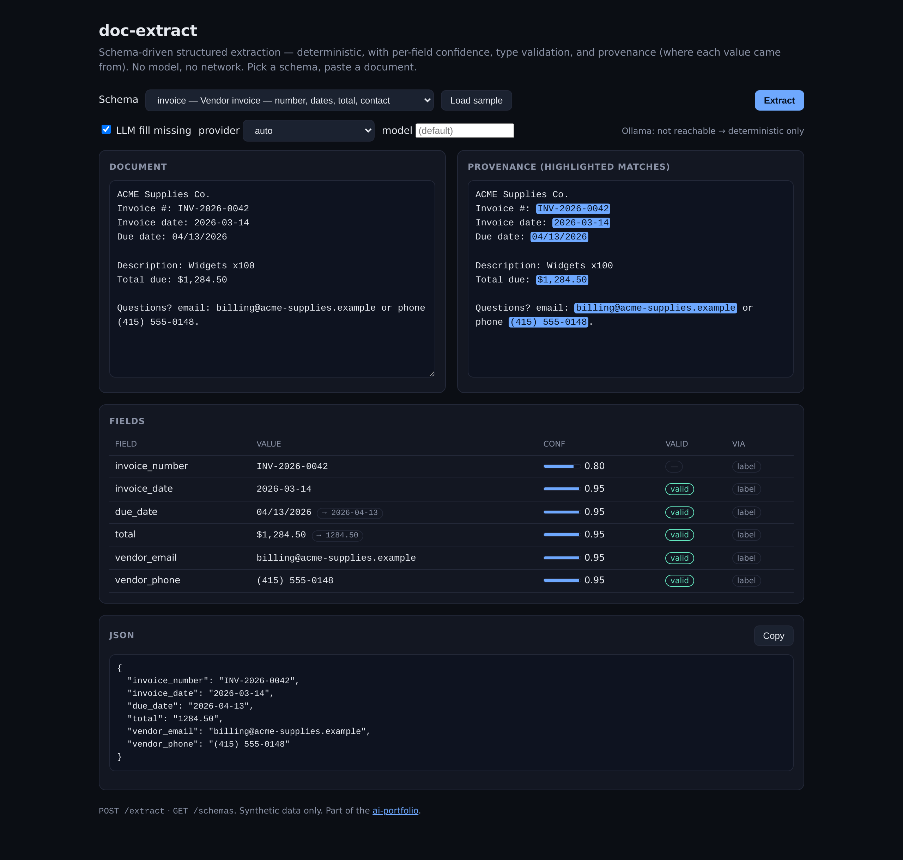

### [agent-sandbox](projects/agent-sandbox/) — v0.1.0

A **ReAct-style agent** over safe, deterministic tools — it reasons, calls a
tool, observes, and chains results across steps, emitting a full
thought→action→observation trace. Deterministic; an LLM planner plugs in behind
the same interface.

- **Sandboxed tools** — calculator (whitelisted AST eval, never `eval`), unit
  convert, date-diff, KB search; pure and offline
- **Multi-step chaining** — e.g. "20% of the days between two dates" runs
  `date_diff` then feeds the result into `calculator`
- **Trace UI** — paste a query, watch each step's thought, tool call, and
  observation, then the final answer

```sh
cd projects/agent-sandbox
./run.sh setup && ./run.sh serve   # API + trace UI at http://localhost:8004
```

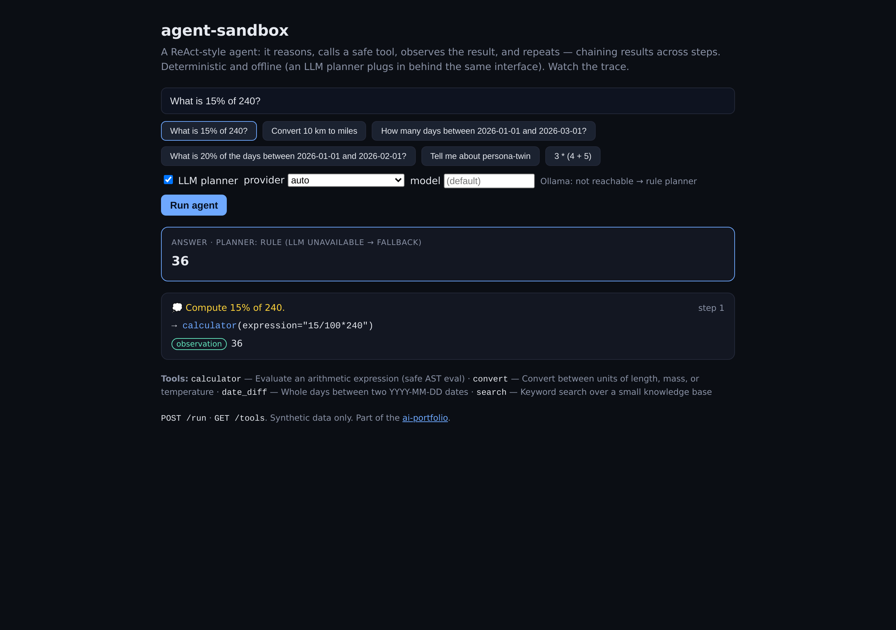

### [promptguard](projects/promptguard/) — v0.1.0

A deterministic **LLM-firewall** — scan prompts for injection & jailbreaks and
responses for secret & PII leakage. Returns `allow`/`flag`/`block` with a risk
score and findings; never echoes a secret it catches.

- **Direction-aware rules** — injection/jailbreak on input, secret/PII leakage
  on output, with severity-driven verdicts
- **Safe by construction** — secret/PII findings report category + length only,
  so logs and responses can't leak detected values
- **Live UI** — paste text, pick a direction, see the verdict, findings
  highlighted by category, and a detections table

```sh
cd projects/promptguard
./run.sh setup && ./run.sh serve   # API + UI at http://localhost:8005
```

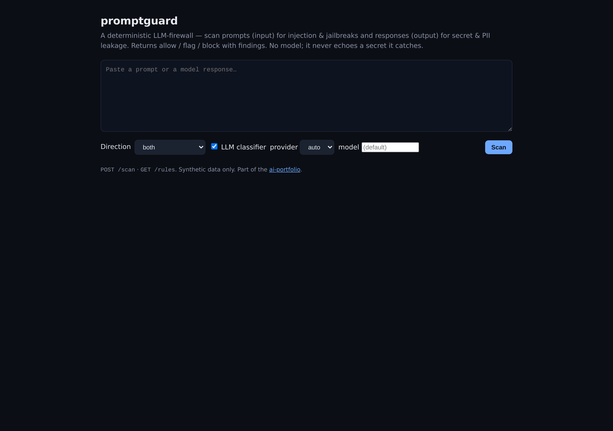

### [synth-data](projects/synth-data/) — v0.1.0

Deterministic, **PII-free synthetic dataset generation** — library + FastAPI +
UI. Define a schema (or pick a preset), set rows + seed, get reproducible JSON
or CSV. The data the rest of the portfolio runs on.

- **Deterministic** — same schema/seed → identical rows (seeded), so fixtures
  are reproducible and diffable
- **PII-free by construction** — RFC 2606 `example.*` emails, reserved
  `555-01xx` phones, fictional name/city/company pools; can't collide with real
  people
- **Live UI** — pick a preset, edit the schema, generate → table preview with
  copy-as-JSON / copy-as-CSV

```sh
cd projects/synth-data
./run.sh setup && ./run.sh serve   # API + UI at http://localhost:8006
```

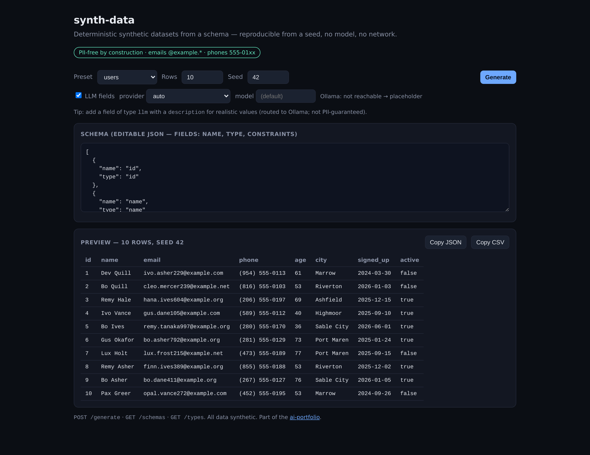

### [forecast](projects/forecast/) — v0.2.0

Classic-ML **time-series forecasting + anomaly detection** — library + FastAPI +
chart UI. The portfolio's non-LLM project: hand-rolled statistics with proper
backtesting and uncertainty.

- **Methods** — naive, mean, linear trend, SES, Holt, seasonal-naive, or `auto`
  (chosen by holdout-backtest MAE), with a 95% confidence band
- **Backtested** — MAE/RMSE/MAPE on a held-out tail, returned for auditability
- **Anomalies** — rolling z-score (past-only); plus an inline SVG chart of
  history, forecast, band, and anomaly points

```sh
cd projects/forecast
./run.sh setup && ./run.sh serve   # API + chart UI at http://localhost:8007
```

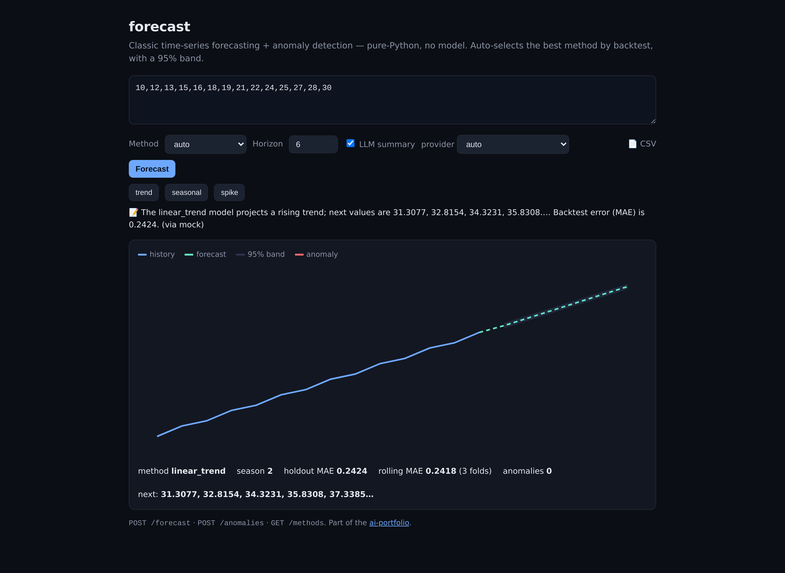

### [multimodal-ocr](projects/multimodal-ocr/) — v0.1.0

An **OCR → PII-detection → box-level redaction** pipeline — library + FastAPI +
UI that blacks out PII *on the page*, not just in the text.

- **Box-level redaction** — maps each PII span back to the OCR tokens it covers
  and redacts those bounding boxes
- **Pluggable OCR** — deterministic/offline on bundled sample documents; a
  Tesseract backend is opt-in for arbitrary images
- **Governance-consistent** — validated detection (Luhn), and detected PII is
  never echoed; UI shows the document and a box-redacted copy side by side

```sh
cd projects/multimodal-ocr
./run.sh setup && ./run.sh serve   # API + UI at http://localhost:8008
```

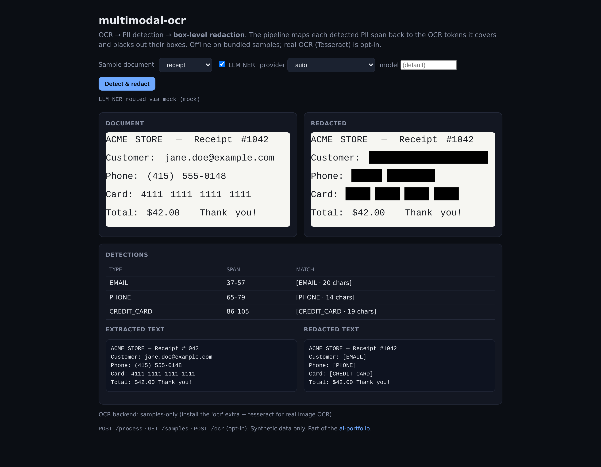

## Roadmap

See [ROADMAP.md](ROADMAP.md) for the prioritized cross-cutting plan and each
project's v0.2.0 milestone (per-project detail in `docs/spec/development-plan.md`).

## Repository conventions

- One directory per project under `projects/`, each with its own spec
  (`docs/spec/`), a production-grade `run.sh`, tests, and docs
- No secrets in the repo — environment variables via gitignored `.env`,
  placeholder `.env.example` committed per project
- All sample data is synthetic and fictional

## License

**Proprietary — all rights reserved.** This repository is public and
source-available for viewing, evaluation, and portfolio purposes only; it is
**not** open source. See [LICENSE](LICENSE). No right to use, copy, modify, or
distribute is granted without explicit prior written permission.
`projects/tanglement-showcase/` carries its own proprietary
[LICENSE](projects/tanglement-showcase/LICENSE).
