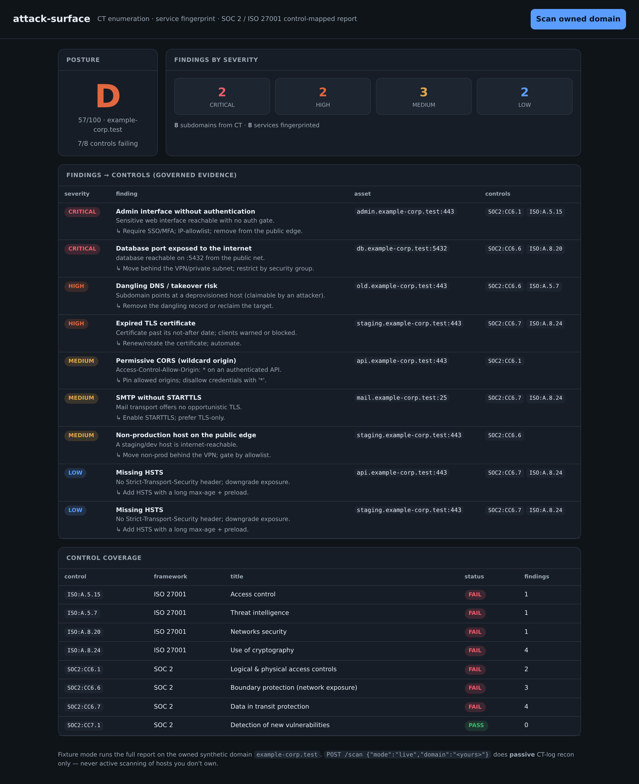

# attack-surface

[](https://github.com/MarcBittner/ai-portfolio/actions/workflows/projects-ci.yml)
[](LICENSE)
[](https://www.python.org)
[](https://github.com/astral-sh/ruff)
[](https://fastapi.tiangolo.com)



**[▶ Live demo](https://attack-surface.onrender.com)**

Attack-surface enumeration that doesn't stop at *"we found an exposure."* It
discovers an org's externally visible assets — subdomains from **Certificate
Transparency**, services and their fingerprints — turns each weakness into a
**finding** with a severity and a remediation, and maps that finding to the
**SOC 2 / ISO 27001 control** it affects (with a **NIST 800-171 ↔ CMMC**
crosswalk on the catalog). The output is governed, auditable evidence: not a raw
scanner dump, but the bridge from *we found it* to *here is the control it
touches and how we'll prove we handled it.*

What raw findings still can't do, and where this demo earns its keep:

- **A board doesn't read a findings table.** The deterministic core produces the
  evidence; a GRC director still has to turn it into a story. An **LLM reads the
  already-computed report — posture, findings, failing controls — and writes a
  board-ready risk narrative plus prioritized remediation guidance**. The model
  only does the writing; it never invents a finding or a score, so the governed
  evidence stays deterministic. It routes **Anthropic/OpenAI → local Ollama →
  free (OpenRouter) → a deterministic template generator**, so the narrative
  renders (and the eval reproduces) with zero keys.
- **Posture is only useful if it moves.** A **before/after remediation diff**
  fixes the two critical findings and shows the posture lift and the controls
  that flip fail → pass — the "if we do X, our grade goes D → B" view that turns
  exposure into a prioritized plan.

## Architecture

Small, single-purpose modules; the data flows one direction through them.

| Module | Responsibility |
|---|---|
| `data.py` | Synthetic CT entries + per-host service fingerprints for the owned fixture domain `example-corp.test` (reserved test TLD; nothing touches a real network). |
| `ct.py` | Certificate-Transparency subdomain enumeration. Fixture mode replays the offline entries; live mode does an opt-in **passive** query of crt.sh (reads published certs). |
| `fingerprint.py` | 8 structure-driven checks over service flags → findings, each pre-mapped to controls with severity + remediation. |
| `controls.py` | SOC 2 (CC6.x/CC7.x) + ISO 27001:2022 (A.5/A.8) catalog with a NIST 800-171 ↔ CMMC crosswalk, and the per-control roll-up to pass/fail + finding counts. |
| `scanner.py` | Orchestrates enumerate → fingerprint → map → severity-weighted posture; `remediated` state + `remediation_diff()`. |
| `narrative.py` | LLM exec risk narrative + remediation guidance over the computed report; structural eval. |
| `llm.py` | Multi-provider routing (paid → local → free → deterministic offline), stdlib HTTP. |
| `evaluate.py` | Reproducible eval → `eval-report.md` (`./run.sh eval`). |
| `api.py` | FastAPI surface (`/scan`, `/controls`, `/report/*`, `/evals`, `/llm`, `/health`) + the report UI. |
| `demo.py` | Offline CLI that prints the full fixture report, exec narrative, and remediation diff (no network). |

```
                 fixture: data.py            live: crt.sh (passive)
                      │                            │
                      ▼                            ▼
  CT logs ──▶ subdomains ──▶ service fingerprint ──▶ findings
                                                  (severity + remediation
                                                   + control ids)
                                                       │
                          map each finding → SOC 2 / ISO 27001 control
                                                       │
                                                       ▼
                        per-control roll-up (pass/fail) ──▶ posture (score + grade)
```

**`GET /scan` (fixture path).** The default report runs entirely offline on the
owned synthetic domain. `scanner.scan_fixture()` enumerates the CT entries from
`data.py`, runs every service fingerprint through `fingerprint.derive()`, sorts
the findings by severity, rolls them up per control with `controls.evaluate()`,
and computes a severity-weighted posture. The response is one object —
`{assets, findings[], severity_counts, controls[], posture}` — where each finding
already carries the control ids it affects.

**Live / passive path.** `POST /scan {mode:"live", domain:"…"}` calls
`ct.enumerate_live()`, which queries the public crt.sh CT-log mirror for certs
covering the domain and returns the distinct subdomains seen. That is **passive
recon** — reading certificates someone already published — never a probe of the
hosts themselves. Live mode deliberately returns **no findings and no controls**;
it is subdomain discovery only.

**Fixture vs live (responsible defaults).** Full fingerprinting and the complete
control-mapped findings report run **only** on the owned fixture domain, where
every "service" is synthetic and authorized by construction. Against any real
domain the tool restricts itself to passive CT enumeration. The safe behavior is
the default, and the unsafe behavior (active probing of a third party) isn't
implemented at all.

## Findings → controls

A finding is the unit of governed evidence. Each one carries a stable `rule_id`,
a `severity`, the affected `asset` (`host:port`), a human `detail`, a
`remediation`, and the **control ids** it maps to — assembled at the moment the
check fires, so the mapping is never an afterthought. The eight checks:

| Check | Severity | Maps to |
|---|---|---|
| Expired TLS certificate | high | SOC2:CC6.7, ISO:A.8.24 |
| Database port exposed to the internet | critical | SOC2:CC6.6, ISO:A.8.20 |
| Unauthenticated admin interface | critical | SOC2:CC6.1, ISO:A.5.15 |
| Dangling DNS / takeover risk | high | SOC2:CC6.6, ISO:A.5.7 |
| Permissive CORS (wildcard) | medium | SOC2:CC6.1 |
| SMTP without STARTTLS | medium | SOC2:CC6.7, ISO:A.8.24 |
| Missing HSTS | low | SOC2:CC6.7, ISO:A.8.24 |
| Non-prod host on the public edge | medium | SOC2:CC6.6 |

`controls.evaluate()` inverts the relationship: it walks every control in the
catalog, collects the findings mapped to it, and assigns a status — **fail** if
any finding hits the control, **pass** otherwise — with a finding count for the
roll-up. The posture score is **severity-weighted**: each finding subtracts a
penalty (critical 10, high 6, medium 3, low 1) from 100, clamped at 0, and the
score maps to a letter grade (A ≥ 90 … F < 40).

On the fixture this produces a **posture of 57/100, grade D, with 7 of 8 controls
failing** — driven by an unauthenticated admin panel and an internet-exposed
database (critical), a dangling subdomain and an expired cert (high), permissive
CORS / plaintext SMTP / a non-prod host on the public edge (medium), and missing
HSTS (low). Only the detection control (CC7.1) has no finding mapped to it and so
passes.

The catalog also carries a **NIST SP 800-171 ↔ CMMC Level 2** crosswalk on every
control, so a single finding (say, the exposed database) is defensible to a SOC 2,
an ISO 27001, *and* a CMMC auditor at once — `SOC2:CC6.6` / `ISO:A.8.20` both map
to `800-171 §3.13.1` / `SC.L2-3.13.1` (boundary protection).

## Executive narrative & remediation

A findings table is evidence; a board needs a *story*. `POST /report/narrative`
(or `GET /report/exec`) feeds the **already-computed** report to the routing chain
and gets back a board-ready risk summary plus prioritized, per-finding remediation
guidance:

```
scan report  ──▶  llm.complete(SYSTEM, report-json, json_mode)
  {posture,            Anthropic / OpenAI → Ollama → OpenRouter → template gen
   findings[],    ──▶  {summary: <plain-prose board risk summary>,
   controls[]}          remediations: [{rule_id, finding, steps}]}   # every crit+high
              ──▶  rendered exec panel + remediation guidance
```

The model only ever **writes prose over numbers it was given** — it never derives
a finding, a score, or a control status, so the governed evidence remains
deterministic and the LLM can't inflate (or hide) risk. The offline generator is a
template keyed by `rule_id`: it produces the *same* `{summary, remediations}`
shape, so the panel renders and the eval reproduces with zero keys, while the LLM
path is what adapts the tone and prioritization to an unseen report in the wild.

### Remediation diff (posture over time)

Posture is only actionable if it *moves*. `GET /report/diff` runs the fixture in
its current state and in a **remediated** state where the two critical findings are
fixed (admin interface gated behind auth, database pulled off the public edge), and
reports the lift:

| state | score | grade | controls failing |
|---|---|---|---|
| before | 57/100 | D | 7/8 |
| after | 77/100 | B | 5/8 |

Fixing the two criticals (`ADMIN_NO_AUTH`, `DB_EXPOSED`) moves posture **D → B
(+20 points)** and **remediates 2 controls** (`ISO:A.5.15`, `ISO:A.8.20` flip
fail → pass). That is the "if we do X, here's where the grade lands" view that
turns a scan into a prioritized plan — and it is deterministic, so the demo and
the eval report the same numbers.

## Routing

The LLM layer (`llm.py`) is the portfolio-standard chain, identical in shape to
the other demos: a provider is *available* only when its key is set (or, for
Ollama, when a probe to `/api/tags` succeeds), so the chain self-selects from the
environment and `complete()` returns the first success, recording which providers
it fell through.

| mode | order |
|---|---|
| `auto` (default) | Anthropic → OpenAI → Ollama → OpenRouter → offline |
| `paid` | Anthropic → OpenAI → offline |
| `local` | Ollama → offline |
| `free` | OpenRouter → offline |
| `offline` | deterministic template generator only |

`GET /llm` reports which providers are reachable and the active mode. The offline
generator is always terminal, so the service never fails for lack of a key — it
degrades to deterministic, not to an error.

## Evals

`./run.sh eval` (or `GET /evals`) asserts the structural GRC invariants as
**measured facts** and writes `eval-report.md`. Because the core is deterministic,
the numbers reproduce exactly with zero keys.

| invariant | holds |
|---|---|
| every finding maps to ≥ 1 control | ✓ |
| every failing control traces to ≥ 1 finding | ✓ |
| posture = 100 − Σ severity penalty (clamped ≥ 0) | ✓ |
| **remediation guidance covers every critical (and high) finding** | ✓ |

The last row is the narrative's safety metric — **an uncovered critical is a gap
in the board report**. The eval also emits the remediation diff (posture before →
after), so the posture lift is a reproducible number, not a claim. Set provider
keys or `LLM_MODE` to generate the narrative with a live model on the same report.

## Design decisions

- **Findings as governed evidence (the GRC bridge).** A scanner result is noise
  until it's attached to a control with a status and a remediation. Mapping is the
  product, not a report add-on — it's what turns exposure into something an
  auditor can trace.
- **Pre-map each check to controls.** The control ids live next to the check that
  emits the finding, so a new check declares its own evidence value and can't drift
  away from its mapping.
- **Structure-driven checks.** Each check reads explicit fingerprint flags
  (`tls_expired`, `internet_exposed`, `auth_required`, `dangling`, …), so the logic
  is deterministic and reviewable rather than pattern-matching on banners.
- **Passive-only live mode.** The tool never actively scans hosts it doesn't own.
  Live mode reads public CT logs and stops there; active fingerprinting exists only
  for the owned synthetic fixture.
- **Severity-weighted posture.** One number that bumps with the *severity* of what's
  open, not the raw finding count, so two criticals outweigh a pile of low-severity
  noise.

**What changes for production:** authorized **active probing** within owned scopes
(real TLS/port/header inspection behind an explicit allowlist); **scan diffing /
drift** so new exposure since the last run is surfaced; **more frameworks**
(NIST CSF, CIS) with a crosswalk between them; and **evidence export** (per-control
finding bundles) for auditors.

## Invariants

- Every finding maps to **≥ 1 control** (no orphan findings).
- Every **failing control traces back to findings** (the roll-up is derived from
  findings, never asserted independently).
- **Live mode produces no active findings** — passive CT enumeration only.

## API

| Method | Path | Purpose |
|---|---|---|
| GET | `/health` | status, control + fixture-finding counts |
| GET | `/controls` | the SOC 2 / ISO 27001 catalog (+ NIST 800-171 / CMMC crosswalk) |
| GET | `/scan` | the fixture exposure report (assets, findings, controls, posture) |
| POST | `/scan` | `{mode:"fixture"}` full report · `{mode:"live","domain":"…"}` passive CT recon |
| POST | `/report/narrative` | LLM exec risk narrative + remediation guidance (`{remediated, mode}`) |
| GET | `/report/exec` | exec narrative (GET convenience; `?remediated=&mode=`) |
| GET | `/report/diff` | before/after the two critical fixes: posture lift + flipped controls |
| GET | `/evals` | structural invariants — does remediation cover every critical? |
| GET | `/llm` | configured/reachable providers + active routing mode |

`GET /scan` → `{ assets, findings[], severity_counts, controls[], posture }` —
each finding carries its mapped control ids and a remediation.
`POST /report/narrative` → `{ summary, remediations:[{rule_id, finding, steps}],
posture, provider, … }`; optional `"mode"` pins the routing tier.

## Code map

```
src/attack_surface/
  data.py        synthetic CT entries + service fingerprints; remediated_services()
  ct.py          CT subdomain enumeration (fixture replay; passive crt.sh live)
  fingerprint.py 8 structure-driven checks → findings pre-mapped to controls
  controls.py    SOC 2 / ISO 27001 catalog + NIST 800-171 ↔ CMMC crosswalk; roll-up
  scanner.py     enumerate → fingerprint → map → posture; remediation_diff()
  narrative.py   LLM exec narrative + remediation guidance over the report; eval
  llm.py         multi-provider router (paid → local → free → offline), stdlib HTTP
  evaluate.py    ./run.sh eval → eval-report.md (invariants + posture before/after)
  api.py         FastAPI service; models.py request models; static/ console UI
tests/           unit (controls, fingerprint, scanner, narrative, llm, api) + live smoke
```

## Env

Runs fully offline with no `.env` (the LLM chain falls back to a deterministic
template generator). Set any of these to route the exec narrative to a real model;
never commit real keys, and leave them unset on a public host. See `.env.example`.

| var | purpose |
|---|---|
| `LLM_MODE` | `auto` (default) · `paid` · `local` · `free` · `offline` |
| `ANTHROPIC_API_KEY` / `ANTHROPIC_MODEL` | paid path (tried first in `auto`) |
| `OPENAI_API_KEY` / `OPENAI_MODEL` | paid path |
| `OLLAMA_BASE_URL` / `OLLAMA_MODEL` | local models, autodetected via `/api/tags` |
| `OPENROUTER_API_KEY` / `OPENROUTER_MODEL` | free-tier models |

## Quickstart

```sh
cd projects/attack-surface
./run.sh setup
./run.sh demo            # offline: report + exec narrative + remediation diff
./run.sh eval            # invariants + remediation coverage + posture before/after
./run.sh serve           # report UI at http://127.0.0.1:8015
./run.sh test            # unit suite
./run.sh smoke           # live smoke/regression (local server, or --url <deploy>)
```

> **Only scan domains you own or are explicitly authorized to assess.** The full
> findings report runs on the owned synthetic fixture (`example-corp.test`); live
> mode is passive CT-log recon only and never actively probes third-party hosts.

## Deploy

Containerized (`Dockerfile`, non-root, `PORT` env, `/health` check) and deployed
on Render's free tier — the same image runs anywhere. **No provider keys are set
on the public host**, so the live demo runs the deterministic offline path; the
LLM chain activates wherever keys/Ollama are present. Free instances cold-start in
~30–50s.

Proprietary, offline-first, no secrets, synthetic data only — conforms to the
portfolio conventions (CONV-1…5).
