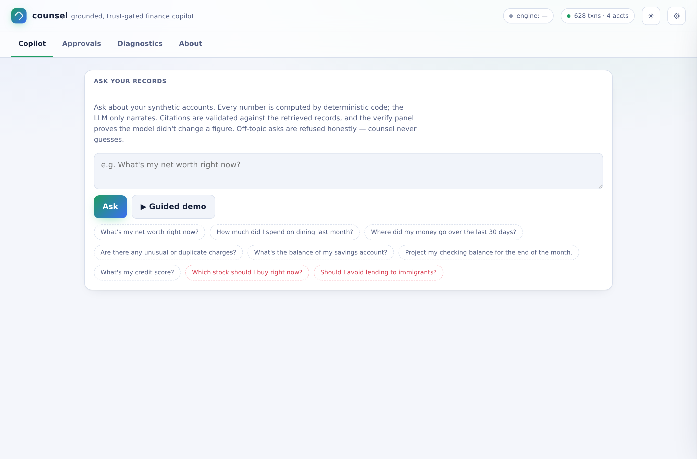

# counsel


**A grounded, trust-gated personal-finance copilot.** Code decides the numbers,
the LLM only narrates, and any action needs explicit human approval.

Live demo: https://counsel-nqcp.onrender.com · Docs: [`OVERVIEW`](docs/OVERVIEW.md) ·
[`ARCHITECTURE`](docs/ARCHITECTURE.md) · [`API`](docs/API.md) ·
[`WALKTHROUGH`](docs/WALKTHROUGH.md) · [`DEPLOYMENT`](docs/DEPLOYMENT.md) ·
Spec: [`docs/spec/spec.md`](docs/spec/spec.md).

## Why it exists

A finance assistant that *sounds* confident is worthless if it can quietly get a
number wrong, act without permission, or make a biased lending call. counsel is
built around the opposite stance: **the language model is never the source of
truth and never has unsupervised agency.** Every figure is computed by
deterministic, tested code; the model is handed those figures and asked only to
phrase them and cite the records they came from. Then code checks the model's
work — both the citations it used and the numbers it stated — and shows the code
value as authoritative whenever they disagree. Actions are proposed, not taken,
until a human approves.

It runs with **zero keys and zero cost** — local Ollama, a free hosted model, or
a fully deterministic offline narrator — so a reviewer can exercise the whole
pipeline immediately.

## The pipeline (`src/counsel/agent.py`)

```
question
  │
  ├─ 1. guardrail        deterministic refusal of discriminatory / fair-lending
  │                      asks and unlicensed investment·tax·legal advice —
  │                      BEFORE any retrieval or model call
  │
  ├─ 2. retrieve+compute deterministic intent → code-computed answer + the
  │                      record ids that back it; ungrounded → honest refusal
  │                      (the model is never asked to guess)
  │
  ├─ 3. narrate          the LLM phrases the CODE-COMPUTED facts and cites ids;
  │                      routes local→paid→free→offline, runs with no keys
  │
  ├─ 4. validate cites   every id the model emits is checked against the
  │                      retrieved set; hallucinated cites are dropped + shown
  │
  └─ 5. verify           the numbers the model stated are compared to the
                         code-computed figures; drift is flagged and the code
                         value wins. The model literally cannot change a balance.
```

And a **trust gate** on top (`/propose` → `/decide`): the agent can only queue a
typed, code-derived proposal (flag a charge, set a budget, recommend a
rebalance). A human must approve before anything applies, the apply is
*simulated* (no real money moves), the ground-truth ledger is never mutated, and
deciding the same proposal twice is refused.

## Quickstart

```bash
./run.sh setup      # editable install (+ dev extras); use --no-venv in CI/containers
./run.sh demo       # run the grounded pipeline end-to-end, offline, zero keys
./run.sh serve      # FastAPI + SPA on http://127.0.0.1:8025
./run.sh test       # unit + api + approvals + security suites
./run.sh eval       # score grounding / verification / guardrail / trust-gate
./run.sh check      # lint + test
```

With no provider keys set, step 3 uses the deterministic offline narrator and
the eval reproduces to the cent. Set `OPENROUTER_API_KEY` (free models) or an
Anthropic/OpenAI key to route through a real model; point a browser at a local
Ollama to run the local tier. Routing telemetry (provider, model, latency, cost,
fallbacks) is surfaced on every answer and in **Engine Diagnostics**.

## What's deterministic vs. model-driven

| Concern | Owner |
|---|---|
| Every dollar figure, balance, projection | **code** (`compute.py`, tested) |
| Which records back an answer | **code** (`retrieve.py`) |
| Safety / fairness refusal | **code** (`guardrail.py`, runs first) |
| Citation validity, number verification | **code** (`agent.py`) |
| Whether an action applies | **human** (`/decide`) — apply is simulated |
| Phrasing of the answer | model (offline fallback if no provider) |

The data is synthetic, PII-free, and seeded (`data.py`) — safe by construction
and reproducible to the cent.

## Stack

Python 3.11 · FastAPI · Pydantic v2 · a stdlib-only multi-provider LLM router
(`llm.py`, the portfolio's standard routing layer) · a single static SPA with an
About panel, Engine Diagnostics, and a light/dark theme · Docker · Render.
No database — the ground-truth ledger is built in memory at startup and the
approval queue is in-memory by design (apply never persists to it).

## Tests

`./run.sh test` runs unit (`compute`, `agent`), API (`api`), approval-queue
(`approvals`), and a hermetic **security** suite (offline-pinned, planted
leak-canary keys, adversarial input) — plus a live smoke suite (`./run.sh smoke`,
local or against a deployed URL). The eval (`./run.sh eval`) is the headline
contract: grounded answers verified against code, refusals correct, and all
trust-gate invariants holding.
