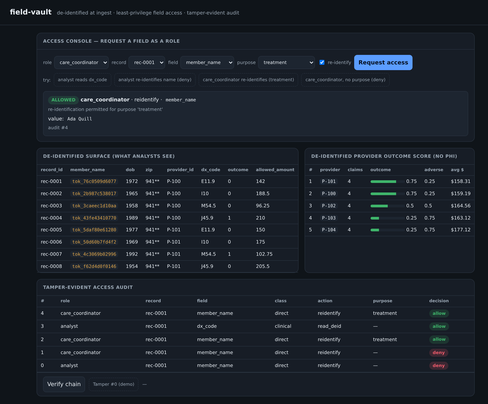

# field-vault



**[▶ Live demo](https://field-vault.onrender.com)**

Field-level **de-identification + least-privilege access + a tamper-evident audit
trail** for regulated records. It is a reference for the data-handling discipline
that lets you run analytics on sensitive records (synthetic medical claims here)
without exposing identities: records are de-identified the moment they land,
every field read is policy-checked and logged, recovering an identity is a
separate and stricter action, and the analytics the business actually wants runs
entirely on the safe surface.

> Offline, deterministic, no secrets. All claims are **synthetic and clearly
> fictional** — members, providers, names, codes, and amounts are invented for
> this portfolio; **no real PHI** ever touches it. The audit log records
> *who/what/why/decision*, **never a field value**.

## Architecture

A small pipeline. `data.py` defines synthetic claims and the per-field
classification that drives everything downstream; `deid.py` turns a raw claim
into a de-identified record plus a vault entry; `store.py` is the only door to
the data and routes each access through `policy.py` and `audit.py`; `score.py`
computes analytics on the de-identified surface only.

| Module | Responsibility |
|---|---|
| `data.py` | 20 synthetic claims + `FIELD_CLASS` (each field → direct/quasi/clinical/financial) |
| `deid.py` | direct → keyed HMAC token, quasi → one-way generalization; `Vault` holds token→original |
| `policy.py` | least-privilege decision: role × field-class × action × purpose → `(allowed, reason)` |
| `audit.py` | append-only, hash-chained access log; `verify` + `demo_tamper`; value-free |
| `store.py` | ingest → de-identify → policy-gated, audited field reads + re-identification |
| `score.py` | de-identified provider outcome score from non-identifying fields only |
| `api.py` | FastAPI service (port 8012); `demo.py` offline walkthrough; `models.py` request models |

### Field classification → treatment

Classification is assigned once, in `FIELD_CLASS`, and decides both how a field is
stored and who may read or re-identify it.

| Class | Fields | Treatment at ingest |
|---|---|---|
| **direct** | `member_id`, `member_name` | keyed token `tok_…` = `HMAC-SHA256(key, value)[:12]`; stable for joins, reversible only via the vault under policy |
| **quasi** | `dob`, `zip`, `service_date` | one-way generalization: dob→birth year, zip→3-digit prefix (`941**`), date→year-month |
| **clinical** | `provider_id`, `dx_code`, `procedure_code`, `outcome` | kept as-is — the safe analytics surface |
| **financial** | `allowed_amount` | kept as-is |

### Flow

```
ingest:  claims() ──▶ Vault.deidentify(claim) ──▶ _records[rec-NNNN]
                        direct → tok_…   (original parked in the vault)
                        quasi  → generalized
                        clinical/financial → unchanged

read:    POST /access ──▶ store.access_field(role, rec, field, purpose, reidentify)
            │
            ├─ policy.decide(role, field, action, purpose) ─▶ (allowed, reason)
            │       action = reidentify if reidentify else read_deid
            ├─ audit.log.append({who, what, why, decision})  ─▶ hash-chained entry
            └─ allowed ?  value (deid surface | vault detokenize)  :  denial
```

### Walkthrough of a `POST /access`

The request body is `{role, record_id, field, purpose, reidentify}`.
`store.access_field` first resolves the record; an unknown id returns
`{allowed: false, status: 404}` **without** touching the policy or the log. The
action is derived from the boolean flag — `read_deid` when `reidentify` is false,
`reidentify` when true — and handed to `policy.decide`.

**`read_deid` path.** `decide` looks up the field's class and asks whether the
role's `read_classes` includes it. An `analyst` (all classes) reading `dx_code`
is allowed and gets the stored clinical value; reading `member_name` is *also*
allowed but returns the **token**, not the name — reading the de-identified form
is not re-identification. An `auditor` (empty `read_classes`) is denied any claim
field. Either way the decision is logged and the response carries the
`audit_seq`.

**`reidentify` path.** `decide` enforces three gates in order: the field must be a
`direct` identifier (re-identifying a `dx_code` is meaningless and denied), the
role must carry `may_reidentify`, and `purpose` must be in that role's permitted
set. A `care_coordinator` re-identifying `member_name` with
`purpose="treatment"` passes all three; the **same role with no purpose is
denied**, as is an `analyst` (cannot re-identify at all). On success the value is
recovered with `Vault.detokenize(token)` — the only place the original is read
back. Every attempt, allowed or denied, appends one audit entry first; the value
is fetched only after a positive decision.

## Design decisions

- **De-identify at ingest.** `store.ingest()` runs every claim through
  `Vault.deidentify` before it is stored, so `_records` never holds a clear
  direct identifier. There is no "raw" table to leak; the cleartext exists only
  as vault entries reachable through the audited access layer.
- **Keyed tokenization for direct identifiers.** `HMAC-SHA256(key, value)` is
  deterministic, so the same member tokenizes identically across records and the
  de-identified data **still joins** — but the token is not invertible by
  computation. Recovery requires the vault, which lives behind policy + audit.
  The key is a de-identification key, not a secret credential: tokens are useless
  without the vault regardless of who holds the key.
- **Generalization is one-way.** Quasi-identifiers are coarsened (birth year,
  `941**`, year-month) with no reverse mapping. This shrinks re-identification
  risk and is deliberately *not* recoverable — there is nothing to gate because
  there is no original to return.
- **Read vs re-identify are distinct actions.** The policy models `read_deid` and
  `reidentify` separately, so "you may see this surface" and "you may recover the
  identity behind it" are independent grants. A role can read every class yet
  never recover a name.
- **Purpose-of-use on re-identification.** Re-identifying requires both a role
  that `may_reidentify` and a valid `purpose` for that role — encoding *why* the
  identity is needed, not just *who* is asking.
- **The audit never stores values.** Entries record role, record, field,
  field-class, action, purpose, and the allow/deny decision — never the field
  value. An access log that copied the data would become a second, less-guarded
  copy of exactly what it is supposed to protect.
- **Analytics on the safe surface only.** `score.provider_scores` consumes the
  de-identified records and touches only `provider_id`, `outcome`, and
  `allowed_amount`. The provider ranking the business wants is produced without
  any PHI and without a single re-identification.

**What changes for production.** The de-id key would be KMS-wrapped and rotated;
the audit chain would persist to a WORM store rather than memory; quasi
generalization would be tuned against a real **k-anonymity / l-diversity** target
instead of fixed truncation; and re-identification would run through a
**break-glass** workflow (time-boxed grants, approver, alerting) on top of the
purpose check.

## Data model & invariants

The de-identified record is the same shape as the claim with direct fields
replaced by tokens and quasi fields generalized; `record_id` (`rec-NNNN`) is
added. Three cardinal invariants hold by construction:

1. **The de-identified surface exposes no direct identifier in the clear.**
   Anything served from `_records` (records, scores, `read_deid`) shows tokens
   for direct fields — never names or member ids.
2. **Re-identification requires role *and* purpose.** A cleartext direct value is
   returned only via `reidentify`, only for a role with `may_reidentify`, and
   only for a purpose permitted to that role.
3. **The audit is value-free and tamper-evident.** Every access appends one
   hash-chained entry with no field value; any later edit breaks the chain and
   `verify()` reports the first broken `seq` (`demo_tamper` shows this live).

## API

| Method | Path | Purpose |
|---|---|---|
| GET | `/health` | status, record/role/audit counts |
| GET | `/roles` | role permissions (read classes, re-id, purposes) |
| GET | `/records` · `/records/{id}` | the de-identified surface |
| POST | `/access` | policy-checked, audited field read (`reidentify` to recover an identity) |
| GET | `/scores` | de-identified provider outcome score |
| GET | `/audit` · `/audit/verify` | the access trail + chain integrity |
| POST | `/audit/_demo_tamper` · `/admin/reset` | demo aids |

`POST /access` body: `{ "role": "care_coordinator", "record_id": "rec-0001",
"field": "member_name", "purpose": "treatment", "reidentify": true }`.

## Quickstart

```sh
cd projects/field-vault
./run.sh setup
./run.sh demo            # offline: de-id + policy decisions + audit verify + score
./run.sh serve           # console at http://127.0.0.1:8012
./run.sh test            # unit suite
./run.sh smoke           # live smoke/regression (local server, or --url <deploy>)
```

Proprietary, offline-first, no secrets, synthetic data only — conforms to the
portfolio conventions (CONV-1…5).
