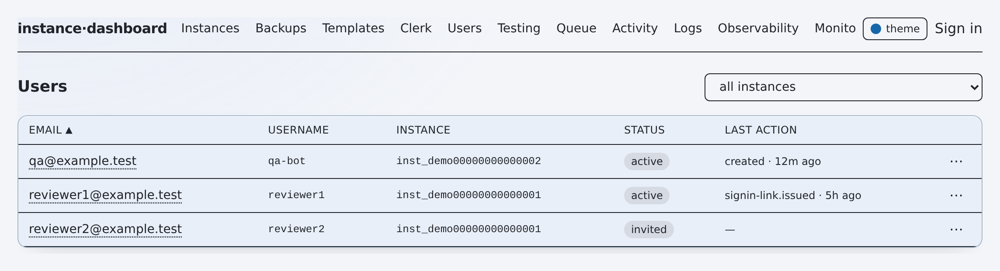

# flotilla — API Reference

**Summary.** Every operator action goes through an `app/api/**/route.ts` handler that
is JSON-in / JSON-out and gated by one uniform wrapper: `withOperator(fn, minRole)`
(`lib/api.ts:29`). `minRole` defaults to **`read-only`** (`lib/api.ts:32`), so GETs stay
open to any signed-in operator; every mutating handler passes `"write"`, and the
role-management and notification-routing routes pass `"admin"`. The **three Vercel-cron
routes** (`/api/observability/poll`, `/api/monitoring/run`, `/api/monitoring/escalate`)
have no operator session — they are gated by a constant-time `CRON_SECRET` bearer check
and **fail closed**. Non-core subsystems sit behind a feature flag that ships **off**
(`lib/models/config.ts`); CRUD routes return `403` when their flag is off, and cron
routes no-op with a `200`. This reference covers the per-endpoint detail; the one-line
route index lives in [CAPABILITY-MAP.md](./CAPABILITY-MAP.md).

## Table of contents

- [Auth & conventions](#auth--conventions)
- [Endpoints by subsystem](#endpoints-by-subsystem)
  - [Instances / provisioning](#instances--provisioning)
  - [Backups / snapshots](#backups--snapshots)
  - [Observability](#observability)
  - [Monitoring](#monitoring)
  - [AI assist](#ai-assist)
  - [Access / RBAC](#access--rbac)
  - [Config](#config)
  - [Testing](#testing)
- [Worker & CLI commands](#worker--cli-commands)
- [Cron endpoints](#cron-endpoints)
- [Related](#related)

---

## Auth & conventions

**The gate.** `withOperator(fn, minRole = "read-only")` (`lib/api.ts:29`) resolves the
caller with `getPrincipal()` (`lib/auth.ts` — Clerk role or break-glass cookie) and maps
each outcome as follows:

| Condition | Result |
|---|---|
| No principal | `401 {"error":"unauthorized"}` |
| `principal.role < minRole` | `403 {"error":"forbidden"}` — audited best-effort as `access.denied` (`lib/api.ts:38`) |
| Handler throws `ZodError` | `400` with joined field messages (`lib/api.ts:49`) |
| Handler throws anything else | `500 {"error":"internal error"}` — real error logged server-side, never leaked (`lib/api.ts:54`) |

**Roles** ascend `read-only < write < admin < super-admin` (`lib/rbac.ts:9`);
`roleAtLeast` (`:31`) is the enforcement predicate. Access mutations additionally honor
the grant boundary `canManageRole` / `canTransitionRole` (`lib/rbac.ts:63`,`:72`) and the
immutable super-admin list (`lib/rbac.ts:39`).

**Response helpers** (`lib/api.ts:11`–`21`): `ok(data)` → `200` JSON; `bad(msg, status)`
→ `{"error":msg}`; `degraded(reason, fallback)` → **`200`** `{degraded:true, reason, …}`.
Read routes wrap their fetch in `safeRead(reason, fallback, fn)` (`lib/api.ts:62`) so a
missing `MONGODB_URI` / unreachable store returns an honest empty payload (a `200`
"connecting…" state) instead of a crash — every "degraded fallback" noted below is that path.

**Feature flags** resolve `stored ?? env ?? default` via `getFeatureFlags()`
(`@/lib/models`). Flag-gated CRUD routes return `403 "<flag> feature is disabled"` when
off; the cron routes return `200 {ok:true, skipped:"<flag> flag off"}`. Flag → env-var →
gate map is in [CAPABILITY-MAP §Feature flags](./CAPABILITY-MAP.md#feature-flags).

**Every** route file declares `runtime = "nodejs"` and `dynamic = "force-dynamic"`.
Handler citations below are repo-relative `path:Lnnn` pointing at the exported method.

**Status legend:** ✅ shipped · ◐ partial · 🔭 flag-gated / planned · ⚠️ caveat.

---

## Endpoints by subsystem

### Instances / provisioning

#### GET /api/instances
- **Auth:** read-only.
- **Request:** none.
- **Response:** `ok({ instances })` (`listInstances()`). Degraded fallback `{ instances: [] }`.
- **Side effects:** none.
- **Handler:** `app/api/instances/route.ts:10`

#### POST /api/instances
- **Auth:** write.
- **Request (zod `CreateBody`):** `name?` (1–120), `kind` `"preview"|"staging"` (default `preview`), `branch` (1–200, **required**), `convexDeployment?`, `backupSnapshotId?`, `backupDeployment?`, `clerkInstance?`, `vercelProject?`, `migrations?`, `scrubPII?`, `dryRun?`, `dangerAck?`, `ttlHours?` (>0, ≤720), `owner?`, `idempotencyKey?`. Omitted `migrations`/`scrubPII`/`ttlHours` fall back to config defaults; `owner` defaults to `principal.id`.
- **Response:** `ok({ jobId, instanceId })`.
- **Side effects:** `enqueueProvision(…)`; best-effort `appendLog` + audit `instance.launch`.
- **Handler:** `app/api/instances/route.ts:47`

#### GET /api/instances/[id]
- **Auth:** read-only.
- **Request:** path `id`.
- **Response:** `ok({ instance })`; `bad("not found", 404)` if missing. Degraded `{ instance: null }`.
- **Side effects:** none.
- **Handler:** `app/api/instances/[id]/route.ts:10`

#### PATCH /api/instances/[id]
- **Auth:** write.
- **Request:** path `id`; body `{ action:"teardown", dryRun? }` routes to teardown, else zod `PatchBody`: `branch?` (1–200), `backupSnapshotId?`, `backupDeployment?`, `clerkInstance?`, `dangerAck?`.
- **Response:** `ok({ jobId })`; on enqueue error `bad(res.error, 404|400)`.
- **Side effects:** `enqueueUpdate(id, patch)`; best-effort audit `instance.update`.
- **Handler:** `app/api/instances/[id]/route.ts:33`

#### DELETE /api/instances/[id]
- **Auth:** write.
- **Request:** path `id`; query `?dryRun=true`.
- **Response:** `ok({ jobId })`; on error `bad(res.error, 404|400)`.
- **Side effects:** `enqueueTeardown(id, { dryRun, reason })`; best-effort audit `instance.teardown` (shared helper `teardown` at `:58`).
- **Handler:** `app/api/instances/[id]/route.ts:52`

#### GET /api/instances/[id]/share
- **Auth:** read-only. **Flag:** `scopedShareLinks` off → `403`.
- **Request:** path `id`.
- **Response:** `ok({ shareLinks })` (`listShareLinks(id)`).
- **Side effects:** none.
- **Handler:** `app/api/instances/[id]/share/route.ts:23`

#### POST /api/instances/[id]/share
- **Auth:** write. **Flag:** `scopedShareLinks` off → `403`.
- **Request:** path `id`; body `{ email (required, regex-validated), expiresDays? (1–30, default 7) }`. Bad email → `400`; instance missing → `404`; no `inst.url` → `409`; no Clerk secret → `409`.
- **Response:** `ok({ shareLink })`.
- **Side effects:** Clerk `findOrCreateUser` + `createSignInToken`; DB `createShareLink`; best-effort audit `shareLink.create`.
- **Handler:** `app/api/instances/[id]/share/route.ts:32`

#### DELETE /api/instances/[id]/share
- **Auth:** write. **Flag:** `scopedShareLinks` off → `403`.
- **Request:** path `id`; query `?linkId=` (required → `400`). Link must belong to `id` else `404`.
- **Response:** `ok({ revoked: linkId })`.
- **Side effects:** Clerk `revokeSignInToken` (best-effort); DB `revokeShareLink`; best-effort audit `shareLink.revoke`.
- **Handler:** `app/api/instances/[id]/share/route.ts:66`

#### GET /api/instances/[id]/drift
- **Auth:** read-only. **Flag:** `driftBadges` off → `403`.
- **Request:** path `id`.
- **Response:** `ok({ drift })` (`computeInstanceDrift`); missing → `bad("instance not found",404)`; on compute throw degrades to `ok({ drift: { status:"unknown", reasons, checkedAt } })`.
- **Side effects:** none persisted (recompute only).
- **Handler:** `app/api/instances/[id]/drift/route.ts:15`

#### GET /api/jobs/[id]
- **Auth:** read-only.
- **Request:** path `id`; query `?since=` (number).
- **Response:** `ok({ job, logs })`; missing → `bad("not found",404)`. Degraded `{ job:null, logs:[] }`.
- **Side effects:** none.
- **Handler:** `app/api/jobs/[id]/route.ts:9`

#### GET /api/jobs/[id]/stream
- **Auth:** ⚠️ **not** `withOperator` — inline `getPrincipal()`; null → `Response("unauthorized",401)`. No role/flag gate.
- **Request:** path `id`.
- **Response:** **SSE** `text/event-stream` (`no-cache, no-transform`, keep-alive). Events: `log` (per new line), `status` `{status,url}`, `error` `{message}`, `done` `{status}`. Polls every 1s up to `maxTicks=300` (~5 min); closes on terminal status (`succeeded`/`failed`/`rolled_back`).
- **Side effects:** none.
- **Handler:** `app/api/jobs/[id]/stream/route.ts:10`

#### GET /api/queue
- **Auth:** read-only.
- **Request:** none.
- **Response:** `ok({ …snap, dlq:[{id,type,instanceId,deadReason,deadAt,attempts,error,idempotencyKey}], queuePanelEnabled, deadLetterEnabled, stalledReclaimEnabled })` — `snap` from `queueHealthSnapshot()` (depth, oldest-unstarted age, stalled/dlq counts, types, lockTimeoutMs, maxAttempts…). Degraded `EMPTY`.
- **Side effects:** none.
- **Handler:** `app/api/queue/route.ts:40`

#### POST /api/queue
- **Auth:** write.
- **Request:** body `{ action, id }`; requires `action==="requeue"` + `id` else `400`.
- **Response:** `ok({ ok:true, job })`; on error `bad(res.error,404)`.
- **Side effects:** `requeueDeadJob(id)`; best-effort audit `queue.requeue`.
- **Handler:** `app/api/queue/route.ts:66`

#### GET /api/branches
- **Auth:** read-only.
- **Request:** query `?repo=` (optional).
- **Response:** `ok({ branches, githubConfigured })` (GitHub API read). Degraded `{ branches:[], githubConfigured }`.
- **Side effects:** external GitHub read.
- **Handler:** `app/api/branches/route.ts:10`

#### GET /api/templates
- **Auth:** read-only.
- **Request:** none.
- **Response:** `ok({ templates })`. Degraded `{ templates:[] }`.
- **Side effects:** none.
- **Handler:** `app/api/templates/route.ts:8`

#### POST /api/templates
- **Auth:** write.
- **Request:** body cast to `NewTemplate` (⚠️ no zod validation).
- **Response:** `ok({ template })`.
- **Side effects:** `createTemplate(body)` (DB write). No audit.
- **Handler:** `app/api/templates/route.ts:17`

#### DELETE /api/templates
- **Auth:** write. The `id` presence check runs **inside** `withOperator`, so an unauthenticated caller gets `401` before any request-shape feedback (API-4 fix 2026-07-07).
- **Request:** query `?id=` (required).
- **Response:** `ok({ deleted: id })`.
- **Side effects:** `deleteTemplate(id)`. No audit.
- **Handler:** `app/api/templates/route.ts:27`

#### GET /api/clerk
- **Auth:** read-only.
- **Request:** query `?instanceId=` (optional).
- **Response:** with `instanceId` → `ok({ config, engine })` (live read + persists drift); without → `ok({ configs, templates, instances:[{id,name,clerkInstance}] })`. No `clerkInstance` → `bad(…,404)`. Degraded `{ configs:[], templates:[], engine:"stub" }`.
- **Side effects:** with `instanceId`, `upsertClerkConfig` (persists drift snapshot) + live `readConfig`.
- **Handler:** `app/api/clerk/route.ts:66`

#### POST /api/clerk
- **Auth:** write.
- **Request:** body dispatched on `action`: `save-template` `{name,clerkInstance,params?}`; `apply` (bulk) `{configId|clerkInstance, instanceIds[], dangerAck?}`; `apply` (single) `{instanceId}`; `set-reference` `{instanceId,clerkInstance,reference}`. Bulk apply enforces per-target `applyDanger` (blocks shared/prod write deployment or sensitive prod `clerkInstance` unless `dangerAck===true`, `:152`).
- **Response:** `save-template`→`ok({config})`; single apply→`ok(res)`; `set-reference`→`ok({config})`; bulk→`ok({ results:[{instanceId,jobId?,error?}] })`; unknown→`bad("unknown action")`.
- **Side effects:** DB `saveClerkTemplate` / `upsertClerkConfig` / `markApplied`; Clerk `applyConfig` (single Playwright apply); `enqueueUpdate` per bulk target; best-effort audits `clerk.save-template` / `clerk.apply` / `clerk.set-reference`.
- **Handler:** `app/api/clerk/route.ts:97`

---

### Backups / snapshots

#### GET /api/backups
- **Auth:** read-only.
- **Request:** query `?deployment=` (optional).
- **Response:** `ok({ backups:[…cloud,…uploads], deployments, cloudConfigured })`. Degraded `{ backups:[], deployments:KNOWN_DEPLOYMENTS, cloudConfigured:false }`.
- **Side effects:** reads only (`listBackups`, Convex-cloud `listCloudBackups` per deployment).
- **Handler:** `app/api/backups/route.ts:20`

#### POST /api/backups
- **Auth:** write. Handles **both** a JSON body and a `multipart/form-data` upload.
- **Request (JSON):** `{ action, deployment?, snapshotId?, cloudBackupId? }`. `action:"grab"` needs `deployment`+`snapshotId`; `action:"grab-all"` sweeps `deployment` or all `KNOWN_DEPLOYMENTS` under a ~250s deadline. Both require `convex.configured` + `snapshotStoreConfigured()`.
- **Request (multipart):** fields `file` (required), `deployment` (required), `note?`; requires `snapshotStoreConfigured()`.
- **Response:** `grab`→`ok({ backup })`; `grab-all`→`ok({ grabbed, skipped, failed:[{deployment,snapshotId,error}], remaining })`; upload→`ok({ backup })`; bad action→`bad("unsupported action")`.
- **Side effects:** `downloadSnapshot` (Convex) → `putSnapshot` (GitHub-Releases store) → `registerBackup` (DB); audits `backup.grab` (per grab), `backup.grab-all`, `backup.upload`.
- **Handler:** `app/api/backups/route.ts:98` (JSON path enters `withOperator` at `:101`; multipart at `:154`)

#### DELETE /api/backups
- **Auth:** write.
- **Request:** query `?id=` (required), `?dangerAck=true` (required else `400`).
- **Response:** `ok({ deleted: id })`.
- **Side effects:** blob delete via `deleteSnapshot(blobRef)` (GH asset) or `deleteBackupBlob(gridfsId)` (legacy); `deleteBackup(id)` (DB); audit `backup.delete`.
- **Handler:** `app/api/backups/route.ts:182`

---

### Observability

🔭 The metrics store is Mongo; when `MONGODB_URI` is unset these routes return a
`configured:false, degraded:true` payload rather than an error. The continuous poller
is the [cron route](#get-apiobservabilitypoll).

#### GET /api/observability
- **Auth:** read-only.
- **Request:** none.
- **Response:** store off → `ok({ configured:false, degraded:true, reason:"MONGODB_URI not set", providers:[], instances:[], metrics:[] })`; on → `ok({ configured:true, degraded, reason, …facets })` (24h facet aggregation). Degraded fallback same empty shape.
- **Side effects:** read-only Mongo aggregation.
- **Handler:** `app/api/observability/route.ts:18`

#### POST /api/observability/query
- **Auth:** read-only.
- **Request:** body `{ metrics:string[] (required, non-empty, ≤ MAX_METRICS else 400), from?, to?, step? (numbers), instanceId?, provider? (strings) }`; passed through `parseSeriesParams` (step floor / max-points clamp).
- **Response:** store off → `ok({ configured:false, timestamps:[], series:[], stepMs, from, to, degraded:true, reason })`; on → `ok({ configured:true, degraded, reason, stepMs, from, to, timestamps, series })`.
- **Side effects:** read-only bounded Mongo aggregation.
- **Handler:** `app/api/observability/query/route.ts:21`

---

### Monitoring

🔭 Behind the `monitoring` flag. **Every** handler checks it as its first line and
returns `bad("monitoring feature is disabled", 403)` when off (the two cron routes
no-op with `200` instead — see [Cron endpoints](#cron-endpoints)). Read lists use
`safeRead` (degraded `200`). All audits are best-effort with `principal.id` as actor.

#### Monitors

##### GET /api/monitoring/monitors
- **Auth:** read-only. **Request:** none. **Response:** `ok({ monitors })` (degraded `{monitors:[]}`). **Side effects:** none. **Handler:** `app/api/monitoring/monitors/route.ts:9`

##### POST /api/monitoring/monitors
- **Auth:** write. **Request:** body validated by `validateMonitorCreate` (check-type registry: name, checkType, target, params, selector…). **Response:** `ok({ monitor })`. **Side effects:** `createMonitor`; audit `monitoring.monitor.create`. **Handler:** `app/api/monitoring/monitors/route.ts:22`

##### GET /api/monitoring/monitors/[id]
- **Auth:** read-only. **Request:** path `id`. **Response:** `ok({ monitor, states })`; missing → `404`. Degraded `{monitor:null}`. **Side effects:** none. **Handler:** `app/api/monitoring/monitors/[id]/route.ts:9`

##### PATCH /api/monitoring/monitors/[id]
- **Auth:** write. **Request:** path `id`; body `validateMonitorPatch(body, existing.checkType)`. **Response:** `ok({ monitor })`; missing → `404`. **Side effects:** `patchMonitor`; audit `monitoring.monitor.update`. **Handler:** `app/api/monitoring/monitors/[id]/route.ts:24`

##### DELETE /api/monitoring/monitors/[id]
- **Auth:** write. **Request:** path `id`. **Response:** `ok({ deleted:true })`; missing → `404`. **Side effects:** `deleteMonitor`; audit `monitoring.monitor.delete`. **Handler:** `app/api/monitoring/monitors/[id]/route.ts:39`

##### POST /api/monitoring/monitors/[id]/run
- **Auth:** write (`maxDuration = 60`). **Request:** path `id`. **Response:** `ok({ counts, targetCount, transitions, outcomes:[{targetId,label,status,output}], dispatched, dispatchReason, channels })`; missing → `404`. **Side effects:** `evaluateMonitor` (advances state machine) + `dispatchAlerts`; audit `monitoring.monitor.run`. **Handler:** `app/api/monitoring/monitors/[id]/run/route.ts:14`

#### Alerts

##### GET /api/monitoring/alerts
- **Auth:** read-only. **Request:** none. **Response:** `ok({ incidents })` (`listOpenIncidents`; degraded `{incidents:[]}`). **Side effects:** none. **Handler:** `app/api/monitoring/alerts/route.ts:10`

##### POST /api/monitoring/alerts/[id]/ack
- **Auth:** write. **Request:** path `id`; body zod `{ note? (trim, ≤500) }` `.strict()`. **Response:** `ok({ incident })`; not-open/missing → `bad("not found or not open",404)`. **Side effects:** `ackIncident` (stops escalation/re-notify); audit `monitoring.alert.ack`; `recordMonitorAlert({kind:"ack",…})`. **Handler:** `app/api/monitoring/alerts/[id]/ack/route.ts:14`

#### Groups (health rollups)

##### GET /api/monitoring/groups
- **Auth:** read-only. **Request:** none. **Response:** `ok({ groups })` (`listGroupsWithState`; degraded `{groups:[]}`). **Side effects:** none. **Handler:** `app/api/monitoring/groups/route.ts:13`

##### POST /api/monitoring/groups
- **Auth:** write. **Request:** body zod `GroupCreate` (`{ name, membership:{kind,…} }`). **Response:** `ok({ group })`. **Side effects:** `createGroup`; audit `monitoring.group.create`. **Handler:** `app/api/monitoring/groups/route.ts:24`

##### GET /api/monitoring/groups/[id]
- **Auth:** read-only. **Request:** path `id`. **Response:** `ok({ group })`; missing → `404`. Degraded `{group:null}`. **Side effects:** none. **Handler:** `app/api/monitoring/groups/[id]/route.ts:8`

##### PATCH /api/monitoring/groups/[id]
- **Auth:** write. **Request:** path `id`; body zod `GroupPatch`. **Response:** `ok({ group })`; missing → `404`. **Side effects:** `patchGroup`; audit `monitoring.group.update`. **Handler:** `app/api/monitoring/groups/[id]/route.ts:21`

##### DELETE /api/monitoring/groups/[id]
- **Auth:** write. **Request:** path `id`. **Response:** `ok({ deleted:true })`; missing → `404`. **Side effects:** `deleteGroup`; audit `monitoring.group.delete`. **Handler:** `app/api/monitoring/groups/[id]/route.ts:34`

##### POST /api/monitoring/groups/[id]/bulk
- **Auth:** write. **Request:** path `id`; body zod `.strict()` `{ action:"enable"|"disable"|"silence", durationMinutes? (int 0–43200), reason? (≤300) }`. **Response:** `ok({ …res })` (incl. `affected`, `memberCount`); missing → `404`. **Side effects:** `silence` → `silenceGroup` (audit `monitoring.group.silence`); else `setGroupEnabled` (audit `monitoring.group.enable|disable`). **Handler:** `app/api/monitoring/groups/[id]/bulk/route.ts:20`

#### Dashboards & registry (read-only)

##### GET /api/monitoring/overview
- **Auth:** read-only. **Request:** none. **Response:** `ok({ totals:{ok,warn,crit,unknown}, monitors:[{id,name,checkType,target,enabled,intervalSec,notify,lastRunAt,nextRunAt,counts,targets:[{targetId,label,status,softCount,since,lastCheckedAt,lastOutput}]}] })` (degraded zero-totals). **Side effects:** none. **Handler:** `app/api/monitoring/overview/route.ts:10`

##### GET /api/monitoring/history
- **Auth:** read-only. **Request:** query `?monitorId=`, `?limit=`. **Response:** `ok({ alerts })` (`listMonitorAlerts`; degraded `{alerts:[]}`). **Side effects:** none. **Handler:** `app/api/monitoring/history/route.ts:9`

##### GET /api/monitoring/check-types
- **Auth:** read-only. **Request:** none. **Response:** `ok({ checkTypes: checkTypeCatalog() })` (in-memory registry; no `safeRead`). **Side effects:** none. **Handler:** `app/api/monitoring/check-types/route.ts:12`

#### Silences

##### GET /api/monitoring/silences
- **Auth:** read-only. **Request:** none. **Response:** `ok({ silences })` (degraded `{silences:[]}`). **Side effects:** none. **Handler:** `app/api/monitoring/silences/route.ts:11`

##### POST /api/monitoring/silences
- **Auth:** write. **Request:** body zod `SilenceCreate` (`{ all, monitorId?, targetId?, duration, reason }`). **Response:** `ok({ silence })`. **Side effects:** `createSilence`; audit `monitoring.silence.create`. **Handler:** `app/api/monitoring/silences/route.ts:22`

##### DELETE /api/monitoring/silences/[id]
- **Auth:** write. **Request:** path `id`. **Response:** `ok({ deleted:true })`; missing → `404`. **Side effects:** `deleteSilence`; audit `monitoring.silence.delete`. **Handler:** `app/api/monitoring/silences/[id]/route.ts:8`

#### Notification routing (admin)

Contacts, contact-groups, escalation-policies, recipients, and time-periods share one
shape: a list `GET`, a create `POST`, and `PATCH`/`DELETE` on `[id]`. **All writes require
`admin`.** ⚠️ For lists, `contacts` and `recipients` require `admin` too, but
`contact-groups`, `escalation-policies`, and `timeperiods` are **read-only** (non-secret
names/tiers/windows are needed to build a monitor). Missing `[id]` → `bad("not found",404)`.
Contacts' Slack-webhook secrets are masked in responses (`maskContact`).

| Method / Path | Auth | Request | Response | Side effects · audit | Handler |
|---|---|---|---|---|---|
| GET /api/monitoring/contacts | admin | — | `ok({ contacts })` (masked) | — | `contacts/route.ts:11` |
| POST /api/monitoring/contacts | admin | `ContactCreate` | `ok({ contact })` | `createContact` · `monitoring.contact.create` | `contacts/route.ts:22` |
| PATCH /api/monitoring/contacts/[id] | admin | `id` + `ContactPatch` | `ok({ contact })` | `patchContact` · `monitoring.contact.update` | `contacts/[id]/route.ts:8` |
| DELETE /api/monitoring/contacts/[id] | admin | `id` | `ok({ deleted:true })` | `deleteContact` (cascades) · `monitoring.contact.delete` | `contacts/[id]/route.ts:21` |
| GET /api/monitoring/contact-groups | read-only | — | `ok({ groups })` | — | `contact-groups/route.ts:11` |
| POST /api/monitoring/contact-groups | admin | `ContactGroupCreate` | `ok({ group })` | `createContactGroup` · `monitoring.contactGroup.create` | `contact-groups/route.ts:22` |
| PATCH /api/monitoring/contact-groups/[id] | admin | `id` + `ContactGroupPatch` | `ok({ group })` | `patchContactGroup` · `monitoring.contactGroup.update` | `contact-groups/[id]/route.ts:8` |
| DELETE /api/monitoring/contact-groups/[id] | admin | `id` | `ok({ deleted:true })` | `deleteContactGroup` · `monitoring.contactGroup.delete` | `contact-groups/[id]/route.ts:21` |
| GET /api/monitoring/escalation-policies | read-only | — | `ok({ policies })` | — | `escalation-policies/route.ts:13` |
| POST /api/monitoring/escalation-policies | admin | `PolicyCreate` (tiers sorted) | `ok({ policy })` | `createPolicy` · `monitoring.policy.create` | `escalation-policies/route.ts:24` |
| PATCH /api/monitoring/escalation-policies/[id] | admin | `id` + `PolicyPatch` | `ok({ policy })` | `patchPolicy` · `monitoring.policy.update` | `escalation-policies/[id]/route.ts:8` |
| DELETE /api/monitoring/escalation-policies/[id] | admin | `id` | `ok({ deleted:true })` | `deletePolicy` · `monitoring.policy.delete` | `escalation-policies/[id]/route.ts:21` |
| GET /api/monitoring/recipients | admin | — | `ok({ recipients })` | — | `recipients/route.ts:12` |
| POST /api/monitoring/recipients | admin | `RecipientCreate` (upsert on email) | `ok({ recipient })` | `createRecipient` · `monitoring.recipient.create` | `recipients/route.ts:23` |
| PATCH /api/monitoring/recipients/[id] | admin | `id` + `RecipientPatch` | `ok({ recipient })` | `patchRecipient` · `monitoring.recipient.update` | `recipients/[id]/route.ts:8` |
| DELETE /api/monitoring/recipients/[id] | admin | `id` | `ok({ deleted:true })` | `deleteRecipient` · `monitoring.recipient.delete` | `recipients/[id]/route.ts:21` |
| GET /api/monitoring/timeperiods | read-only | — | `ok({ timeperiods })` | — | `timeperiods/route.ts:13` |
| POST /api/monitoring/timeperiods | admin | `TimeperiodCreate` | `ok({ timeperiod })` | `createTimeperiod` · `monitoring.timeperiod.create` | `timeperiods/route.ts:24` |
| PATCH /api/monitoring/timeperiods/[id] | admin | `id` + `TimeperiodPatch` | `ok({ timeperiod })` | `patchTimeperiod` · `monitoring.timeperiod.update` | `timeperiods/[id]/route.ts:8` |
| DELETE /api/monitoring/timeperiods/[id] | admin | `id` | `ok({ deleted:true })` | `deleteTimeperiod` · `monitoring.timeperiod.delete` | `timeperiods/[id]/route.ts:21` |

(All paths above are under `app/api/monitoring/`.)

#### Config bundle import / export

##### POST /api/monitoring/import
- **Auth:** admin. **Request:** body `{ mode?:"apply"|"dryRun" (default dryRun), bundle? }` (`bundle` nested or the body itself; validated inside `importBundle`). **Response:** `ok({ report })` (per-entity `create/update/skip` preview + unresolved refs; `applied` flag). **Side effects:** `importBundle` (apply upserts by name in dependency order, never partial); audit `monitoring.config.import` **only** when `mode==="apply" && report.applied`. **Handler:** `app/api/monitoring/import/route.ts:17`

##### GET /api/monitoring/export
- **Auth:** admin. **Request:** query `?includeAutoManaged=1`. **Response:** ⚠️ **not** `ok(...)` — a raw `Response` (`application/json`, `content-disposition: attachment; filename="monitoring-config-<YYYY-MM-DD>.json"`) of `buildBundle(...)` (name-referenced, secrets redacted). Degraded `{ error:"export unavailable" }`. **Side effects:** audit `monitoring.config.export`. **Handler:** `app/api/monitoring/export/route.ts:14`

---

### AI assist

🔭 Each surface is behind its own flag and its own `ANTHROPIC_API_KEY` check.
Provider calls are server-side direct `fetch` (`lib/clients/anthropic.ts`); Ask-AI never
hard-fails (falls back to a deterministic keyword tier).

#### POST /api/ask
- **Auth:** read-only. **Flag:** `askAi` off → `bad("askAi feature is disabled",403)`.
- **Request:** zod `{ question (trim, 1–2000, required), page? (≤200) }`.
- **Response:** `ok({ answer, provider, fellBackFrom })`.
- **Side effects:** best-effort audit `ai.ask`; `askAi(...)` (provider chain → Anthropic, never throws).
- **Handler:** `app/api/ask/route.ts:25`

#### POST /api/instances/[id]/triage
- **Auth:** read-only. **Flag:** `aiFailureTriage` off → `403`; `!anthropicConfigured()` → `bad(…,409)`; instance missing → `404`; not-failed → `ok({ notFailed:true, message })`.
- **Request:** path `id` (no body used).
- **Response:** `ok({ notFailed:true, message })` or `ok({ …result })` (`triageInstance`).
- **Side effects:** read `getInstance`; audit `ai.triage`; one Anthropic call (read-only, no instance mutation).
- **Handler:** `app/api/instances/[id]/triage/route.ts:19`

#### POST /api/instances/[id]/fix-loop
- **Auth:** write. **Flag:** `aiValidatedFixLoop` off → `403`; `!anthropicConfigured()` → `409`.
- **Request:** path `id`; body `Record<string,unknown>`. `action:"adopt"` → `adopt(id, actor, plan)` (`validateFixPlan`; empty ops → `400`); else **start** (`fixLoopGuard(inst,{requireFailed:true})`; fail → `bad(reason, inst?409:404)`).
- **Response:** start → `ok({ jobId, instanceId })`; adopt → `ok({ jobId, adopted })`; enqueue error → `bad(res.error,409)`.
- **Side effects:** start → `enqueueFixLoop(id)` + audit `ai.fixloop.start`. adopt → `updateInstance(...)` + `enqueueReprovision(id)` + audit `ai.fixloop.adopt`. ⚠️ The only instance-changing AI path.
- **Handler:** `app/api/instances/[id]/fix-loop/route.ts:34`

#### GET /api/instances/[id]/fix-loop
- **Auth:** read-only. **Request:** path `id`. **Response:** `ok({ fixLoop })` (`getLatestFixLoopForInstance`; degraded `{fixLoop:null}`). **Side effects:** none. **Handler:** `app/api/instances/[id]/fix-loop/route.ts:95`

#### POST /api/monitoring/ai-draft
- **Auth:** write (drafting spends AI tokens; the draft is inert — no monitor is created). **Flag:** `monitoring` off → `403`.
- **Request:** zod `{ request (trim, 1–2000), instanceId? (≤120), page? (≤200) }`.
- **Response:** `ok({ draft, rationale, warnings, canDraft, configured, model, checkedAt })` (`draftMonitor`); no `ANTHROPIC_API_KEY` → `configured:false, draft:null, canDraft:false` (not an error).
- **Side effects:** optional `getInstance` for grounding; audit `monitoring.ai.draft`; tool-forced Anthropic call.
- **Handler:** `app/api/monitoring/ai-draft/route.ts:34`

---

### Access / RBAC

#### GET /api/access
- **Auth:** admin.
- **Request:** none.
- **Response:** `ok({ users, self:principal.id, role:principal.role, immutable:IMMUTABLE_SUPERADMINS })`. Degraded `{ users:[], immutable }`.
- **Side effects:** none (`listDashboardUsers`).
- **Handler:** `app/api/access/route.ts:45`

#### POST /api/access
- **Auth:** admin + per-action grant boundary.
- **Request:** dispatched on `action`: `invite` `{email, role?=read-only}`; `set-role` `{email, role}`; `disable`/`enable` `{email}`. Guards: `isImmutableSuperadmin` reject; `canManageRole`/`canTransitionRole` else `403`; target-not-found `404`; last-super-admin demote/disable → `409`.
- **Response:** invite → `ok({ user, emailSent, emailNote, alreadyExists })`; set-role / disable / enable → `ok({ user })`; unknown → `bad("unknown action")`.
- **Side effects:** DB `inviteDashboardUser` / `setDashboardUserRole` / `setDashboardUserDisabled`; on invite, Clerk `createInvitation` (best-effort, skipped without `CLERK_SECRET_KEY`); audits `access.invite|set-role|disable|enable` (+ `access.denied`). `ImmutableSuperadminError` → `403`.
- **Handler:** `app/api/access/route.ts:123`

#### DELETE /api/access
- **Auth:** admin + grant boundary.
- **Request:** query `?email=` (required else `bad("email required")`). Guards: immutable `403`; not-found `404`; `canManageRole` else `403`; last super-admin `409`.
- **Response:** `ok({ removed })`.
- **Side effects:** `removeDashboardUser`; audit `access.remove`.
- **Handler:** `app/api/access/route.ts:222`

#### POST /api/breakglass
- **Auth:** ⚠️ unauthenticated by design — the scrypt fallback login. Per-IP `authRateLimit(bg:<ip>)` → `429` (with `retry-after`) if blocked; then `verifyBreakglassLogin(email, password)` (env scrypt hash).
- **Request:** `{ email, password }` (both required else `400`).
- **Response:** `ok({ ok:true, email })`; invalid → `bad("invalid credentials",401)`; blocked → `429`.
- **Side effects:** failure → `recordAuthFailure`; success → `clearAuthFailures` + `createSessionToken` + sets httpOnly `BREAKGLASS_COOKIE` (`sameSite:lax`, `maxAge` 8h, `secure` in prod). Password never logged.
- **Handler:** `app/api/breakglass/route.ts:17`

#### DELETE /api/breakglass
- **Auth:** none (sign-out). **Request:** none. **Response:** `ok({ ok:true })`. **Side effects:** clears `BREAKGLASS_COOKIE`. **Handler:** `app/api/breakglass/route.ts:56`

#### GET /api/users

*The managed-users view backed by the /api/users endpoints.*

- **Auth:** read-only.
- **Request:** query `?instanceId=` (optional).
- **Response:** `ok({ users })` (`listManagedUsers`; degraded `{users:[]}`).
- **Side effects:** none.
- **Handler:** `app/api/users/route.ts:33`

#### POST /api/users
- **Auth:** **admin** (credential-class user mutations — API-1 fix 2026-07-07). The prod-Clerk guard `clerkTargetBlocked(clerkInstance)` (blocklist `SENSITIVE_CLERK_INSTANCES`, incl. `clerk.example.com`) → `403` is additional defense-in-depth, not the primary gate.
- **Request:** dispatched on `action`: `create` `{instanceId, email, username?, password?}`; `reset-password` `{id, clerkInstance, clerkUserId, password?}`; `set-username` `{…, username}`; `sign-in-link` `{id, clerkInstance, clerkUserId}`.
- **Response:** create → `ok({ user })`; reset-password → `ok(res)`; set-username → `ok({ ok:true })`; sign-in-link → `ok(link)`; unknown → `bad("unknown action")`.
- **Side effects:** Clerk `createUser` / `resetPassword` / `setUsername` / `createSignInLink`; DB `upsertManagedUser` + `recordUserAction`; audit `user.<action>`.
- **Handler:** `app/api/users/route.ts:48`

#### GET /api/audit
- **Auth:** read-only.
- **Request:** query `?limit=` (default 200, clamped 1–1000).
- **Response:** `ok({ entries:[{ts,actor,action,target,detail}] })` (`listAudit`; degraded `{entries:[]}`).
- **Side effects:** none.
- **Handler:** `app/api/audit/route.ts:11`

---

### Config

#### GET /api/config
- **Auth:** read-only.
- **Request:** none.
- **Response:** `ok({ config:maskConfig(values), features, meta:{ provenance, featureProvenance, envKeys, featureEnvKeys, readOnly, updatedAt, updatedBy } })`. `notifyWebhookUrl` masked host-only. Degraded `{ config:{}, meta:{provenance:{}, readOnly} }`.
- **Side effects:** none.
- **Handler:** `app/api/config/route.ts:63`

#### PUT /api/config
- **Auth:** write — ⚠️ escalates to **admin** if the body touches any `RESTRICTED_CONFIG_KEYS` (`notifyWebhookUrl`, `ollamaUrl`) or any `features.*` key (`roleAtLeast(role,"admin")` else `403`, checked on the raw body).
- **Request:** editable fields via strict `ConfigPatch.parse` + optional `features` via strict `FeaturePatch.parse` (unknown/read-only keys → `400`).
- **Response:** `ok({ config:maskConfig(values), features, changed, featuresChanged, meta:{…} })`.
- **Side effects:** `updateConfig(patch, actor)` + `updateFeatures(featurePatch, actor)`; audit `config.update` (only when something changed).
- **Handler:** `app/api/config/route.ts:100`

#### POST /api/config
- **Auth:** write. ("Send test" notification.)
- **Request:** none.
- **Response:** `ok({ sent, reason })` — `reason`: `"notifications feature is off"`, `"no webhook URL configured"`, or `"webhook POST failed"` (else `undefined`).
- **Side effects:** `notify({ kind:"test" })` against stored config (best-effort); never echoes the webhook URL.
- **Handler:** `app/api/config/route.ts:157`

#### GET /api/config/ai-providers
- **Auth:** read-only.
- **Request:** none.
- **Response:** `ok({ cloud, ollama:{id,label,order,url}, selected })` (`probeCloudAiProviders` — deliberately does **not** probe Ollama). Degraded fallback with empty `cloud` + localhost Ollama + `selected:"auto"`.
- **Side effects:** none (read-only probe).
- **Handler:** `app/api/config/ai-providers/route.ts:18`

#### GET /api/logs
- **Auth:** read-only.
- **Request:** query `?instanceId=`, `?source=` (validated `system|audit|vercel`), `?limit=` (default 500, clamped 1–2000).
- **Response:** `ok({ entries, links:{convex?,clerk?}, logs })` (`logs` = raw system `LogDoc`s for back-compat). Degraded `{ entries:[], links:{}, logs:[] }`.
- **Side effects:** none. Reads `queryLogs` + `listAudit`; a live Vercel pull (`getDeploymentLogs`) only when an instance with a `vercelDeploymentId`/`url` is selected and source is unset or `vercel` (failures degrade to `[]`).
- **Handler:** `app/api/logs/route.ts:50`

---

### Testing

#### GET /api/testing
- **Auth:** read-only. **Request:** query `?instanceId=`. **Response:** `ok({ runs, wired:true })` (`listTestRuns`; degraded `{runs:[], wired:true}`). **Side effects:** none. **Handler:** `app/api/testing/route.ts:25`

#### POST /api/testing
- **Auth:** write.
- **Request:** zod `{ kind:"smoke"|"regression"|"security"|"self", instanceId (required for non-self, validated in `enqueueTest`) }`.
- **Response:** `ok({ runId })`; enqueue error → `bad(res.error)`.
- **Side effects:** `enqueueTest(instanceId, kind)`; best-effort audit `testing.run` + `appendLog`.
- **Handler:** `app/api/testing/route.ts:36`

#### POST /api/testing/gate
- **Auth:** read-only (via `handle(runId,"read-only")`). **Flag:** `aiSmokeGate` off → `403`; `!runId` → `400`; `!anthropicConfigured()` → `409`; run missing → `404`.
- **Request:** body `{ runId? }`.
- **Response:** `ok({ …result })` (`gateVerdict`).
- **Side effects:** read `getTestRun`; on a **cache miss**, one Anthropic call (advisory, no mutation) + audit `ai.gate`, then the verdict is **memoized** per run version (`putCachedGateVerdict`); a repeat POST is served from cache (API-2 fix 2026-07-07).
- **Handler:** `app/api/testing/gate/route.ts:64`

#### GET /api/testing/gate
- **Auth:** read-only. **Flag:** same gate chain as POST.
- **Request:** query `?runId=`.
- **Response:** `ok({ …verdict, cached:true })` when a verdict is cached; else `409 "request one via POST"`.
- **Side effects:** **cache-only** — returns the memoized verdict or `409`. It NEVER triggers the billable Anthropic call (API-2 fix 2026-07-07).
- **Handler:** `app/api/testing/gate/route.ts:69`

---

## Worker & CLI commands

Long-running work runs off the request path. Scripts run `.ts` directly via
`--experimental-strip-types`; four load secrets with `--env-file=.env.local` (worker,
auto-refresh, sync-backups, metrics-poll) — `provision` and `refresh-staging` do not.

### Worker loop — `npm run worker`
`scripts/worker.ts` — standalone Node worker that polls Mongo `flotilla_jobs`, claims each
job exactly once (heartbeat via `renewJobLock`), and runs the all-HTTP engine, streaming
logs to `flotilla_logs`. No CLI args — all tuning via env.
- **Dispatch (`workOnce`, `:131`):** `test` → `runTestJob`, `fix-loop` → `runFixLoopJob`, else `runJob`; notifies on `failed`/`rolled_back`.
- **`loop` (`:236`) per tick:** `sweepExpired` → `reclaimSweep` → `maybeSyncBackups` → `maybePollMetrics` → `workOnce`; sleeps `FLOTILLA_WORKER_POLL_MS` (default 3000) when idle. `SIGINT`/`SIGTERM` → `shutdown` (`:263`).
- **Sweeps:** `sweepExpired` (`:210`, TTL teardown of expired instances) · `reclaimSweep` (`:177`, 🔭 `stalledReclaim`, reclaims stalled/dead-letters jobs) · `maybeSyncBackups` (`:55`, 🔭 `AUTO_INGEST_BACKUPS`) · `maybePollMetrics` (`:73`, 🔭 `observability`) · `maybeNotifyDlq` (`:112`).
- **Env:** `FLOTILLA_WORKER_POLL_MS`, `FLOTILLA_LOCK_TIMEOUT_MS`, `FLOTILLA_LOCK_HEARTBEAT_MS` (15000), `FLOTILLA_MAX_ATTEMPTS`, `FLOTILLA_METRICS_POLL_MS` (300000), `AUTO_INGEST_BACKUPS` + `AUTO_INGEST_INTERVAL_MS`, `FLOTILLA_DLQ_REMINDER_MS`; plus `MONGODB_URI`, `VERCEL_TOKEN`, `CONVEX_ACCESS_TOKEN` consumed by imported libs. Flags cached 30s (`FLAG_TTL_MS`).

### Provision — `npm run provision`
`scripts/provision.ts:42` (`main`) — thin CLI over `lib/provision.ts`; runs the saga and prints per-step ok/rolled-back/FAIL.
- **Required flags:** `--branch`, `--backup`, `--convex-deployment`, `--clerk-instance` (missing → throws, `:25`).
- **Optional:** `--kind preview|staging` (default `preview`), `--vercel-project <v>`, `--no-migrations`, `--no-scrub`, `--dry-run`. Exit `0`/`1` on `result.ok`.

### Auto-refresh — `npm run auto-refresh`
`scripts/auto-refresh.ts:92` (`main`) → `:65` (`autoRefresh`) — resolves the latest cloud backup of an instance's source deployment and enqueues a masked re-import refresh into that instance's own deployment.
- **Args:** first positional `instance` (id or name, **required**); `--snapshot <id>`, `--deployment <name>`, `--run` (drain the one job inline), `--dry-run`. Unknown `--` flag throws.
- **Env:** effectively needs `CONVEX_ACCESS_TOKEN` when no `--snapshot` is given (`latestSnapshot`, `:56`).

### Refresh staging — `npm run refresh-staging`
`scripts/refresh-staging.ts:287` (`main`) → `:143` (`refreshStaging`) — idempotent, rollback-safe staging-prod refresh saga (A-1 preflight … A-5 rollback compensator). ◐ Never writes prod.
- **Flags:** `--target <name>` (default `STAGING_PROD_DEPLOYMENT`), `--prod-backup <path>` (required at preflight), `--no-migrations`, `--no-scrub`, `--force` (override cron-window guard), `--dry-run`, `--schedule` (print A-6 cron stub), `--i-verified-prod-name`.
- **Guards:** `checkTarget` (`:47`, refuse prod), `assertNotInCronWindow` (`:85`, refuse 09:00–10:00 UTC unless `--force`), `checkEmailGuard` (`:73`). **Env:** `CONVEX_DEPLOY_KEY`; `I_VERIFIED_PROD_CONFIRM` must equal the target to allow a prod target; `ALLOW_OUTBOUND_EMAIL` checked on the *target deployment* (remote env, not local).

### Sync backups — `npm run sync-backups -- [deployment]`
`scripts/sync-backups.ts:7` (`main`) — cron-runnable idempotent scan; ingests new Convex cloud backups into the GitHub-Releases snapshot store (`syncNewBackups`). One optional positional `deployment` scopes the sweep. ⚠️ Runs `main()` unconditionally on load (no direct-invoke guard).

### Metrics poll — `npm run metrics-poll`
`scripts/metrics-poll.ts:37` (`main`) — 🔭 standalone backstop for the worker's metrics sweep; calls the same `pollAndIngest()` once and exits. Not flag-gated (running it is the opt-in). Flags: `--dry-run` (collect + cap, don't push), `--backfill` (force deep window, parity with the poll route's `?backfill=1`). Degrades cleanly (exit `0`) when creds absent.

---

## Cron endpoints

Three routes are registered in `vercel.json` at `*/5 * * * *`. They have **no operator
session** — Vercel attaches `Authorization: Bearer $CRON_SECRET`, and each route **requires**
it (fail closed): `!secret || !auth || !timingSafeEqualStr(auth, "Bearer "+secret)` →
`401 {"error":"unauthorized"}`. The compare is constant-time; unequal lengths short-circuit
to a mismatch. After auth each checks its feature flag and **no-ops with `200`
`{ok:true, skipped:"<flag> flag off"}`** when off (⚠️ not `403`, unlike the CRUD routes).

#### GET /api/observability/poll
- **Auth:** `CRON_SECRET` bearer. **Flag:** `observability` (off → skip 200). `maxDuration = 300`.
- **Request:** query `?backfill=1` forces a deep backfill this run.
- **Response:** `{ ok:true, mode, ingested, degraded, log }`.
- **Side effects:** `pollAndIngest(...)` — fans out Vercel/Clerk/Atlas + Mongo aggregates and upserts metrics into the dedicated store.
- **Handler:** `app/api/observability/poll/route.ts:36`

#### GET /api/monitoring/run
- **Auth:** `CRON_SECRET` bearer. **Flag:** `monitoring` (off → skip 200). `maxDuration = 60`.
- **Request:** none (headers only).
- **Response:** `{ ok:true, …summary, escalation, log }`.
- **Side effects:** `runDueMonitors(...)` (finds due monitors, evaluates light checks inline, advances soft→hard, dispatches digest alerts), then `runEscalationSweep(...)` folded in best-effort (a sweep error is logged, never fails the run; idempotent per-tier cursor).
- **Handler:** `app/api/monitoring/run/route.ts:31`

#### GET /api/monitoring/escalate
- **Auth:** `CRON_SECRET` bearer. **Flag:** `monitoring` (off → skip 200). `maxDuration = 60`.
- **Request:** none.
- **Response:** `{ ok:true, escalation, log }`.
- **Side effects:** `runEscalationSweep(...)` (advances unacked hard-CRIT incidents through policy tiers / bounded re-notify). ⚠️ Not `.catch`-wrapped here, so a sweep throw rejects — safe to run alongside `/run` because the per-tier last-notified cursor prevents double-paging.
- **Handler:** `app/api/monitoring/escalate/route.ts:28`

---

## Related

- [Docs index](./README.md) — start here.
- [Capability map](./CAPABILITY-MAP.md) — the one-line route index this doc details, plus feature-flag → env-var map.
- [Architecture](./ARCHITECTURE.md) — system shape, layers, and job lifecycle behind these routes.
