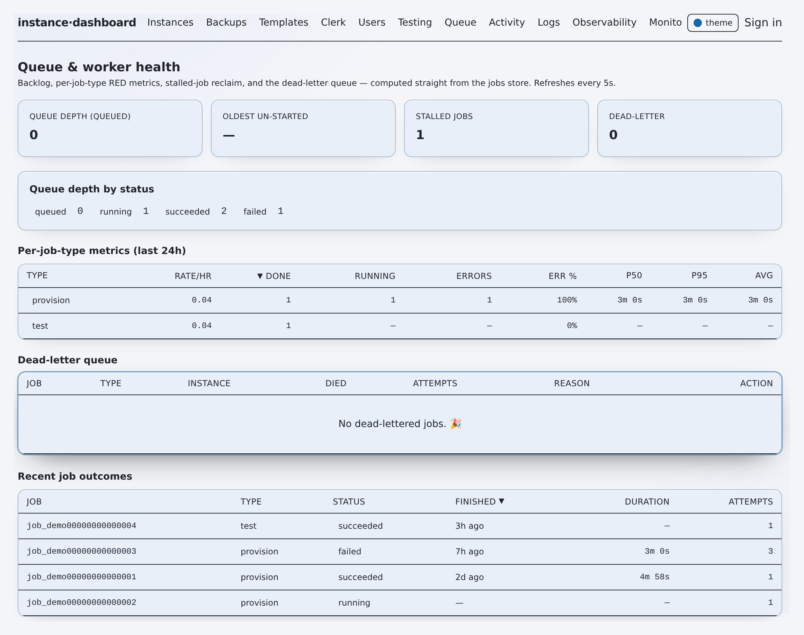

# flotilla — Architecture

**System in one minute.** flotilla is a control plane for ephemeral preview environments.
It provisions, refreshes, and tears down **instances** — each an
`(git branch × PII-masked data clone × dedicated auth config)` deployed across
**Vercel + Convex + Clerk**. It is a Next.js App Router app whose route handlers only
**enqueue** jobs into MongoDB and return a `{jobId}` immediately; a **standalone Node
worker** (`scripts/worker.ts`) polls that queue and runs the long, all-HTTP provisioning
**saga** off the serverless request path (snapshot import is tens of MB; PII masking
needs a filesystem). Auth is a Clerk gate with a scrypt **break-glass** fallback, guarded
by a four-role RBAC floor. Every non-core subsystem — observability, monitoring, AI
assist, cost, drift, share links — is **feature-flagged off by default**. Hard safety
guards (production write/teardown block, `dangerAck` on shared deployments, forced PII
masking of prod data) live in their own modules and are **never** behind a flag.


*The operator console — the instances view.*

Status legend: ✅ shipped · ◐ partial · 🔭 flag-gated/planned · ⚠️ caveat.

## Table of contents

- [The stack](#the-stack)
- [Layers & boundaries](#layers--boundaries)
- [Request & job lifecycle](#request--job-lifecycle)
- [Data flow & persistence](#data-flow--persistence)
- [Cross-cutting concerns](#cross-cutting-concerns)
- [Key design decisions & why](#key-design-decisions--why)
- [Drift & gotchas](#drift--gotchas)
- [Open questions](#open-questions)

## The stack

| Layer | Technology | Notes |
|---|---|---|
| UI + API | Next.js App Router, React 19 | Route handlers are `runtime = "nodejs"`, `dynamic = "force-dynamic"` |
| Styling | Tailwind v4 | Design tokens in `app/globals.css` |
| Auth gate | Clerk (`@clerk/nextjs`) + scrypt break-glass | `middleware.ts`, `lib/auth.ts`, `lib/breakglass.ts` |
| Persistence | MongoDB | A primary cluster for dashboard state; a **separate** metrics cluster for time-series |
| Worker | Plain Node process (`scripts/worker.ts`) | `node --experimental-strip-types --env-file=.env.local`, Node ≥ 20 |
| Data validation | Zod | Every model + API body parses through a schema |
| PII masking | `@snaplet/copycat`, optional | HMAC fallback when absent (`lib/mask.ts:48`) |
| Charts | uPlot | Observability tab only |
| AI | **SDK-free direct `fetch`** to Anthropic/OpenAI/OpenRouter/Ollama | `lib/clients/anthropic.ts`, `lib/aiRouter.ts` |

External control planes it drives: **Vercel REST** (`lib/clients/vercel.ts`),
**Convex management + deployment cloud API** (`lib/clients/convexDeploy.ts`,
`lib/clients/convexBackups.ts`), **Clerk backend API** (`lib/clients/clerk.ts`),
**GitHub REST** for the branch picker and snapshot blob store
(`lib/clients/github.ts`, `lib/clients/snapshotStore.ts`).

## Layers & boundaries

```
┌───────────────────────────────────────────────────────────────────────────┐
│  BROWSER — app/app/** pages (Instances, Backups, Queue, Config, Monitoring, │
│  Observability, Access, Logs, …) + AskAI widget. SWR polling + SSE tail.    │
└───────────────┬───────────────────────────────────────────────────────────┘
                │ HTTP (same origin)
┌───────────────▼───────────────────────────────────────────────────────────┐
│  NEXT.js ROUTE HANDLERS — app/api/**  (runtime=nodejs, force-dynamic)       │
│  • middleware.ts gates /app  • withOperator() gates every handler on RBAC   │
│  • MUTATING routes only ENQUEUE a job → return {jobId} (never run inline)   │
└───────┬───────────────────────────────────────────────┬───────────────────┘
        │ lib/ domain (shared by routes AND worker)      │
        │  jobs.ts · executor.ts · provision.ts          │
        │  deployments.ts · mask.ts · rbac.ts · auth.ts  │
        ▼                                                ▼
┌───────────────────────┐              ┌────────────────────────────────────┐
│  MongoDB              │◄────────────►│  STANDALONE WORKER scripts/worker.ts │
│  primary cluster:     │  poll queue  │  loop(): sweepExpired → reclaim →    │
│   flotilla_jobs (queue)  │  claim job   │  ingest → metrics → workOnce()       │
│   flotilla_instances     │  stream logs │  → runJob() → executeProvision()     │
│   flotilla_logs, audit…  │──────────────│  (all-HTTP saga; fs for PII mask)    │
│  metrics cluster:     │              └───────────────┬────────────────────┘
│   flotilla_metrics (TTL) │                              │ HTTPS
└───────────────────────┘              ┌───────────────▼────────────────────┐
                                       │  EXTERNAL CONTROL PLANES            │
        GitHub Releases  ◄─────────────│  Vercel · Convex (mgmt+deploy) ·    │
        (snapshot ZIP blobs)           │  Clerk · GitHub                     │
                                       └─────────────────────────────────────┘
```

**Boundary rules that matter:**

- **Route handlers never provision.** They call `enqueue*()` in `lib/jobs.ts`, which
  writes a `queued` job and returns (`app/api/instances/route.ts:60`, `lib/jobs.ts:92`).
  The engine "streams tens of MB and, for PII scrub, needs a filesystem"
  (`lib/jobs.ts:31`), so it must live off the request path.
- **`lib/` is shared** by both the route handlers and the worker; the split is runtime,
  not code. `FLOTILLA_INLINE_WORKER=1` opts a single process into running jobs inline for
  local dev (`lib/jobs.ts:555`).
- **The worker is a plain Node process** — filesystem, `unzip`/`zip`, the Convex CLI,
  optional Playwright (`scripts/worker.ts:1`). Safe to run N copies: `claimJob()` is an
  atomic single-winner flip (`lib/models/jobs.ts:138`).
- **Two Mongo clusters.** The dashboard's own state is on the primary cluster
  (`lib/mongo.ts:5`); high-volume metrics live on a **separate** cluster because a shared
  512 MB cluster filled once and blocked writes (`lib/mongo.ts:32`).
- **Break-glass is inlined into `middleware.ts`** (not imported) because the Edge runtime
  can't load `node:crypto` (`middleware.ts:5`).

## Request & job lifecycle

A launch is fully asynchronous. The API returns a job id; the browser tails the live log
over SSE; the worker executes the saga and converges instance + job status.



*The queue view — jobs move queued → running → done; the worker executes off the request path.*

```
Operator            POST /api/instances        lib/jobs.ts            Mongo flotilla_jobs        Worker (scripts/worker.ts)
   │  fill form + submit    │                       │                       │                        │
   ├───────────────────────►│ withOperator("write") │                       │                        │
   │                        ├─ parse zod body       │                       │                        │
   │                        ├─ getConfigValues() ───┤ (fill omitted flags)  │                        │
   │                        ├─ enqueueProvision() ──►│ createInstance()      │                        │
   │                        │                        ├─ enqueueJob() ───────►│ INSERT status=queued   │
   │                        │                        │  (upsert idempotencyKey)                       │
   │   {jobId, instanceId}  │◄───────────────────────┤                       │                        │
   │◄───────────────────────┤                       │                       │  loop(): nextQueuedJob()│
   │                        │                       │                       │◄───────────────────────┤
   │  GET /api/jobs/:id/stream (SSE)                 │                       │  claimJob() queued→running (atomic)
   │◄════════ log lines + status every 1s ══════════╪═══════════════════════╪═► runJob()→executeProvision()
   │                        │                       │                       │   ┌──────────────────────────────┐
   │                        │                       │  appendLog() ─────────┤   │ SAGA (runSaga, provision.ts):  │
   │                        │                       │  flotilla_logs           │   │  1 preflight (prod/dangerAck)  │
   │                        │                       │                       │   │  2 provision-convex (fresh|auth)│
   │                        │                       │                       │   │  3 deploy-code (Vercel REST)   │
   │                        │                       │                       │   │  4 import-data (mask→import)   │
   │                        │                       │                       │   │  5 reset-auth  6 migrations    │
   │                        │                       │                       │   │  7 clerk-select  8 verify      │
   │                        │                       │                       │   │  fail → unwind compensators    │
   │                        │                       │  updateJob(succeeded) │   └──────────────────────────────┘
   │  SSE "done"            │                       │  updateInstance(ready)│◄── notify() + onInstanceReady()
   │◄═══════════════════════╪═══════════════════════╪═══════════════════════╪═══════════════════════┘
```

Key mechanics:

- **Idempotency everywhere.** `enqueueProvision` derives an `idempotencyKey` and both the
  instance and the job upsert on it, so a double-submit converges to one of each
  (`lib/jobs.ts:97`, `lib/models/jobs.ts:105`).
- **Single-winner claim.** `claimJob` flips `queued→running` only if still `queued`, so a
  re-invocation or a second worker no-ops (`lib/models/jobs.ts:138`); `runJob` re-reads
  and bails when the claim fails (`lib/jobs.ts:605`).
- **The saga runner** executes named steps, each of which may register a **compensating**
  action; on an uncorrectable throw it unwinds executed steps in reverse (teardown
  preview / restore pre-provision snapshot) so a half-provisioned instance never lingers
  (`lib/provision.ts:71`). The worker-side engine reuses the same `runSaga`
  (`lib/executor.ts:24`, `lib/executor.ts:123`).
- **Verbs.** `runJob` dispatches by `job.type`: `test`→`runTestJob`,
  `fix-loop`→`runFixLoopJob`, `teardown`→`runTeardownJob`, else the provision engine
  (`lib/jobs.ts:596`). Enqueue helpers: `enqueueProvision` / `enqueueUpdate` (per-dimension
  patch) / `enqueueReprovision` / `enqueueRefresh` / `enqueueTeardown` / `enqueueTest` /
  `enqueueFixLoop`.
- **Dimensions.** An instance has three independently-(re)provisionable dimensions —
  `code`, `data`, `clerk` (`lib/models/jobs.ts:18`); a PATCH re-provisions only the
  changed one(s) (`lib/jobs.ts:157`).
- **Live tail** is SSE polling Mongo every 1 s, closing on a terminal status with a
  ~5-min guard (`app/api/jobs/[id]/stream/route.ts:25`).
- **Reliability.** The worker heartbeats a `lockRenewedAt` every 15 s while a job runs
  (`scripts/worker.ts:139`); a `running` job whose heartbeat is older than the lock
  timeout (default 120 s) is presumed crashed and either reclaimed to `queued` or, past
  `maxAttempts` (default 3), **dead-lettered** to `flotilla_jobs_dead`
  (`lib/models/jobs.ts:178`, `lib/models/jobs.ts:259`). Every transition is an atomic
  conditional update guarded on the still-stale lock.

## Data flow & persistence

**MongoDB — the dashboard's own state** (namespaced `flotilla_*` so it can share a DB,
`lib/mongo.ts:72`):

| Collection | Holds |
|---|---|
| `flotilla_instances` | Managed instances + provenance (`createdByTool`, `createdConvexDeployment`, `masked`, `expiresAt`) (`lib/models/instances.ts:56`) |
| `flotilla_jobs` / `flotilla_jobs_dead` | The async job queue + dead-letter queue (`lib/models/jobs.ts:57`) |
| `flotilla_logs` | Streamed provision/worker log lines (live tail + Logs tab) |
| `flotilla_backups` | Snapshot **metadata** (blob lives elsewhere — see below) (`lib/models/backups.ts:14`) |
| `flotilla_audit` | Who-did-what accounting trail (`lib/models/audit.ts`) |
| `flotilla_config` | Operator-editable defaults + feature flags (singleton) (`lib/models/config.ts`) |
| `flotilla_dashboard_users` | RBAC store — operators + roles (distinct from managed test users) |
| `flotilla_clerkConfigs` / `flotilla_managedUsers` | Per-instance Clerk secrets + test users |
| `flotilla_testruns`, `flotilla_fixloops`, `flotilla_share_links`, `flotilla_templates` | Tests, AI fix-loop runs, reviewer links, launch templates |
| `flotilla_monitor*` (11 collections) | 🔭 Monitoring subsystem — monitors, state, alerts, policies, incidents, groups (`lib/mongo.ts:108`) |
| `flotilla_metrics` (separate cluster) | 🔭 Observability time-series, one doc per `(provider,metric,labels,minute)` with a **TTL index** (`lib/mongo.ts:99`, `lib/observability/store.ts`) |

**GitHub Release assets — the snapshot blob store** ✅. Convex snapshot ZIPs are
60–180 MB and must not live in the shared cluster (`.env.example:52`). They are stored as
assets under a single lazily-created release (tag `blobs`) in a private `SNAPSHOT_REPO`
(`lib/clients/snapshotStore.ts:1`). The `flotilla_backups` doc carries only a `blobRef` (the
release asset id). ⚠️ A **legacy GridFS** path (`gridfsId`, `storeKind:"gridfs"`) is
still read for old rows (`lib/models/backups.ts:20`, `lib/executor.ts:98`) but new blobs
never go to Mongo.

**Where a provision reads data from:** `openSnapshotSource` prefers a "grabbed" blob
(GitHub Releases, else legacy GridFS), otherwise streams the snapshot **live** from the
Convex cloud backup via the account token (`lib/executor.ts:98`,
`lib/clients/convexBackups.ts`).

**Feature-flag gating of data.** `getConfig` resolves each value as
`stored ?? env default ?? hardcoded` with an `overriddenBy` provenance marker
(`lib/models/config.ts`). Flags live in the same singleton; reliability nets ship **ON**,
everything genuinely new ships **OFF** (`lib/models/config.ts:168`). The config store
**never holds secrets** and the prod/shared guards are surfaced read-only there, enforced
in their own modules (`lib/models/config.ts:15`).

**Scheduled/background sweeps.** The worker `loop()` runs, each poll (default 3 s), in
order: `sweepExpired` (TTL teardown), `reclaimSweep` (stalled-job reclaim/DLQ),
`maybeSyncBackups` (opt-in cloud-backup ingest), `maybePollMetrics` (🔭 observability),
then `workOnce` (`scripts/worker.ts:236`). Separately, **Vercel cron** hits three routes
every 5 min: `/api/observability/poll`, `/api/monitoring/run`, `/api/monitoring/escalate`
(`vercel.json:3`) — so monitoring/observability work even without a running worker.

## Cross-cutting concerns

### RBAC — the security floor

Four ascending roles `read-only → write → admin → super-admin`, rank-ordered as data so
the UI and server share one source of truth (`lib/rbac.ts:9`). Every route gates through
`withOperator(fn, minRole)`: no principal → 401, role `< minRole` → 403 (audited), Zod
error → 400, else 500 with the real error logged server-side but never leaked
(`lib/api.ts:29`). Reads default to `read-only`; mutations pass `"write"`
(`app/api/instances/route.ts:79`). A **grant boundary** (`canManageRole` /
`canTransitionRole`) governs who may change whom: super-admins manage admins; admins
manage only non-admin users (`lib/rbac.ts:63`). A hardcoded **immutable super-admin** list
can never be demoted or removed (`lib/rbac.ts:39`).

Principals resolve from **break-glass cookie first, then Clerk** (`lib/auth.ts:63`):
break-glass = super-admin; Clerk requires a **verified primary email**, then
`resolveClerkRole` maps it (immutable → existing row → an allow-listed domain
auto-provisions read-only → `ALLOWED_EMAILS` bridge auto-provisions write → else **null /
fail-closed**) (`lib/auth.ts:40`). An empty `ALLOWED_EMAILS` denies all Clerk logins.

**The public guest tier (demo).** For a public demo, principal resolution is extended so
an *unauthenticated* request resolves to a below-`read-only` **guest**: it passes every
GET route (which default to `read-only`) and fails **every** `write`+ route at the same
`withOperator` gate, server-side, before any handler body runs. A guest therefore reads
the entire console and can never enqueue a job — the credential-bearing worker is never
reached. See [SECURITY.md](./SECURITY.md#the-public-guest-tier-demo).

### Break-glass

A single `BREAKGLASS_EMAIL` identity signs in against a scrypt hash in env
(`BREAKGLASS_PASSWORD_HASH`, never plaintext), minting a signed httpOnly session cookie
whose HMAC key derives from the hash itself (`lib/breakglass.ts:94`,
`lib/breakglass.ts:48`). Constant-time verification, fail-closed. The login is
rate-limited by a Mongo sliding window (8 failures / 15 min per IP, fails **open** on a
store error) (`lib/ratelimit.ts`).

### PII masking

`lib/mask.ts` is a **string-level JSONL rewriter**: it parses each export row only to
locate the spans of string values to mask, then splices masked text back in — "every
number, every key order, every byte we don't target is preserved verbatim"
(`lib/mask.ts:1`). This exists because an earlier JSON round-trip approach silently
dropped Convex's float encoding (`1234.0 → 1234`) and would corrupt numeric rollups
(`lib/mask.ts:6`). Masking is deterministic + referentially consistent (same input → same
output, so `_id`-joins survive), backed by `@snaplet/copycat` seeded per run, with an
**HMAC fallback** when the dep is absent (`lib/mask.ts:89`). It masks identity fields
(`classifyField`, `lib/mask.ts:192`) and **never** touches `_id`, `*Id`/`*Ids`
references, Convex-id-shaped values, `authId`, `organizationId`, or any numeric field
(`lib/mask.ts:24`). The masking runs only in the worker (needs `unzip`/`zip` + fs), via
dynamic import to keep `child_process`/`copycat` out of the serverless bundle
(`lib/executor.ts:432`).

### Feature flags

Booleans in the config singleton (`lib/models/config.ts:114`), each with an env default
(`FLOTILLA_FEATURE_*`, `lib/models/config.ts:187`). Reliability/safety nets
(`deadLetterQueue`, `stalledReclaim`, `queuePanel`) ship **ON**; new subsystems
(`observability`, `monitoring`, `askAi`, `aiFailureTriage`, `aiValidatedFixLoop`,
`aiSmokeGate`, `costEstimates`, `scopedShareLinks`, `driftBadges`, `notifications`,
`autoIngestBackups`) ship **OFF** (`lib/models/config.ts:168`). Flags gate
**behavior/routes only, never security remediations** — the prod/shared guards stay
enforced regardless.

### AI provider chain

All AI is **SDK-free direct `fetch`** (`lib/clients/anthropic.ts:1`) — a deliberate "no
heavy deps" posture. Two shapes:

- **Ask-AI** 🔭 (`askAi` flag) — an ordered fallback **chain**
  `auto → anthropic → openai → ollama → free → deterministic`; the first configured
  provider that succeeds answers, each failover is recorded, and the terminal
  `deterministic` tier is a **non-AI keyword map** so Ask-AI never hard-fails even with no
  key/network (`lib/aiRouter.ts:39`, `lib/aiRouter.ts:482`). Provider liveness is probed
  split-by-reachability: cloud providers server-side, Ollama client-side (a Vercel server
  can't reach the operator's localhost) (`lib/aiProviders.ts:1`).
- **Read-only helpers** 🔭 — failure **triage** (one forced-tool Anthropic call
  explaining why an instance failed, with an entity-faithfulness post-check that
  downgrades confidence when the model cites an id it was never shown,
  `lib/aiTriage.ts:242`) and the **validated fix-loop** (propose→apply→verify: the model
  proposes a closed-enum `FixPlan`, a deterministic dispatcher applies it to the
  instance's **own disposable preview** and re-provisions for real; the verdict is the
  real provision result, never the model's narrative, `lib/aiFixLoop.ts:337`).

Non-negotiable posture: **"the model proposes; nothing here disposes."** The fix-loop
re-derives a scope guard on every executor call — tool-created only, never prod or shared,
bounded to ≤3 attempts + a token budget (`lib/aiFixLoop.ts:95`). Keys are read from env
inside each provider, sent only as the documented auth header, never logged or returned.

### Deployment-topology safety guards

`lib/deployments.ts` is the single source of truth for the managed Convex topology,
env-overridable but with baked defaults so guards stay fail-safe when unconfigured
(`lib/deployments.ts:1`). Layered defenses:

1. **Production hard block** — the `PROD_CONVEX_DEPLOYMENT`
   (`FLOTILLA_PROD_CONVEX_DEPLOYMENT`) can **never** be a write/refresh/teardown target; **no
   `dangerAck` overrides it** (`lib/deployments.ts:48`, preflight at `lib/executor.ts:164`,
   teardown at `lib/executor.ts:370`, also `lib/provision.ts:166`).
2. **`dangerAck` on any pre-existing deployment** — the primary overwrite guard,
   independent of the topology table: writing a deployment the tool did not create throws
   unless `dangerAck=true` (`lib/executor.ts:172`). Shared deployments
   (`SHARED_DEPLOYMENTS`, roles production/staging-prod/ci/dev/staging-dev) are
   danger-flagged (`lib/deployments.ts:52`).
3. **Forced PII masking of prod data** — a snapshot **sourced** from a
   production/staging-prod deployment forces masking on regardless of the caller's
   `scrubPII` flag (`lib/executor.ts:77`, `lib/executor.ts:248`).
4. **Vercel project guards** — never deploy to the production project; shared projects
   need `dangerAck`; `PROTECTED_VERCEL_PROJECTS` are never torn down (`lib/executor.ts:157`,
   `lib/executor.ts:349`).
5. **Email kill-switch preflight** — refuses any target where `ALLOW_OUTBOUND_EMAIL=true`
   (that marks a production deployment) (`lib/executor.ts:197`, `lib/provision.ts:169`).
6. **auth-id reset** — imported prod auth ids carry the source tenant's Clerk issuer and
   can never match this instance; they're rewritten to `pending:<email>` post-import
   (`lib/executor.ts:268`).
7. **Teardown scope** — only `createdByTool` instances, never prod/shared resources
   (`lib/executor.ts:366`).

### Auditing & notifications

Every mutating route records `recordAudit(actor, action, target, detail)` — best-effort,
append-only (`lib/models/audit.ts`). `notify()` fires proactive Slack/email alerts on
ready/teardown/job-failure/TTL-warn/DLQ, double-gated behind the `notifications` flag + a
configured webhook (`lib/notify.ts`).

## Key design decisions & why

- **Worker off the request path.** Provisions stream tens of MB and need a filesystem
  (PII unzip/mask/re-zip) + potentially Playwright — impossible inside a serverless
  handler. The API only enqueues; the worker executes (`lib/jobs.ts:29`). Trade-off: an
  extra always-on process, mitigated by the optional `FLOTILLA_INLINE_WORKER=1` for
  single-process dev.
- **Snapshots in GitHub Releases, not Mongo.** 60–180 MB ZIPs filled the shared cluster
  and caused an outage; Releases give free, out-of-Mongo, HTTP-reachable blob storage
  (2 GB/asset) (`lib/clients/snapshotStore.ts:1`, `.env.example:51`). Metrics likewise
  moved to a **separate** cluster (`lib/mongo.ts:32`).
- **Flags off by default.** "Enabling a flag never changes behavior for anyone until its
  UI is used." New subsystems can ship dark; reliability nets are the only defaults-ON
  flags (`lib/models/config.ts:165`).
- **Env-driven deployment topology.** The prod name + shared map are env-overridable but
  baked with safe defaults, so the guards are fail-safe when unconfigured **and** client
  components (which can't read server env) can still render picker lists
  (`lib/deployments.ts:1`). Set `FLOTILLA_PROD_CONVEX_DEPLOYMENT` in every real environment to
  arm the hard block.
- **SDK-free direct-fetch AI.** One call shape (a forced-tool request) means the
  Anthropic/other SDKs would add dependency + bundle weight for no benefit
  (`lib/clients/anthropic.ts:4`). The deterministic terminal tier guarantees a useful
  answer with no key.
- **Idempotent, compensating saga.** Named steps with reverse-order compensators make a
  failed provision self-healing (teardown the preview it created; restore the
  pre-provision snapshot) rather than leaving a half-built instance (`lib/provision.ts:63`).
- **Public-safe by construction.** Authorization is one server-side gate ahead of every
  handler; a guest is simply its lowest rung. The demo is safe because the same RBAC floor
  that protects the real tool protects the demo — hiding a button is never the mechanism.
- **All-HTTP executor** (`lib/executor.ts`) replaced the CLI-driven `provision.ts` so the
  same engine can run from a serverless-shaped worker over Vercel REST + Convex cloud HTTP
  APIs (`lib/executor.ts:1`). ⚠️ See gotchas.

## Drift & gotchas

- ⚠️ **Two provisioning engines coexist.** `lib/executor.ts` (all-HTTP, what the worker +
  jobs actually run) is the live path; `lib/provision.ts` (CLI-driven,
  `execCapture`/`npx convex`) still exports `runSaga` + the migration constants the
  executor imports, and is used by `scripts/refresh-staging.ts` (`lib/provision.ts:62`,
  `lib/executor.ts:24`). Don't assume `provision()` is the code path a dashboard launch
  takes — it isn't; `executeProvision()` is.
- ⚠️ **Clerk auth-strategy toggles are not applied by the engine.** The `clerk` dimension
  only *records a selection*; real config toggles are a Playwright worker follow-up,
  "logged here, not applied" (`lib/executor.ts:300`).
- ⚠️ **`reset-auth` + `migrations` over HTTP are best-effort, not fatal.** On the executor
  path a failure is warned and deferred ("run manually if needed"), unlike the CLI path
  where they throw (`lib/executor.ts:273` vs `lib/provision.ts:240`).
- ⚠️ **Axiom is dormant.** The observability store is MongoDB; `lib/clients/axiom.ts` and
  all `AXIOM_*` env vars are unwired and unused unless the client is revived
  (`.env.example:139`, `lib/observability/store.ts:1`).
- ⚠️ **Rate limiter fails open.** The break-glass limiter chooses availability over
  lockout on a store error (`lib/ratelimit.ts`) — acceptable because scrypt still slows
  guessing, but note it.
- ⚠️ **Metrics TTL caps history depth.** Pollers backfill as far back as each provider
  retains, but points past `FLOTILLA_METRICS_TTL_DAYS` (default 30) are reaped by the Mongo
  TTL index (`.env.example:146`).
- ⚠️ **Legacy GridFS reads.** Old backup rows still resolve via GridFS
  (`storeKind:"gridfs"`/`gridfsId`); only new blobs use Releases (`lib/executor.ts:107`).
- ⚠️ **Node version.** The worker's `--experimental-strip-types` path prefers Node ≥ 22.6;
  on older ≥ 20 run via `tsx`.

## Open questions

- **Worker deployment topology.** The worker is a standalone process, but the repo doesn't
  declare where it runs in production (host/service/supervisor) — only how to start it
  locally. ⚠️ Unverified from code.
- **Cron vs worker overlap.** Monitoring/observability run *both* via `vercel.json` cron
  (every 5 min) *and* the worker `loop()` sweeps — the intended split (which is
  authoritative in prod) isn't documented in code (`vercel.json:3`, `scripts/worker.ts:236`).
- **`lib/provision.ts` retirement.** Is the CLI engine kept only for
  `scripts/refresh-staging.ts`, or is it a supported fallback? The live engine is
  `executor.ts`.

---

**Related:** [Docs index](./README.md) · [Capability map](./CAPABILITY-MAP.md) · [Data model](./DATA-MODEL.md) · [Security](./SECURITY.md) · [Decisions](./DECISIONS.md)
