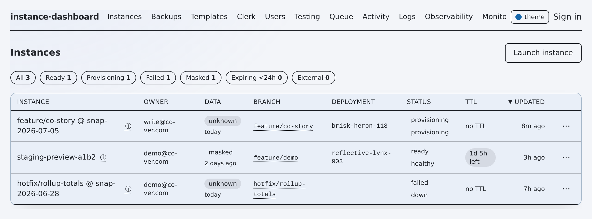
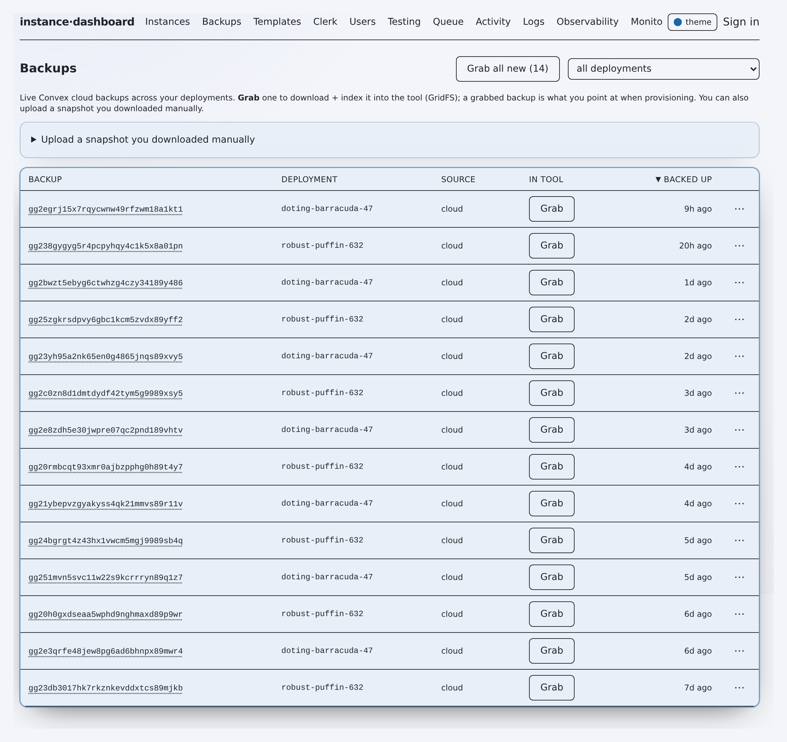
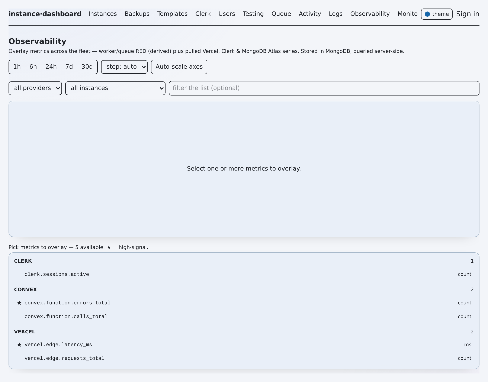
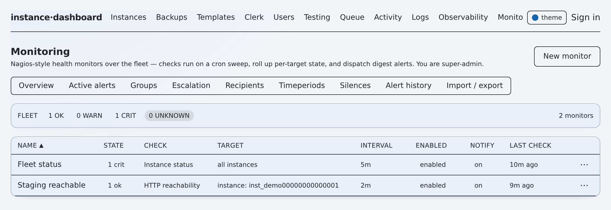
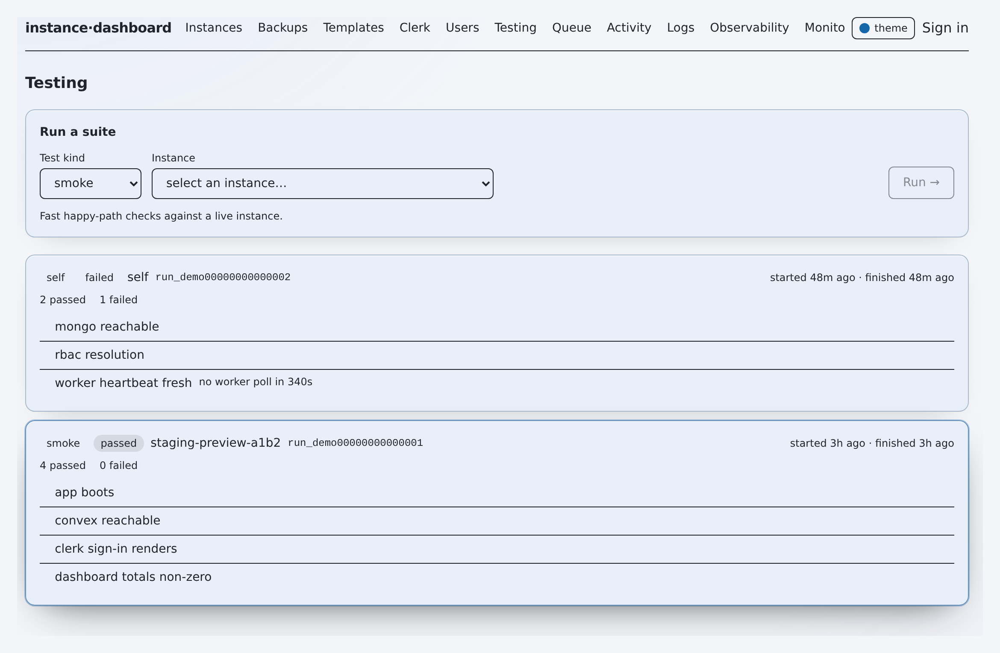
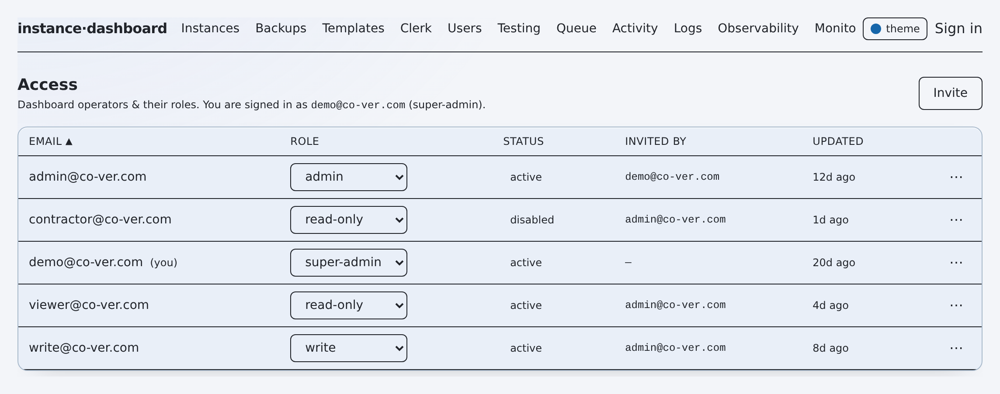
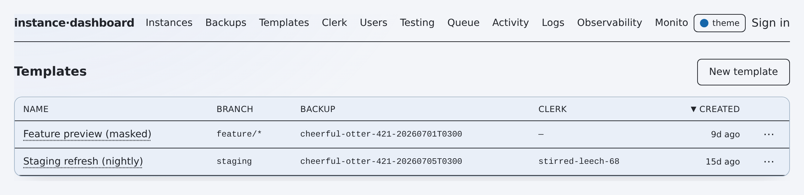
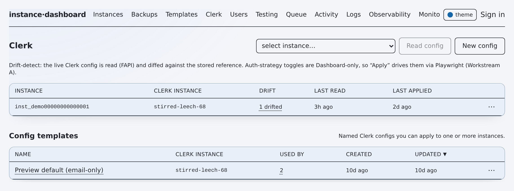

# flotilla — Capability Map

**Purpose: locate the code behind any feature.** This is a capability-to-code
*index*, not a design document. Locate the subsystem in the [table of contents](#table-of-contents),
read its capability table, and jump to the cited `path:Lnnn` entrypoint. Every row
points at the exact function or route where the behaviour lives, and every `path:Lnnn`
is verified against the working tree. HTTP routes live in `app/api/**/route.ts`, domain
logic in `lib/**`, and the standalone worker and CLIs in `scripts/**`. Auth is uniform:
almost every route runs through `withOperator(fn, minRole)` (`lib/api.ts:29`); the
three cron routes use a `CRON_SECRET` bearer instead. Every non-core subsystem sits
behind a feature flag that defaults **off** (`lib/models/config.ts:126`).

## Table of contents

- [Status legend](#status-legend)
- [Capabilities by subsystem](#capabilities-by-subsystem)
  - [Instance lifecycle (provision / refresh / teardown)](#instance-lifecycle-provision--refresh--teardown)
  - [PR-native lifecycle (GitHub webhook)](#pr-native-lifecycle-github-webhook)
  - [Snapshots & backups](#snapshots--backups)
  - [Observability (metrics pipeline)](#observability-metrics-pipeline)
  - [Monitoring & alerting](#monitoring--alerting)
  - [AI assist (triage / Ask-AI / fix-loop)](#ai-assist-triage--ask-ai--fix-loop)
  - [Access control (RBAC)](#access-control-rbac)
- [Entry-point index](#entry-point-index)
  - [API routes](#api-routes)
  - [Worker & CLI commands](#worker--cli-commands)
- [Feature flags](#feature-flags)
- [Planned / not-yet-default](#planned--not-yet-default)

## Status legend

| Symbol | Meaning |
|---|---|
| ✅ | Shipped — on the core path, no flag |
| ◐ | Partial — works, but a caveat or narrow scope applies |
| 🔭 | Flag-gated — behind a feature flag that ships **off** by default |
| ⚠️ | Caveat — a safety guard, dormant dependency, or claim held with lower confidence |

## Capabilities by subsystem

### Instance lifecycle (provision / refresh / teardown)

Long-running work runs off the request path on the worker; API routes only enqueue
jobs. The saga runner rolls back partial provisions, and the guards in
`lib/deployments.ts` block writes and teardowns against production and shared Convex
deployments.

*The instances view — launch, refresh, and track preview/staging instances, with status and TTL.*

| Capability | Status | Entry point (`path:Lnnn`) | Notes |
|---|---|---|---|
| Provision saga (compensating steps) | ✅ | `lib/provision.ts:150` (`provision`); runner `lib/provision.ts:71` (`runSaga`) | Vercel + Convex + Clerk fan-out; rolls back on failure |
| Execute provision (do the work) | ✅ | `lib/executor.ts:123` (`executeProvision`) | Called by the job runner, not the route |
| Execute teardown | ✅ | `lib/executor.ts:351` (`executeTeardown`) | Protected-project guard `lib/executor.ts:349` |
| Prod-data-source guard | ✅ ⚠️ | `lib/executor.ts:82` (`isProdDataSource`) | Forces PII masking when sourcing from prod-like data |
| Managed-deployment danger gates | ✅ | `lib/deployments.ts:72` (`isProdDeployment`), `:75` (`isSharedDeployment`), `:79` (`isSensitiveDeployment`) | Hard block on prod; env `FLOTILLA_PROD_CONVEX_DEPLOYMENT` |
| Enqueue provision / update / reprovision / teardown / refresh | ✅ | `lib/jobs.ts:98`, `:165`, `:231`, `:282`, `:326` | One `enqueue*` per lifecycle verb |
| Patch push (upload a diff, redeploy) | 🔭 ⚠️ | `lib/patchPush.ts:192` (`runPatchPush`); guard `:112` (`patchPushGuard`); validate `:61` (`validatePatch`) | Flag `patchPush`; applies a unified diff to an ephemeral branch then code-redeploys the instance's OWN target; needs push-scoped `GITHUB_TOKEN` |
| Patch-push git apply + push | 🔭 ⚠️ | `lib/clients/github.ts` (`pushPatchBranch`) | Worker-only (git CLI); token redacted from logs |
| PR-native lifecycle (webhook → provision/refresh/teardown) | 🔭 ⚠️ | `lib/prLifecycle.ts`; webhook `app/api/webhooks/github/route.ts` | Flag `prNativeLifecycle`; HMAC-authed webhook, bot/label gate, inactivity TTL |
| Run a queued job | ✅ | `lib/jobs.ts:705` (`runJob`) | Dispatches by job kind |
| Worker: claim & run one job | ✅ | `scripts/worker.ts:133` (`workOnce`); loop `:275` | `npm run worker` |
| Worker: reclaim crashed jobs / expire TTL instances | ✅ | `scripts/worker.ts:181` (`reclaimSweep`), `:249` (`sweepExpired`) | Gated by `stalledReclaim` flag |
| Create instance (enqueue provision) | ✅ | `app/api/instances/route.ts:47` (POST, write) | Merges request over config defaults |
| Update / teardown instance | ✅ | `app/api/instances/[id]/route.ts:33` (PATCH), `:52` (DELETE), both write | |
| Ownership registry — capture owner/team on create, filter, reassign | ✅ | `lib/models/instances.ts` (`ownerUserId`/`ownerEmail`/`ownerName`/`team`, `updateInstanceOwner`); `app/api/instances/route.ts` (stamp acting principal on create; `?owner=`/`?team=` filter); `app/api/instances/[id]/route.ts` (`action:"reassign-owner"`, write) | Legacy rows owner-less until set; reassign audits `instance.owner.reassign` |
| Fleet scorecards — pure hygiene score/grade per instance + fleet rollup | 🔭 | `lib/scorecard.ts` (pure scorer + rollup), `lib/scorecardService.ts` (fleet glue + monitoring signal), `GET /api/instances/scorecards` (read gate + flag), Scorecards section on `/app` | Flag `fleetScorecards` (off); read-only, deterministic; a failing check only lowers a score, never relaxes a guard |
| CLI: one-off provision | ✅ | `scripts/provision.ts:42` (`main`) | `npm run provision` |
| CLI: auto-refresh an existing instance | ✅ | `scripts/auto-refresh.ts:65` (`autoRefresh`) | `npm run auto-refresh` |
| CLI: refresh staging (cadence + guards) | ◐ | `scripts/refresh-staging.ts:143` (`refreshStaging`) | Cron-window + email + prod-name guards (`:47`, `:73`, `:85`) |
| Worker: pre-reap TTL heads-up (notify-before-reap) | ✅ | `scripts/worker.ts:219` (`sweepExpiringSoon`) | "expires in X — extend?" before teardown; lead `FLOTILLA_TTL_WARN_LEAD_MS` |
| Inactivity-TTL clock (reset on push/access) | ✅ | `lib/models/instances.ts:235` (`touchInstanceActivity`) | Re-stamps `expiresAt`; sweep reaps on the earlier of TTL or PR-close |

### PR-native lifecycle (GitHub webhook)

🔭 Behind the `prNativeLifecycle` flag (default off). A GitHub PR webhook drives the
instance lifecycle: PR opened ⇒ provision, push ⇒ refresh, closed/merged ⇒ teardown,
with a **bot/agent skip + required-label gate** to bound cost and an **inactivity TTL**
(every push/access resets it; a pre-reap "extend?" heads-up precedes teardown). The
route is authenticated by the GitHub HMAC signature — the ONE route that is not
`withOperator` — and no-ops when the flag is off. All provisioning uses the same
enqueue verbs (and therefore the same prod/shared executor preflight) as an operator
launch; PR instances are always FRESH deployments, never prod/shared.

| Capability | Status | Entry point (`path:Lnnn`) | Notes |
|---|---|---|---|
| Webhook ingress (verify → gate → enqueue) | 🔭 | `app/api/webhooks/github/route.ts:20` (POST, **HMAC**) | No-op 200 when flag off; 401 on bad signature; 503 without secret |
| Webhook HMAC verification | 🔭 ⚠️ | `lib/clients/github.ts:25` (`verifyGithubSignature`) | Constant-time compare vs `GITHUB_WEBHOOK_SECRET` |
| PR event → lifecycle orchestration | 🔭 | `lib/prLifecycle.ts:138` (`handlePullRequestEvent`) | Maps action → provision / reprovision / teardown; audited |
| Bot/agent skip + label gate (pure) | 🔭 | `lib/prLifecycle.ts:106` (`classifyProvisionDecision`); bots `:88` (`isBotActor`) | Config `prRequireLabel` / `prBotAllowlist` |
| PR→instance idempotency + generation | 🔭 | `lib/models/instances.ts:225` (`getLiveInstanceByPr`) | One live instance per PR; reopen bumps generation |
| Canonical PR comment (edit-in-place) | 🔭 | `lib/prComment.ts:51` (`syncPrComment`) | One comment per PR, edited on each phase; token-gated, best-effort |

### Snapshots & backups

Snapshot blobs (60–180 MB Convex ZIPs) live as GitHub Release assets in a private
snapshot repo, **not** in Mongo. The store degrades off when `SNAPSHOT_REPO` is unset.

*The backups view — cloud backups and captured snapshots available to restore from.*

| Capability | Status | Entry point (`path:Lnnn`) | Notes |
|---|---|---|---|
| Grab a Convex cloud backup into the snapshot store | ✅ | `lib/backupSync.ts:24` (`grabSnapshotToStore`) | |
| Sync all new cloud backups | ✅ | `lib/backupSync.ts:47` (`syncNewBackups`) | Known deployments `:14` |
| Put / get / delete snapshot blob | ✅ | `lib/clients/snapshotStore.ts:127` (`putSnapshot`), `:168` (`getSnapshot`), `:181` (`deleteSnapshot`) | Configured check `:36` |
| List / mint Convex backups client | ✅ | `lib/clients/convexBackups.ts:75` (`makeConvexBackupsClient`) | Uses `CONVEX_ACCESS_TOKEN` |
| Backups API (list / capture / delete) | ✅ | `app/api/backups/route.ts:20` (GET), `:98` (POST, write), `:182` (DELETE, write) | |
| CLI: sync backups | ✅ | `scripts/sync-backups.ts:7` (`main`) | `npm run sync-backups -- [deployment]` |
| Worker: periodic auto-ingest sweep | 🔭 | `scripts/worker.ts:55` (`maybeSyncBackups`) | Gated by `autoIngestBackups` / `AUTO_INGEST_BACKUPS` |

### Observability (metrics pipeline)

🔭 The entire subsystem sits behind the `observability` flag. The store is MongoDB
(reusing `MONGODB_URI`); a Mongo TTL index reaps points past `FLOTILLA_METRICS_TTL_DAYS`.
Pollers pull Vercel, Clerk, and Atlas and derive internal RED signals.

*The observability tab — provider and internal metrics charted over time.*

| Capability | Status | Entry point (`path:Lnnn`) | Notes |
|---|---|---|---|
| Collect metrics from all pollers | 🔭 | `lib/observability/collect.ts:59` (`collectMetrics`) | |
| Poll + ingest (recent vs deep-backfill) | 🔭 | `lib/observability/collect.ts:159` (`pollAndIngest`); mode `:128` (`decideBackfillMode`) | Backfill gate default 1h (`:26`) |
| Metric store (Mongo, TTL, upsert) | 🔭 | `lib/observability/store.ts:187` (`getMetricStore`); available `:115`; TTL `:106` | |
| Query / align series for charts | 🔭 | `lib/observability/query.ts:90` (`alignSeries`), `:161` (`parseSeriesParams`), `:36` (`stepForWindow`) | |
| Pollers (per source) | 🔭 | `lib/observability/pollers/{atlas,clerk,internal,vercel}.ts` | Atlas ⚠️ needs its own project key |
| Catalog API (available metrics) | 🔭 | `app/api/observability/route.ts:18` (GET, read-only) | |
| Series query API | 🔭 | `app/api/observability/query/route.ts:21` (POST, read-only) | |
| Cron poll API | 🔭 ⚠️ | `app/api/observability/poll/route.ts:36` (GET, **CRON_SECRET**) | `?backfill=1` forces a deep backfill |
| CLI: metrics poll | 🔭 | `scripts/metrics-poll.ts:37` (`main`) | `npm run metrics-poll [-- --backfill]` |
| Worker: metrics sweep | 🔭 | `scripts/worker.ts:73` (`maybePollMetrics`) | |
| Axiom store (original backend) | ⚠️ | `lib/clients/axiom.ts` | **Dormant/unwired** — `AXIOM_*` vars unused by active path |

### Monitoring & alerting

🔭 The entire subsystem sits behind the `monitoring` flag; when off, the scheduler
no-ops and every `/api/monitoring/**` route returns 403. A closed check registry feeds
an OK/WARN/CRIT state machine, then escalation, then Slack and email digests.

*The monitoring view — per-check OK/WARN/CRIT state and escalation.*

| Capability | Status | Entry point (`path:Lnnn`) | Notes |
|---|---|---|---|
| Run due monitors (scheduler) | 🔭 | `lib/monitoring/scheduler.ts:41` (`runDueMonitors`) | Driven by the cron run route |
| Evaluate one monitor | 🔭 | `lib/monitoring/evaluate.ts:75` (`evaluateMonitor`) | |
| State machine (soft→hard, alert transitions) | 🔭 | `lib/monitoring/stateMachine.ts:37` (`applyResult`), `:79` (`transitionAlerts`) | |
| Escalation sweep + policy/renotify logic | 🔭 | `lib/monitoring/escalate.ts:199` (`runEscalationSweep`), `:50` (`pickPolicyAction`), `:79` (`shouldRenotifyDirect`) | |
| Materialize default monitors on ready/teardown | 🔭 | `lib/monitoring/materialize.ts:58` (`materializeInstanceDefaults`), `:133` (`onInstanceReady`), `:148` (`onInstanceTeardown`) | |
| Check registry (metric / HTTP / status) | 🔭 | `lib/monitoring/checks/registry.ts` + `metricThreshold.ts`, `httpReachability.ts`, `instanceStatus.ts` | Closed registry (`checks/types.ts`) |
| AI-drafted monitor | 🔭 | `lib/monitoring/aiDraft.ts:276` (`draftMonitor`) | See AI assist |
| Cron: run monitors | 🔭 ⚠️ | `app/api/monitoring/run/route.ts:31` (GET, **CRON_SECRET**) | Fail-closed |
| Cron: escalation sweep | 🔭 ⚠️ | `app/api/monitoring/escalate/route.ts:28` (GET, **CRON_SECRET**) | Fail-closed |
| Config/state APIs (monitors, alerts, contacts, groups, policies, silences, time-periods, recipients, import/export) | 🔭 | `app/api/monitoring/**` — see [entry-point index](#api-routes) | Reads write-role; contacts/policies/recipients require **admin** |

### AI assist (triage / Ask-AI / fix-loop)

All provider calls are server-side direct `fetch` (Anthropic via `lib/clients/anthropic.ts`);
with no key, triage and gate return 409 and Ask-AI degrades to a deterministic keyword
tier. Each surface sits behind its own flag. Informational surfaces are read-only; the
fix-loop is the only instance-changing AI path, and it re-validates.

*The testing view — where the advisory AI smoke-gate verdict is requested.*

| Capability | Status | Entry point (`path:Lnnn`) | Notes |
|---|---|---|---|
| Ask-AI provider chain | 🔭 | `lib/aiRouter.ts:482` (`askAi`); chain `:39`; availability `:144`; deterministic tier `:447` | Flag `askAi` |
| Probe cloud providers | 🔭 | `lib/aiProviders.ts:166` (`probeCloudAiProviders`) | Feeds Config → AI Providers |
| Failure triage (explain why an instance failed) | 🔭 | `lib/aiTriage.ts:242` (`triageInstance`); `looksFailed` `:60` | Flag `aiFailureTriage` + `ANTHROPIC_API_KEY` |
| Validated fix-loop | 🔭 ⚠️ | `lib/aiFixLoop.ts:337` (`runFixLoop`); guard `:95`; apply `:312` | Flag `aiValidatedFixLoop`; only instance-changing AI path |
| Fix-plan schema / validation / apply | 🔭 | `lib/fixPlan.ts:85` (`validateFixPlan`), `:129` (`applyFixPlanToOpts`) | Zod discriminated union `:36` |
| Drift compute (feeds triage/badges) | 🔭 | `lib/drift.ts:158` (`computeInstanceDrift`) | Flag `driftBadges` gates the API |
| AI smoke gate (test verdict) | 🔭 | `lib/aiSmokeGate.ts` | Flag `aiSmokeGate` |
| Ask-AI API | 🔭 | `app/api/ask/route.ts:25` (POST, read-only + `askAi`) | |
| Triage API | 🔭 | `app/api/instances/[id]/triage/route.ts:19` (POST, write + `aiFailureTriage`) | |
| Fix-loop API (run / status) | 🔭 | `app/api/instances/[id]/fix-loop/route.ts:34` (POST, write), `:95` (GET) | `aiValidatedFixLoop` |
| Smoke-gate API | 🔭 | `app/api/testing/gate/route.ts:64` (POST, computes+caches), `:69` (GET, cache-only) | `aiSmokeGate` |
| Monitor-draft API | 🔭 | `app/api/monitoring/ai-draft/route.ts:34` (POST, write + `monitoring`) | |

### Access control (RBAC)

Four roles with a server-enforced grant boundary. Immutable super-admins cannot be
demoted or disabled. Clerk is the primary gate, with a scrypt break-glass cookie as the
fallback. Middleware protects the app shell.

*The access pane — operators and their roles under the four-role model.*

| Capability | Status | Entry point (`path:Lnnn`) | Notes |
|---|---|---|---|
| Role model + ranking | ✅ | `lib/rbac.ts:9` (`Role`), `:13` (`ROLES`), `:31` (`roleAtLeast`) | `read-only < write < admin < super-admin` |
| Grant boundary (who may manage/transition a role) | ✅ | `lib/rbac.ts:63` (`canManageRole`), `:72` (`canTransitionRole`) | |
| Immutable super-admins | ✅ ⚠️ | `lib/rbac.ts:51` (`isImmutableSuperadmin`); list `:39` | Can't be demoted/disabled |
| Uniform route gate + audit-on-deny | ✅ | `lib/api.ts:29` (`withOperator`) | 401 no-principal, 403 low-role |
| Resolve principal (Clerk role or break-glass) | ✅ | `lib/auth.ts:63` (`getPrincipal`); Clerk role `:40` | Fail-closed on empty `ALLOWED_EMAILS` |
| Break-glass login (scrypt) | ✅ | `lib/breakglass.ts:94` (`verifyBreakglassLogin`), `:64` (`createSessionToken`), `:74` (`verifySessionToken`) | Hash in env only |
| Auth rate-limiting | ✅ | `lib/ratelimit.ts` (`authRateLimit`, `recordAuthFailure`) | Per-IP brute-force guard |
| App-shell route protection | ✅ | `middleware.ts` | |
| Access API (list / invite+grant / revoke) | ✅ | `app/api/access/route.ts:45` (GET, **admin**), `:123` (POST), `:222` (DELETE) | |
| Break-glass API (login / logout) | ✅ | `app/api/breakglass/route.ts:17` (POST), `:56` (DELETE) | Rate-limited, unauthenticated by design |
| Managed-user API | ◐ | `app/api/users/route.ts:33` (GET), `:48` (POST, **admin**) | Refuses to touch a production Clerk instance (`:55`) |

## Entry-point index

### API routes

Auth column: role = `withOperator` `minRole` (GET defaults to **read-only**);
**CRON** = `CRON_SECRET` bearer; **session** = break-glass cookie or unauthenticated.
🔭 marks a route that is also feature-gated (403 when the flag is off).

| Method | Path | Auth | Handler (`path:Lnnn`) |
|---|---|---|---|
| GET | /api/access | admin | `app/api/access/route.ts:45` |
| POST | /api/access | admin (grant boundary) | `app/api/access/route.ts:123` |
| DELETE | /api/access | admin | `app/api/access/route.ts:222` |
| POST | /api/ask | read-only 🔭 askAi | `app/api/ask/route.ts:25` |
| GET | /api/audit | read-only | `app/api/audit/route.ts:11` |
| GET | /api/backups | read-only | `app/api/backups/route.ts:20` |
| POST | /api/backups | write | `app/api/backups/route.ts:98` |
| DELETE | /api/backups | write | `app/api/backups/route.ts:182` |
| GET | /api/branches | read-only | `app/api/branches/route.ts:10` |
| POST | /api/breakglass | session (rate-limited) | `app/api/breakglass/route.ts:17` |
| DELETE | /api/breakglass | session | `app/api/breakglass/route.ts:56` |
| GET | /api/clerk | read-only | `app/api/clerk/route.ts:66` |
| POST | /api/clerk | write | `app/api/clerk/route.ts:97` |
| GET | /api/config/ai-providers | read-only | `app/api/config/ai-providers/route.ts:18` |
| GET | /api/config | read-only | `app/api/config/route.ts:63` |
| PUT | /api/config | write (admin for restricted keys + flags) | `app/api/config/route.ts:100` |
| POST | /api/config | write | `app/api/config/route.ts:157` |
| GET | /api/instances | read-only | `app/api/instances/route.ts:10` — optional `?owner=`/`?team=` ownership filter |
| POST | /api/instances | write | `app/api/instances/route.ts:47` — stamps owner from the acting principal (or explicit on-behalf-of owner) |
| GET | /api/instances/[id] | read-only | `app/api/instances/[id]/route.ts:10` |
| PATCH | /api/instances/[id] | write | `app/api/instances/[id]/route.ts:33` — dimension re-provision, or `action:"reassign-owner"` (audited owner/team change) |
| DELETE | /api/instances/[id] | write | `app/api/instances/[id]/route.ts:52` |
| GET | /api/instances/[id]/drift | read-only 🔭 driftBadges | `app/api/instances/[id]/drift/route.ts:15` |
| POST | /api/instances/[id]/fix-loop | write 🔭 aiValidatedFixLoop | `app/api/instances/[id]/fix-loop/route.ts:34` |
| GET | /api/instances/[id]/fix-loop | read-only 🔭 | `app/api/instances/[id]/fix-loop/route.ts:95` |
| POST | /api/instances/[id]/patch-push | write 🔭 patchPush | `app/api/instances/[id]/patch-push/route.ts:59` |
| GET | /api/instances/[id]/share | read-only 🔭 scopedShareLinks | `app/api/instances/[id]/share/route.ts:23` |
| POST | /api/instances/[id]/share | write 🔭 | `app/api/instances/[id]/share/route.ts:32` |
| DELETE | /api/instances/[id]/share | write 🔭 | `app/api/instances/[id]/share/route.ts:66` |
| POST | /api/instances/[id]/triage | write 🔭 aiFailureTriage | `app/api/instances/[id]/triage/route.ts:19` |
| GET | /api/jobs/[id] | read-only | `app/api/jobs/[id]/route.ts:9` |
| GET | /api/jobs/[id]/stream | read-only (SSE) | `app/api/jobs/[id]/stream/route.ts:10` |
| GET | /api/logs | read-only | `app/api/logs/route.ts:50` |
| POST | /api/monitoring/ai-draft | write 🔭 monitoring | `app/api/monitoring/ai-draft/route.ts:34` |
| POST | /api/monitoring/alerts/[id]/ack | write 🔭 | `app/api/monitoring/alerts/[id]/ack/route.ts:14` |
| GET | /api/monitoring/alerts | read-only 🔭 | `app/api/monitoring/alerts/route.ts:10` |
| GET | /api/monitoring/check-types | read-only 🔭 | `app/api/monitoring/check-types/route.ts:12` |
| PATCH | /api/monitoring/contact-groups/[id] | admin 🔭 | `app/api/monitoring/contact-groups/[id]/route.ts:8` |
| DELETE | /api/monitoring/contact-groups/[id] | admin 🔭 | `app/api/monitoring/contact-groups/[id]/route.ts:21` |
| GET | /api/monitoring/contact-groups | read-only 🔭 | `app/api/monitoring/contact-groups/route.ts:11` |
| POST | /api/monitoring/contact-groups | admin 🔭 | `app/api/monitoring/contact-groups/route.ts:22` |
| PATCH | /api/monitoring/contacts/[id] | admin 🔭 | `app/api/monitoring/contacts/[id]/route.ts:8` |
| DELETE | /api/monitoring/contacts/[id] | admin 🔭 | `app/api/monitoring/contacts/[id]/route.ts:21` |
| GET | /api/monitoring/contacts | read-only 🔭 | `app/api/monitoring/contacts/route.ts:11` |
| POST | /api/monitoring/contacts | admin 🔭 | `app/api/monitoring/contacts/route.ts:22` |
| GET | /api/monitoring/escalate | **CRON** 🔭 | `app/api/monitoring/escalate/route.ts:28` |
| PATCH | /api/monitoring/escalation-policies/[id] | admin 🔭 | `app/api/monitoring/escalation-policies/[id]/route.ts:8` |
| DELETE | /api/monitoring/escalation-policies/[id] | admin 🔭 | `app/api/monitoring/escalation-policies/[id]/route.ts:21` |
| GET | /api/monitoring/escalation-policies | read-only 🔭 | `app/api/monitoring/escalation-policies/route.ts:13` |
| POST | /api/monitoring/escalation-policies | admin 🔭 | `app/api/monitoring/escalation-policies/route.ts:24` |
| GET | /api/monitoring/export | admin 🔭 | `app/api/monitoring/export/route.ts:14` |
| POST | /api/monitoring/groups/[id]/bulk | write 🔭 | `app/api/monitoring/groups/[id]/bulk/route.ts:20` |
| GET | /api/monitoring/groups/[id] | read-only 🔭 | `app/api/monitoring/groups/[id]/route.ts:8` |
| PATCH | /api/monitoring/groups/[id] | write 🔭 | `app/api/monitoring/groups/[id]/route.ts:21` |
| DELETE | /api/monitoring/groups/[id] | write 🔭 | `app/api/monitoring/groups/[id]/route.ts:34` |
| GET | /api/monitoring/groups | read-only 🔭 | `app/api/monitoring/groups/route.ts:13` |
| POST | /api/monitoring/groups | write 🔭 | `app/api/monitoring/groups/route.ts:24` |
| GET | /api/monitoring/history | read-only 🔭 | `app/api/monitoring/history/route.ts:9` |
| POST | /api/monitoring/import | admin 🔭 | `app/api/monitoring/import/route.ts:17` |
| GET | /api/monitoring/monitors/[id] | read-only 🔭 | `app/api/monitoring/monitors/[id]/route.ts:9` |
| PATCH | /api/monitoring/monitors/[id] | write 🔭 | `app/api/monitoring/monitors/[id]/route.ts:24` |
| DELETE | /api/monitoring/monitors/[id] | write 🔭 | `app/api/monitoring/monitors/[id]/route.ts:39` |
| POST | /api/monitoring/monitors/[id]/run | write 🔭 | `app/api/monitoring/monitors/[id]/run/route.ts:14` |
| GET | /api/monitoring/monitors | read-only 🔭 | `app/api/monitoring/monitors/route.ts:9` |
| POST | /api/monitoring/monitors | write 🔭 | `app/api/monitoring/monitors/route.ts:22` |
| GET | /api/monitoring/overview | read-only 🔭 | `app/api/monitoring/overview/route.ts:10` |
| PATCH | /api/monitoring/recipients/[id] | admin 🔭 | `app/api/monitoring/recipients/[id]/route.ts:8` |
| DELETE | /api/monitoring/recipients/[id] | admin 🔭 | `app/api/monitoring/recipients/[id]/route.ts:21` |
| GET | /api/monitoring/recipients | read-only 🔭 | `app/api/monitoring/recipients/route.ts:12` |
| POST | /api/monitoring/recipients | admin 🔭 | `app/api/monitoring/recipients/route.ts:23` |
| GET | /api/monitoring/run | **CRON** 🔭 | `app/api/monitoring/run/route.ts:31` |
| DELETE | /api/monitoring/silences/[id] | write 🔭 | `app/api/monitoring/silences/[id]/route.ts:8` |
| GET | /api/monitoring/silences | read-only 🔭 | `app/api/monitoring/silences/route.ts:11` |
| POST | /api/monitoring/silences | write 🔭 | `app/api/monitoring/silences/route.ts:22` |
| PATCH | /api/monitoring/timeperiods/[id] | admin 🔭 | `app/api/monitoring/timeperiods/[id]/route.ts:8` |
| DELETE | /api/monitoring/timeperiods/[id] | admin 🔭 | `app/api/monitoring/timeperiods/[id]/route.ts:21` |
| GET | /api/monitoring/timeperiods | read-only 🔭 | `app/api/monitoring/timeperiods/route.ts:13` |
| POST | /api/monitoring/timeperiods | admin 🔭 | `app/api/monitoring/timeperiods/route.ts:24` |
| GET | /api/observability/poll | **CRON** 🔭 observability | `app/api/observability/poll/route.ts:36` |
| POST | /api/observability/query | read-only 🔭 | `app/api/observability/query/route.ts:21` |
| GET | /api/observability | read-only 🔭 | `app/api/observability/route.ts:18` |
| GET | /api/queue | read-only | `app/api/queue/route.ts:40` |
| POST | /api/queue | write | `app/api/queue/route.ts:66` |
| GET | /api/templates | read-only | `app/api/templates/route.ts:8` |
| POST | /api/templates | write | `app/api/templates/route.ts:17` |
| DELETE | /api/templates | write | `app/api/templates/route.ts:25` |
| POST | /api/testing/gate | read-only 🔭 aiSmokeGate | `app/api/testing/gate/route.ts:64` |
| GET | /api/testing/gate | read-only 🔭 (cache-only) | `app/api/testing/gate/route.ts:69` |
| GET | /api/testing | read-only | `app/api/testing/route.ts:25` |
| POST | /api/testing | write | `app/api/testing/route.ts:36` |
| GET | /api/users | read-only | `app/api/users/route.ts:33` |
| POST | /api/users | **admin** (prod-Clerk guard) | `app/api/users/route.ts:48` |
| POST | /api/webhooks/github | **HMAC** 🔭 prNativeLifecycle | `app/api/webhooks/github/route.ts:20` |

### Worker & CLI commands

| Command | npm script | Entry point (`path:Lnnn`) | Purpose |
|---|---|---|---|
| Worker loop | `npm run worker` | `scripts/worker.ts:273` (`loop`); one-shot `:133` (`workOnce`) | Runs jobs off-request; sweeps |
| — reclaim sweep | (within worker) | `scripts/worker.ts:179` (`reclaimSweep`) | 🔭 `stalledReclaim` |
| — TTL expiry sweep | (within worker) | `scripts/worker.ts:247` (`sweepExpired`) | Auto-expire instances past TTL |
| — pre-reap TTL heads-up | (within worker) | `scripts/worker.ts:219` (`sweepExpiringSoon`) | "expires in X — extend?" before reap |
| — backup ingest sweep | (within worker) | `scripts/worker.ts:55` (`maybeSyncBackups`) | 🔭 `autoIngestBackups` |
| — metrics sweep | (within worker) | `scripts/worker.ts:73` (`maybePollMetrics`) | 🔭 `observability` |
| Provision | `npm run provision` | `scripts/provision.ts:42` (`main`) | One-off provision from CLI args |
| Auto-refresh | `npm run auto-refresh` | `scripts/auto-refresh.ts:92` (`main`) → `:65` (`autoRefresh`) | Refresh an existing instance from latest snapshot |
| Refresh staging | `npm run refresh-staging` | `scripts/refresh-staging.ts:287` (`main`) → `:143` (`refreshStaging`) | Cadence refresh with prod/email/cron-window guards |
| Sync backups | `npm run sync-backups` | `scripts/sync-backups.ts:7` (`main`) | Ingest new Convex cloud backups |
| Metrics poll | `npm run metrics-poll` | `scripts/metrics-poll.ts:37` (`main`) | 🔭 `observability`; `--backfill` forces deep pull |

## Feature flags

All flags resolve **stored (Config page) ?? env ?? hardcoded default**
(`lib/models/config.ts:398` `getConfig`). Reliability nets default **on**; anything
genuinely new defaults **off**. Env keys map at `lib/models/config.ts:206`; hardcoded
defaults at `:186`.

| Flag | Env var | Default | Gates (`path:Lnnn`) |
|---|---|---|---|
| `deadLetterQueue` | `FLOTILLA_FEATURE_DEAD_LETTER_QUEUE` | on ✅ | Route exhausted-retry jobs to a dead-letter collection (`config.ts:128`) |
| `stalledReclaim` | `FLOTILLA_FEATURE_STALLED_RECLAIM` | on ✅ | Reclaim crashed-worker jobs — `scripts/worker.ts:179` |
| `queuePanel` | `FLOTILLA_FEATURE_QUEUE_PANEL` | on ✅ | Expose `/app/queue` panel + `/api/queue` (`config.ts:130`) |
| `autoIngestBackups` | `AUTO_INGEST_BACKUPS` | off 🔭 | Worker backup ingest sweep — `scripts/worker.ts:55` |
| `scopedShareLinks` | `FLOTILLA_FEATURE_SCOPED_SHARE_LINKS` | off 🔭 | `/api/instances/[id]/share` (`share/route.ts:26`) |
| `driftBadges` | `FLOTILLA_FEATURE_DRIFT_BADGES` | off 🔭 | `/api/instances/[id]/drift` (`drift/route.ts:18`) |
| `patchPush` | `FLOTILLA_FEATURE_PATCH_PUSH` | off 🔭 | `/api/instances/[id]/patch-push` (`patch-push/route.ts:63`); also needs a push-scoped `GITHUB_TOKEN` |
| `aiFailureTriage` | `FLOTILLA_FEATURE_AI_FAILURE_TRIAGE` | off 🔭 | `/api/instances/[id]/triage` (`triage/route.ts:22`) |
| `aiValidatedFixLoop` | `FLOTILLA_FEATURE_AI_VALIDATED_FIX_LOOP` | off 🔭 | `/api/instances/[id]/fix-loop` (`fix-loop/route.ts:38`) |
| `aiSmokeGate` | `FLOTILLA_FEATURE_AI_SMOKE_GATE` | off 🔭 | `/api/testing/gate` (`gate/route.ts:34`) |
| `notifications` | `FLOTILLA_FEATURE_NOTIFICATIONS` | off 🔭 | Slack-compatible webhook alerts (`config.ts:143`; also needs `notifyWebhookUrl`) |
| `costEstimates` | `FLOTILLA_FEATURE_COST_ESTIMATES` | off 🔭 | Rough per-instance/day cost display (`lib/cost.ts`) |
| `askAi` | `FLOTILLA_FEATURE_ASK_AI` | off 🔭 | `/api/ask` + widget (`ask/route.ts:27`) |
| `observability` | `FLOTILLA_FEATURE_OBSERVABILITY` | off 🔭 | Metrics pipeline + tab — `lib/observability/*`, `scripts/worker.ts:73` |
| `monitoring` | `FLOTILLA_FEATURE_MONITORING` | off 🔭 | Whole monitoring subsystem — all `/api/monitoring/**` 403 when off |
| `prNativeLifecycle` | `FLOTILLA_FEATURE_PR_NATIVE_LIFECYCLE` | off 🔭 | PR-native lifecycle webhook — `app/api/webhooks/github/route.ts:20` (no-ops when off; also needs `GITHUB_WEBHOOK_SECRET`) |
| `fleetScorecards` | `FLOTILLA_FEATURE_FLEET_SCORECARDS` | off 🔭 | Fleet hygiene scorecards — `GET /api/instances/scorecards` 403s when off (`scorecards/route.ts`); pure scorer `lib/scorecard.ts` |

## Planned / not-yet-default

Items that are flag-gated (default off) or referenced but inert. Enabling a flag never
changes behaviour until its UI is used (see README).

| Item | Status | Where (`path:Lnnn`) | Note |
|---|---|---|---|
| Observability pipeline & tab | 🔭 | `lib/observability/collect.ts:59`; flag `observability` | Genuinely new; Mongo store, degrades off |
| Monitoring & alerting | 🔭 | `lib/monitoring/scheduler.ts:41`; flag `monitoring` | Cron routes fail-closed even when the flag is on |
| Ask-AI assistant | 🔭 | `lib/aiRouter.ts:482`; flag `askAi` | Deterministic tier means it never hard-fails |
| AI failure triage | 🔭 | `lib/aiTriage.ts:242`; flag `aiFailureTriage` | 409 without `ANTHROPIC_API_KEY` |
| AI validated fix-loop | 🔭 ⚠️ | `lib/aiFixLoop.ts:337`; flag `aiValidatedFixLoop` | Only instance-changing AI path; re-validates |
| AI smoke gate | 🔭 | `lib/aiSmokeGate.ts`; flag `aiSmokeGate` | Billable AI verdict on test runs |
| Patch push | 🔭 ⚠️ | `lib/patchPush.ts:192`; flag `patchPush` | Diff → ephemeral branch → code redeploy of the instance's own target; never prod/shared; needs push-scoped `GITHUB_TOKEN` |
| Scoped share links | 🔭 | `app/api/instances/[id]/share/route.ts:32`; flag `scopedShareLinks` | |
| Drift badges | 🔭 | `lib/drift.ts:158`; flag `driftBadges` | |
| Cost estimates | 🔭 | `lib/cost.ts`; flag `costEstimates` | Flat rate × age — never real billing |
| Fleet scorecards | 🔭 | `lib/scorecard.ts`; `GET /api/instances/scorecards`; flag `fleetScorecards` | Pure weighted hygiene checklist (owner/mask/TTL/monitoring/drift/health) → 0–100 + A–F; read-only |
| Notifications webhook | 🔭 | flag `notifications` (`lib/notify.ts`) | Also needs `notifyWebhookUrl` set |
| Auto-ingest backups | 🔭 | `scripts/worker.ts:55`; flag `autoIngestBackups` | |
| PR-native lifecycle | 🔭 | `app/api/webhooks/github/route.ts:20`; flag `prNativeLifecycle` | HMAC-authed webhook; bot/label gate + inactivity TTL; needs `GITHUB_WEBHOOK_SECRET` |
| Axiom metric store | ⚠️ inert | `lib/clients/axiom.ts` | Dormant/unwired; `AXIOM_*` vars unused by active Mongo path |
| Patch/diff push to a running instance | 🔭 planned | *(not built yet)* | New `FLOTILLA_FEATURE_*` flag, default off; write-role gated; respects `lib/deployments.ts` topology guards (never prod/shared) |

## Other operator screens

*The templates view — reproducible instance recipes (branch + backup + settings) that launch an instance in one action.*

*The Clerk configuration view — the per-instance Clerk credentials a provisioned instance uses.*

---

**Related:** [Docs index](./README.md) · [Architecture](./ARCHITECTURE.md) · [Data model](./DATA-MODEL.md) · [Security](./SECURITY.md) · [Decisions](./DECISIONS.md)
