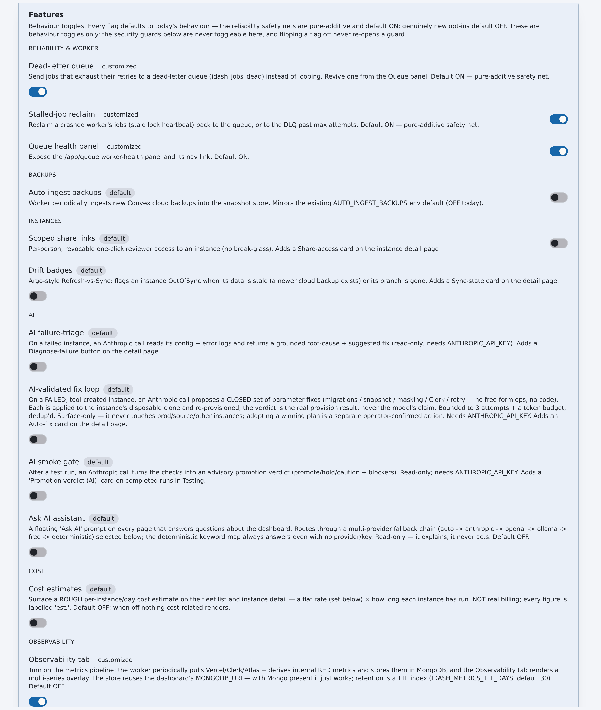

# flotilla — FAQ

**TL;DR** — The common "why is it built this way?" and "how is X done safely?"
questions, answered against the code and the deeper docs. The recurring themes: the
**worker runs off the request path** because provisioning streams tens of MB and
needs a filesystem; **every non-core subsystem is flag-gated off** so shipping dark
never changes anyone's behavior; **safety guards (prod hard-block, `dangerAck`,
forced PII masking) are never behind a flag**; and the whole app **degrades but
never crashes** when a dependency is unset. Each answer links the doc that goes
deeper. When prose and a `path:Lnnn` disagree, the code wins — file the doc as
stale.

**Status legend:** ✅ shipped · ◐ partial · 🔭 flag-gated / planned · ⚠️ caveat

---

## Architecture

**Q: Why is the worker a separate process instead of running provisions inline in the API?**
Route handlers only **enqueue** a job and return `{jobId}` immediately
(`app/api/instances/route.ts:47`); a standalone Node worker (`scripts/worker.ts`)
claims and runs the saga. A provision streams a tens-of-MB snapshot and needs a real
filesystem for the PII `unzip`/mask/`re-zip` step (`lib/jobs.ts:29`) — impossible
inside a serverless handler. `lib/` is shared by both; the split is runtime, not
code. For single-process local dev, `FLOTILLA_INLINE_WORKER=1` opts one process into
running jobs inline (`lib/jobs.ts:555`). See [ARCHITECTURE → Request & job
lifecycle](./ARCHITECTURE.md#request--job-lifecycle).

**Q: Can more than one worker run at once?**
Yes. `claimJob()` is an atomic single-winner flip from `queued→running`, so a
second worker (or a re-invocation) simply no-ops on an already-claimed job
(`lib/models/jobs.ts:138`). A `running` job whose 15 s heartbeat goes stale past the
lock timeout is reclaimed to `queued`, or dead-lettered to `flotilla_jobs_dead` past
`maxAttempts` (`lib/models/jobs.ts:178`, `:259`).

**Q: What happens when a provision fails halfway?**
The saga runner unwinds executed steps in reverse, running each step's registered
**compensating** action, so a half-built instance never lingers
(`lib/provision.ts:71`). ⚠️ A **FRESH preview** unwinds cleanly (the created Vercel
deployment is torn down); an **EXISTING refresh** has no data-restore compensator in
the HTTP engine — recover via snapshot restore. See the
[provisioning-failure runbook](./operations/provisioning-failure.md).

**Q: There are two provisioning engines — which one runs?**
`lib/executor.ts` (all-HTTP over Vercel REST + Convex cloud APIs) is the live path
the worker and jobs run; `lib/provision.ts` (CLI-driven `npx convex`) is legacy,
kept only for `scripts/refresh-staging.ts` and the shared `runSaga`/migration
constants (`lib/executor.ts:24`, `lib/provision.ts:62`). A dashboard launch takes
`executeProvision()`, not `provision()`. See [ARCHITECTURE →
Drift & gotchas](./ARCHITECTURE.md#drift--gotchas).

**Related:** [README.md](./README.md) · [ARCHITECTURE.md](./ARCHITECTURE.md) · [operations/provisioning-failure.md](./operations/provisioning-failure.md)

## Operations

**Q: Why are feature flags off by default?**
So enabling a flag "never changes behavior for anyone until its UI is used"
(`README.md:29`). Each flag defaults to *today's* behavior: reliability and safety
nets (`deadLetterQueue`, `stalledReclaim`, `queuePanel`) ship **ON**; genuinely new
subsystems (`observability`, `monitoring`, `askAi`, `costEstimates`, …) ship **OFF**
(`lib/models/config.ts:168`). Flipping a flag off **never** re-opens a security
guard — those live in their own modules. See [ARCHITECTURE → Feature
flags](./ARCHITECTURE.md#feature-flags).

*Feature flags live in the in-app Config page and default off.*

**Q: Which subsystems no-op when their env is unset?**
Everything optional degrades cleanly rather than crashing: the **snapshot store**
degrades off with no `SNAPSHOT_REPO` (`.env.example:54`); **AI** returns `409 "AI
not configured"` with no key (`.env.example:61`) and each provider is skipped when
its key is unset (`.env.example:81`); **observability** no-ops with no metrics Mongo
and shows an empty tab (`.env.example:135`); **auto-ingest** of backups is off
unless `AUTO_INGEST` is set (`.env.example:105`). The whole dashboard renders an
honest "connecting…" empty state, not an error, when a store is unreachable
(`lib/api.ts:19`). See [GLOSSARY → the "connecting…" degraded read
posture](./GLOSSARY.md#the-connecting-degraded-read-posture).

**Q: How can a real deployment be targeted safely?**
Three layered guards protect it. **Production is a hard block** — the
`PROD_CONVEX_DEPLOYMENT` (default `prod-deployment-a1b2c3`, or
`FLOTILLA_PROD_CONVEX_DEPLOYMENT`) can never be a write/refresh/teardown target, and
**no `dangerAck` overrides it** (`lib/deployments.ts:48`, `lib/executor.ts:164`). Any
other **pre-existing or shared** deployment requires an explicit `dangerAck=true` to
overwrite (`lib/executor.ts:172`). Keep `FLOTILLA_PROD_CONVEX_DEPLOYMENT` correct in
every environment — a wrong value weakens the hard-block. See [SECURITY →
Provisioning safety guards](./SECURITY.md#provisioning-safety-guards).

**Q: How is a failed provision diagnosed?**
Start from the `jobId` the POST returned (or the instance's `currentJobId`): read
`GET /api/jobs/:id` for status and consolidated log, or tail live via
`GET /api/jobs/:id/stream` (SSE). The job ends `failed` (engine threw) or
`rolled_back` (saga unwound); a stuck `running` job shows as a **stalled** count on
the Queue panel (`app/api/queue/route.ts:40`). The full decision tree —
auto-vs-manual recovery, dead-letter requeue, rollback — is in the
[provisioning-failure runbook](./operations/provisioning-failure.md).

**Q: Why did the metrics store move off Axiom?**
Axiom was the original observability store, but its dataset-creation API returns 500s
server-side, so the pipeline moved to MongoDB (a separate metrics cluster with a TTL
index) (`.env.example:138`). `lib/clients/axiom.ts` and all `AXIOM_*` env vars are
kept **dormant and unwired** — set them only to revive the client
(`.env.example:139`, `lib/observability/store.ts:1`). See [ARCHITECTURE → Drift &
gotchas](./ARCHITECTURE.md#drift--gotchas).

**Related:** [README.md](./README.md) · [ARCHITECTURE.md](./ARCHITECTURE.md) · [operations/](./operations/) · [.env.example](../.env.example)

## Security & access

**Q: How is an operator added or a role granted?**
RBAC has four ascending roles, `read-only → write → admin → super-admin`
(`lib/rbac.ts:9`). Admins invite, set-role, disable, and remove **non-admin** users
via the **Access** pane; only a **super-admin** may grant or revoke
`admin`/`super-admin` (the grant boundary `canManageRole`, `lib/rbac.ts:63`).
First-login bootstrap: `@example.com` emails self-provision at `read-only`, and any
address still in `ALLOWED_EMAILS` is auto-provisioned at `write` — a fail-closed
continuity bridge, not an allowlist gate; remove entries once operators are properly
invited (`lib/auth.ts:40`, `.env.example:101`). See [SECURITY → Authorization
map](./SECURITY.md#authorization-map).

**Q: Can an operator be locked out — or lock everyone else out?**
No. A hardcoded set of **immutable super-admins** always resolves to super-admin and
can never be demoted or removed, even by another super-admin (`lib/rbac.ts:39`); a
demote/disable/remove can never drop the fleet below one effective super-admin
(`app/api/access/route.ts:171`). Because ≥2 immutable super-admins always remain,
lockout is structurally impossible.

**Q: What happens if Clerk is down (break-glass)?**
A single `BREAKGLASS_EMAIL` identity signs in against a **scrypt hash held only in
env** (`BREAKGLASS_PASSWORD_HASH`, never plaintext), minting a signed httpOnly
session cookie whose HMAC key is derived from the hash itself
(`lib/breakglass.ts:94`, `:48`). A valid break-glass cookie resolves to
**super-admin** — the deliberate offline-remediation path (`lib/auth.ts:66`). The
login is rate-limited per IP but ⚠️ **fails open** on a store error, and the hash is
the only thing between an env leak and full control. See the
[break-glass runbook](./operations/break-glass-login.md).

**Q: How is PII masked in clones?**
`lib/mask.ts` is a **string-level JSONL rewriter** run in the worker *before*
`convex import`: it masks only identity fields (email/name/phone/address-ish) to a
`masked.invalid` domain and **never** touches `_id`, any `*Id` reference, Convex ids,
`authId`, `organizationId`, or numeric fields — so id-joins and financial rollups
survive byte-for-byte (`lib/mask.ts:1`, `:24`). It is deterministic and
referentially consistent (`@snaplet/copycat`, HMAC fallback). Masking is on by
default and **forced ON** for any prod or staging-prod source regardless of the
caller's `scrubPII` flag (`lib/executor.ts:245`). See [SECURITY → Sensitive
data](./SECURITY.md#sensitive-data-secrets--retention).

**Related:** [README.md](./README.md) · [SECURITY.md](./SECURITY.md) · [operations/break-glass-login.md](./operations/break-glass-login.md)

## Data & AI

**Q: Where do snapshots live, and why not Mongo?**
Convex snapshot ZIPs are 60–180 MB; they are stored as assets under a single
lazily-created GitHub Release (tag `blobs`) in a private `SNAPSHOT_REPO`, and the
`flotilla_backups` doc carries only a `blobRef` (`lib/clients/snapshotStore.ts:1`,
`.env.example:52`). They do not live in Mongo because these blobs once filled the
shared 512 MB Atlas cluster and caused an outage; Releases give free, out-of-Mongo,
HTTP-reachable storage (2 GB/asset). ⚠️ A legacy GridFS path is still *read* for old
rows, but new blobs never go to Mongo (`lib/executor.ts:107`). Restore steps:
[snapshot-restore runbook](./operations/snapshot-restore.md).

**Q: Why are there two MongoDB clusters?**
The dashboard's own state (`flotilla_*` collections) lives on the main `dashboard-primary`
cluster (`lib/mongo.ts:5`); high-volume observability time-series live on a
**separate** metrics cluster because the shared 512 MB cluster filled once and
blocked writes (`lib/mongo.ts:32`). Metrics carry a TTL index, so points past
`FLOTILLA_METRICS_TTL_DAYS` (default 30) are reaped (`.env.example:146`). See
[ARCHITECTURE → Data flow](./ARCHITECTURE.md#data-flow--persistence).

**Q: Can the AI change infrastructure?**
No — **the model proposes; nothing here disposes.** Informational surfaces
(Ask-AI, failure triage) are read-only; the only instance-changing helper is the
validated fix-loop, which applies a closed-enum `FixPlan` to the instance's **own
disposable preview** and re-provisions for real — the verdict is the actual
provision result, never the model's narrative (`lib/aiFixLoop.ts:337`). It re-derives
a scope guard on every call: tool-created only, never prod or shared, ≤3 attempts
(`lib/aiFixLoop.ts:95`). All AI is SDK-free direct `fetch` and degrades to a
deterministic keyword tier with no key. See [ARCHITECTURE → AI provider
chain](./ARCHITECTURE.md#ai-provider-chain).

**Related:** [README.md](./README.md) · [ARCHITECTURE.md](./ARCHITECTURE.md) · [DATA-MODEL.md](./DATA-MODEL.md) · [operations/snapshot-restore.md](./operations/snapshot-restore.md)

## UI

**Q: Why is there no sidebar?**
It is the **trueline** convention: a single non-wrapping horizontal top-nav whose tab
order mirrors the operator flow (instances → data/code/auth/users → test → audit →
logs) (`app/components/nav.tsx:10`). The nav must never wrap to a second line — on
narrow viewports it scrolls horizontally instead (`app/components/nav.tsx:43`). See
[GLOSSARY → Horizontal top-nav, never a
sidebar](./GLOSSARY.md#horizontal-top-nav-never-a-sidebar).

*The horizontal top-nav (no sidebar) — the trueline convention.*

**Q: Why does the UI say "connecting…" instead of showing an error?**
The defining trueline read posture: when a backing store or platform engine is
unreachable, reads return a **200 with an empty payload and a `reason`** (not an
error), and the UI renders an honest "connecting…" empty state instead of crashing
(`lib/api.ts:19`, `app/components/kit.tsx:187`). The dashboard is a worktree tool
that must build, typecheck, and render even with no Mongo/Clerk/Convex creds. See
[GLOSSARY → the "connecting…" degraded read
posture](./GLOSSARY.md#the-connecting-degraded-read-posture).

**Q: Why does every action pop a confirm dialog?**
A promise-based confirm modal that **every mutating action in every tab routes
through** before anything touches real Vercel/Convex/Clerk infra
(`app/components/kit.tsx:626`). It shows the exact target (deployment, branch,
backup) and styles prod/destructive confirms red — the UI half of the server-side
[`dangerAck`](./GLOSSARY.md#danger-ack-dangerack) gate. See [GLOSSARY →
Confirm-every-mutation guard](./GLOSSARY.md#confirm-every-mutation-guard).

**Q: How is a new table or page added?**
There is no UI-spec doc — **copy an existing tab.** Tables are the primary surface,
built from shared glass-table primitives (`Table`, `Th`, `Td`, `SortTh`/`useSort`,
`EmptyRow`) in `app/components/kit.tsx:32`; there are **no other bespoke or editable
tables** — extend these. Status colors go through the shared `Pill`/`Badge` palette
so a color means the same thing everywhere (`app/components/kit.tsx:400`). See
[GLOSSARY → Trueline design-language
conventions](./GLOSSARY.md#trueline-design-language-conventions).

**Related:** [README.md](./README.md) · [GLOSSARY.md](./GLOSSARY.md) · [CAPABILITY-MAP.md](./CAPABILITY-MAP.md)
