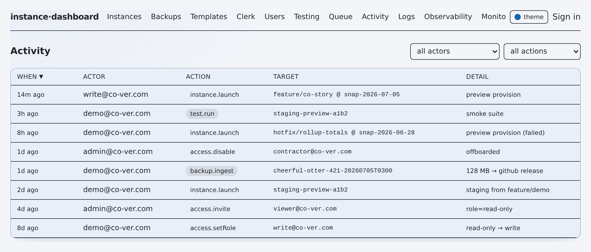

# flotilla — Security

**Summary.** This is a control plane that holds credentials for real infrastructure, so
the security bar is set accordingly. Access is gated by **Clerk** with a **scrypt
break-glass fallback** for the offline / no-Clerk path (`lib/auth.ts:63`,
`lib/breakglass.ts:94`). Authorization is a **four-role RBAC floor** enforced server-side
on every route (`lib/api.ts:29`, `lib/rbac.ts:31`) with a grant boundary and immutable
super-admins that can never be demoted or removed (`lib/rbac.ts:63`, `lib/rbac.ts:39`).
For a public demo, that floor gains a **read-only guest tier below `read-only`**, so an
unauthenticated visitor can browse the entire console and is **server-side-blocked from
every destructive action**. **No secrets live in the repo** — every credential is
environment-only and secret env files are gitignored. **PII is masked** before any
snapshot reaches a test instance, and masking is *forced* on prod-sourced data regardless
of caller intent (`lib/mask.ts:1`, `lib/executor.ts:245`). Writes to production are a
**hard, non-ackable block**; writes to other shared deployments require an explicit
`dangerAck` (`lib/executor.ts:164`, `lib/executor.ts:172`).

## Table of contents

- [Severity / confidence legend](#severity--confidence-legend)
- [Trust boundaries](#trust-boundaries)
- [Authentication](#authentication)
- [Authorization map](#authorization-map)
- [The public guest tier (demo)](#the-public-guest-tier-demo)
- [Provisioning safety guards](#provisioning-safety-guards)
- [Sensitive data, secrets & retention](#sensitive-data-secrets--retention)
- [Posture summary](#posture-summary)

## Severity / confidence legend

| Mark | Meaning |
|---|---|
| ✅ | Verified in code at the cited `path:Lnnn`. |
| ◐ | Partial — enforced, with a documented caveat or defense-in-depth caveat. |
| ⚠️ | Caveat / residual risk — read the note. |
| 🔭 | Planned / not yet enforced. |

Every load-bearing claim below cites the code that enforces it. If a line reference and this prose disagree, **the code wins** — treat the doc as stale and file it.

## Trust boundaries

The dashboard sits between a browser (an operator, or an unauthenticated guest) and the
credential-bearing worker that mutates managed instances. Each arrow crosses a trust
boundary; the guards on each are named in the sections below.

```
 ┌───────────┐   Clerk session / bg_session cookie    ┌────────────────────────────┐
 │  Browser  │ ─────────────────────────────────────► │  Dashboard (Next.js API)   │
 │ (operator │ ◄───────────────────────────────────── │  middleware.ts + getPrincipal
 │  or guest)│   masked reads, scrubbed errors         │  withOperator RBAC floor   │
 └───────────┘   (guest: passes GET, 403 on write+)    └─────────────┬──────────────┘
                                                                      │ enqueue job
                                                                      ▼
                                                        ┌────────────────────────────┐
                                                        │  Background worker         │
                                                        │  executor.ts preflight     │
                                                        │  (prod hard-block, dangerAck,
                                                        │   forced PII masking)      │
                                                        └───┬───────────────────┬────┘
                                                            │ env-only creds    │ mask before import
                                                            ▼                   ▼
   ┌──────────────────────────────────────┐   ┌──────────────────────────────────────┐
   │  External providers                  │   │  Managed Convex / Vercel instances   │
   │  Vercel · Convex · Clerk · GitHub ·  │   │  (preview / staging targets;         │
   │  Anthropic/OpenAI · MongoDB store    │   │   PRODUCTION is read-only)           │
   └──────────────────────────────────────┘   └──────────────────────────────────────┘
```

- **Browser ↔ Dashboard** — untrusted until a principal resolves. `middleware.ts:19` gates `/app(.*)`; every API route re-checks via `withOperator` (`lib/api.ts:29`). Reads are masked and error messages scrubbed before they cross back (`lib/api.ts:54`). A guest resolves below `read-only`: passes GET routes, `403`s on any write+ route. ✅
- **Dashboard ↔ Worker** — the worker runs off the request path and is the only component that mutates instances; its `preflight` step is the last line of defense (`lib/executor.ts:150`). A guest never enqueues a job, so this boundary is never reached on their behalf. ✅
- **Worker ↔ External providers** — credentials are supplied as env-only auth headers, never logged or echoed (`.env.example:63`). ✅
- **Worker ↔ Managed instances** — PRODUCTION is a read-only source; all other shared targets are `dangerAck`-gated (`lib/executor.ts:164`, `lib/executor.ts:172`). ✅

## Authentication

Route-level auth accepts **either** a Clerk session **or** the break-glass cookie, resolved by `getPrincipal` (`lib/auth.ts:63`). The break-glass cookie is checked first because it is cheap and works with zero Clerk keys configured (`lib/auth.ts:65`).

| Path | Mechanism | Fail-closed guarantee |
|---|---|---|
| **Clerk (primary)** | Matches the user's **primary** email and requires it be **verified**; an unverified or unknown email outside the allow-listed domain resolves to `null` (deny) | `lib/auth.ts:79`, `lib/auth.ts:82`; resolution matrix `lib/auth.ts:40` |
| **Break-glass (fallback)** | `BREAKGLASS_EMAIL` + password verified against a **scrypt** hash in env (`salt:hashHex`), constant-time compare; mints a signed, httpOnly, HMAC session cookie | `lib/breakglass.ts:94`, `lib/breakglass.ts:27`, `app/api/breakglass/route.ts:45` |

Notes:

- **`ALLOWED_EMAILS` is a fail-closed continuity bridge, not an allowlist gate.** RBAC supersedes the flat allowlist; an email still present in `ALLOWED_EMAILS` is auto-provisioned at `write` on first login (verified-email + fail-closed still required), and an allow-listed-domain email self-provisions at `read-only`. Everything else resolves to `null` (`lib/auth.ts:50`, `lib/auth.ts:55`, `lib/auth.ts:60`). ◐ — remove entries once operators are properly invited (`lib/auth.ts:21`).
- **Break-glass hardening.** The HMAC signing key is *derived from the scrypt hash* so it never appears in client-visible config (`lib/breakglass.ts:48`); tokens carry an 8h expiry checked on every verify (`lib/breakglass.ts:84`); the login route is rate-limited per client IP to blunt online brute-force (`app/api/breakglass/route.ts:24`); the password is never logged. ✅
- **Break-glass session = super-admin.** A valid break-glass cookie resolves to the highest role (`lib/auth.ts:67`) — the deliberate offline-remediation path. ⚠️ The scrypt hash is the only thing standing between an env leak and full control; keep `BREAKGLASS_PASSWORD_HASH` out of everything but `.env.local`.

## Authorization map

Roles are ordered `read-only < write < admin < super-admin`; the array index doubles as the enforcement rank (`lib/rbac.ts:13`, `lib/rbac.ts:15`). Every route gates on `roleAtLeast(principal.role, minRole)` via `withOperator`, defaulting to `read-only` so GET handlers stay open to any authenticated operator while mutations pass `write`/`admin`/`super-admin` (`lib/api.ts:32`, `lib/api.ts:35`). Denials are audited best-effort without changing the 403 outcome (`lib/api.ts:38`).


*The access pane — the four-role model as operators see it.*

| Capability | guest | read-only | write | admin | super-admin | Enforced at |
|---|:---:|:---:|:---:|:---:|:---:|---|
| Read dashboards / lists (GET routes) | ✅ | ✅ | ✅ | ✅ | ✅ | `lib/api.ts:32` (default floor) |
| Ordinary config defaults, provisioning jobs | — | — | ✅ | ✅ | ✅ | `withOperator(..., "write")` |
| `notifyWebhookUrl` / `ollamaUrl` / feature flags | — | — | — | ✅ | ✅ | `app/api/config/route.ts` |
| View the Access pane (user list + self role) | — | — | — | ✅ | ✅ | `app/api/access/route.ts:56` |
| Invite / set-role / disable / remove **non-admin** users | — | — | — | ✅ | ✅ | grant boundary `lib/rbac.ts:63` |
| Grant / revoke **admin** or **super-admin** | — | — | — | — | ✅ | `lib/rbac.ts:64` |

**The grant boundary** (`canManageRole`, `lib/rbac.ts:63`): granting or revoking `admin`/`super-admin` requires super-admin; an admin may fully manage only `read-only`/`write` users (invite, set-role, disable/enable, remove — one predicate governs all three destructive levers). A role *change* additionally requires the actor to be allowed to touch **both** ends of the transition (`canTransitionRole`, `lib/rbac.ts:72`), which stops an admin from demoting an admin. The route re-checks the boundary per action (`app/api/access/route.ts:138`, `:165`, `:195`, `:232`). ✅

**Immutable super-admins** (`IMMUTABLE_SUPERADMINS`, `lib/rbac.ts:39`): a hardcoded, source-defined set that *always* resolves to super-admin regardless of any stored/disabled row, and every mutation targeting them (set-role, disable, remove) is rejected at both the route and the model layer (`app/api/access/route.ts:133`, `:157`, `:185`, `:227`). ✅

**Lockout guard:** a demote/disable/remove can never drop the fleet below one effective super-admin (`app/api/access/route.ts:171`, `:201`, `:235`); because ≥1 immutable super-admin always remains, lockout is structurally impossible. ✅

## The public guest tier (demo)

The whole point of a *public* demo of an ops tool is that a stranger can look at the real
thing and be structurally unable to touch it. flotilla gets that for free from the same
`withOperator` floor above — the guest is just its bottom rung.

**How it works.** For the demo, principal resolution treats an unauthenticated request as
a **guest** with a role *below* `read-only`. `withOperator(handler, minRole)` runs before
every handler body:

- GET routes default to `minRole = "read-only"`, and a guest satisfies that floor for
  *reads* — so a guest sees every dashboard, list, log tail, and detail page.
- Every mutating route declares `minRole ∈ {write, admin, super-admin}`. A guest ranks
  below `write`, so **the gate returns `403` before the handler runs** — the mutation
  never parses a body, never calls `enqueue*()`, never writes a job. The
  credential-bearing worker is therefore never reached on a guest's behalf.

```
 request ──► middleware ──► withOperator(handler, minRole)
                                   │
              ┌────────────────────┼─────────────────────┐
        GET (read-only floor)                MUTATE (write+ floor)
              │                                        │
        guest satisfies floor                  guest ranks BELOW write
              ▼                                        ▼
        handler runs → 200                     403 (server-side) — no enqueue, no worker
```

**Why it's robust — not just a hidden button.** The block is at the route gate, not the
UI. A guest who copies the `POST /api/instances` call out of the network tab and replays
it by hand still gets a `403`; there is no client-trust anywhere in the decision. Reads
are additionally masked and errors scrubbed on the way back (`lib/api.ts:54`), so a guest
never sees a secret or a stack trace either.

**Defense in depth.** The guest tier composes with the [provisioning safety
guards](#provisioning-safety-guards): even if a demo were mis-seeded with an authenticated
operator, that operator still could not write to a production deployment (the hard block
is non-ackable). A public demo fleet is thus doubly fenced — the guest can't mutate at
all, and the guards can't be aimed at anything real.

> **Shipped vs demo.** The four-role floor, the server-side `withOperator` gate, and the
> production/shared guards are **shipped** invariants of the tool. The **guest tier** is
> the public demo's surface: the same gate, extended so an unauthenticated principal
> resolves below `read-only`. It relaxes nothing — it only *adds* a rung that can read but
> never write.

## Provisioning safety guards

All of the following live in the worker's `preflight` step (`lib/executor.ts:150`) and are independent of the RBAC floor — they are the last line of defense before a real deployment is touched.

| Guard | Behavior | Cite |
|---|---|---|
| **Production hard-block (write)** | Provisioning that would overwrite the production Convex deployment throws — no `dangerAck` can override it; PRODUCTION is a read-only *source* only | `lib/executor.ts:164` ✅ |
| **Production hard-block (teardown)** | Tearing down the production deployment throws; protected Vercel projects (the production/main app project, shared staging, …) are never deleted | `lib/executor.ts:370`, `lib/executor.ts:349` ✅ |
| **`dangerAck` on shared deployments** | Re-provisioning any pre-existing deployment requires explicit `dangerAck=true`; a shared Vercel project likewise | `lib/executor.ts:172`, `lib/executor.ts:160` ✅ |
| **Email kill-switch preflight** | Best-effort refusal to overwrite a target whose env marks it as email-sending (`ALLOW_OUTBOUND_EMAIL=true`) — never send real email from a clone | `lib/executor.ts:194` ◐ (best-effort) |
| **Forced prod-data masking** | When the snapshot source is `PRODUCTION`/`staging-prod`, masking is forced ON regardless of the caller's `scrubPII` flag — a test env must never receive raw prod identity PII | `lib/executor.ts:245`, `lib/executor.ts:82` ✅ |

The prod/shared topology that drives these guards is centralized in one env-overridable module (`lib/deployments.ts`), with baked defaults so the guards stay fail-safe when unconfigured. `FLOTILLA_PROD_CONVEX_DEPLOYMENT` names the hard-block target (`lib/deployments.ts:48`); `FLOTILLA_SHARED_DEPLOYMENTS` maps names to danger-gated roles (`lib/deployments.ts:52`); `isSensitiveDeployment` flags prod + staging-prod for the UI (`lib/deployments.ts:79`). ⚠️ Keep `FLOTILLA_PROD_CONVEX_DEPLOYMENT` correct in **every** environment — a wrong value weakens the hard-block.

## Sensitive data, secrets & retention



*The activity view — every privileged action is audited.*

- **PII masking before import.** `lib/mask.ts` performs a deterministic, referentially-consistent, string-level transform of a Convex snapshot *before* import, so real identity PII never lands on a test instance (`lib/mask.ts:1`). It masks identity fields only (email / name / phone / address-ish and `*Email`/`*Name`) to a `masked.invalid` domain (`lib/mask.ts:33`) and **never** touches `_id`, `_creationTime`, any `*Id` reference, Convex ids, or numeric/financial fields so id-joins and rollups survive (`lib/mask.ts:36`). Masking is on by default (`FLOTILLA_MASK_BY_DEFAULT=true`, `.env.example:116`) and *forced* for prod sources (see above). A residual-email scan runs after masking (`lib/executor.ts:459`). ✅
- **Mask hash-key hardening.** copycat's default SipHash key is a PUBLIC constant, so an attacker holding the public seed + a known dataset could pre-compute copycat's output and reverse a masked identity value. Set the env-only, never-logged `FLOTILLA_MASK_HASH_KEY` and it is fed to copycat's `setHashKey()` and mixed into the HMAC-fallback key, salting every masked value with a credential the attacker does not have (`lib/mask.ts:89`, `resolveMaskHashKey`). Determinism is retained **for a given key** — same key + same input ⇒ identical output ⇒ `_id`-joins and rollups still line up. **Back-compat:** UNSET/blank ⇒ byte-for-byte the prior default-seed behaviour (no forced migration). ⚠️ **Operational note:** the key is a STABLE per-deployment credential — changing it changes the *entire* mapping, so rotate only alongside a full re-mask/refresh. ✅
- **No secrets in the repo.** Every credential is environment-only; `.env.example` ships placeholders only, and secret env files (`.env`, `.env*.local`) plus belt-and-suspenders patterns (`*.pem`, `*.key`, `credentials*.md`, `*secret*.env`) are gitignored (`.gitignore:5`, `.gitignore:14`). ✅
- **Scrubbed error surface.** Unhandled server errors log server-side but return a generic `internal error` / `<reason> (unavailable)` to the client so Mongo URIs, driver internals, and paths never leak to an authenticated caller — or a guest (`lib/api.ts:54`, `lib/api.ts:73`). ✅
- **Config secret masking.** Monitoring webhook/config secrets are masked on read and preserved on redacted writes so a UI round-trip can't clobber the real value. ✅
- **Break-glass hash.** Stored as an env-only scrypt `salt:hashHex` — never a plaintext password in source or env (`lib/breakglass.ts:19`, `.env.example:10`). ✅
- **Metrics retention (TTL).** Observability samples are reaped by a Mongo TTL index; `FLOTILLA_METRICS_TTL_DAYS` defaults to 30 and caps how deep backfill history is retained (`.env.example:143`). Instances can auto-expire via `FLOTILLA_DEFAULT_TTL_HOURS` (`.env.example:118`). ✅

## Posture summary

| Control | Where | State |
|---|---|---|
| Server-side authorization on every route | `withOperator` (`lib/api.ts:29`) | ✅ shipped |
| Four-role RBAC + grant boundary + immutable super-admins | `lib/rbac.ts` | ✅ shipped |
| Read-only public guest tier | principal resolution + `withOperator` | ✅ shipped (demo surface) |
| Production write/teardown hard-block (non-ackable) | `lib/executor.ts`, `lib/deployments.ts` | ✅ shipped |
| `dangerAck` on any pre-existing/shared target | `lib/executor.ts:172` | ✅ shipped |
| Forced, deterministic PII masking of prod-sourced data | `lib/mask.ts`, `lib/executor.ts:245` | ✅ shipped |
| Scrypt break-glass with derived HMAC + rate-limit | `lib/breakglass.ts`, `lib/ratelimit.ts` | ✅ shipped |
| No secrets in the repo; env-only credentials | `.gitignore`, `.env.example` | ✅ shipped |
| Scrubbed errors + masked reads across the trust boundary | `lib/api.ts` | ✅ shipped |
| Optional AI surfaces read-only by posture ("model proposes; nothing disposes") | `lib/aiRouter.ts`, `lib/aiFixLoop.ts` | 🔭 flag-gated (off) |

---

**Related:** [README.md](./README.md) · [ARCHITECTURE.md](./ARCHITECTURE.md) · [DATA-MODEL.md](./DATA-MODEL.md) · [DECISIONS.md](./DECISIONS.md)
