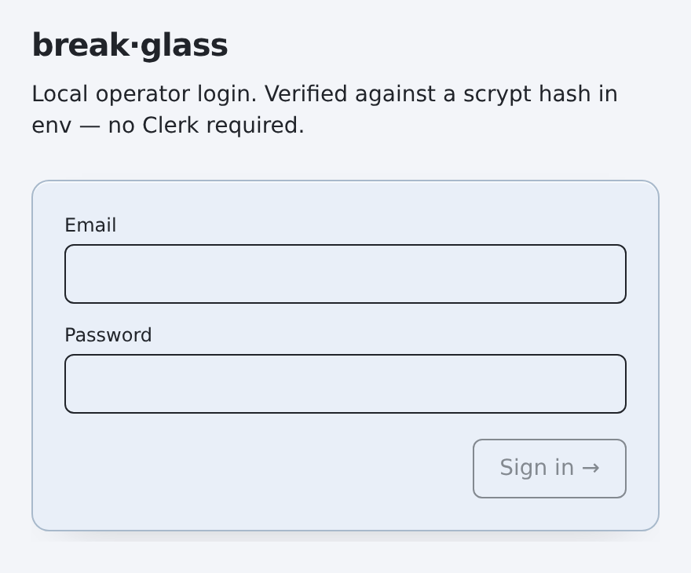
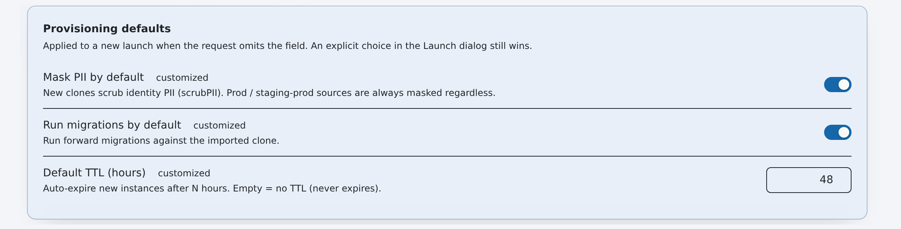

# Getting started

## The 60-second picture

flotilla is the operator console for provisioning, refreshing, and
tearing down preview/staging application instances across Vercel + Convex +
Clerk. It's a Next.js (App Router) app backed by MongoDB, gated by Clerk auth
(with a scrypt break-glass fallback), plus a **standalone background worker**
that runs the long provisioning jobs off the request path. This doc ends with
two processes running locally: the **dashboard** (`npm run dev`, at
http://localhost:3000) showing an honest empty state, and the **worker**
(`npm run worker`) polling the job queue. Every non-core subsystem
(observability, monitoring, AI) is feature-flagged **off** and no-ops cleanly
until configured, so a minimal env is enough to boot and grow from there.

> **Legend:** ✅ success signal · 🔭 optional / can skip for a first boot ·
> ⚠️ gotcha worth reading before you hit it.

## Prerequisites

- **Node.js ≥ 20.** The worker and the `scripts/*.ts` CLIs run TypeScript
  directly via `node --experimental-strip-types`, which needs **Node ≥ 22.6**.
  On older Node (20.x / 21.x), run them through `tsx` instead (it's already a
  devDependency) — e.g. `npx tsx scripts/worker.ts`. The Next.js dev server
  itself is fine on Node ≥ 20.
- **A MongoDB instance** — Atlas or a local `mongod`. This is the persistence
  layer for instances, config, the job queue, metrics, and monitoring.
- **A Clerk application** (publishable + secret key) for the dashboard auth
  gate. 🔭 Defer this and use the **break-glass** login for a first boot — see
  Troubleshooting.

## Setup & run

**1. Install dependencies.**

```bash
npm install
```

**2. Create your local env file.**

```bash
cp .env.example .env.local   # never commit .env.local — it's gitignored
```

Open `.env.local` and fill in values. `.env.example` documents every var
inline, grouped by subsystem. A first local boot needs only a small
**required** core; everything else is optional and no-ops when unset.

**Strictly required to boot + log in:**

```bash
# --- Persistence (.env.example §Persistence, lines ~12–14) ---
MONGODB_URI=            # your Atlas SRV string or mongodb://localhost:27017
MONGODB_DB=flotilla # already defaulted in .env.example

# --- Dashboard auth: pick ONE path ---
# Path A — Clerk gate (.env.example §Dashboard auth, lines ~4–7):
NEXT_PUBLIC_CLERK_PUBLISHABLE_KEY=
CLERK_SECRET_KEY=
CLERK_JWT_ISSUER_DOMAIN=
# ⚠️ With Clerk enabled, ALLOWED_EMAILS is REQUIRED and FAIL-CLOSED:
# an empty/unset value denies ALL logins (.env.example line ~100–102).
ALLOWED_EMAILS=you@example.com

# Path B — Break-glass (no Clerk needed; .env.example lines ~8–10):
# Leave the CLERK_* vars blank and set a scrypt password hash instead.
BREAKGLASS_EMAIL=you@example.com
BREAKGLASS_PASSWORD_HASH=   # scrypt hash, never plaintext — see lib/breakglass.ts
```

> ⚠️ **Auth is one-or-the-other, driven by `NEXT_PUBLIC_CLERK_PUBLISHABLE_KEY`.**
> If it's set, `middleware.ts` runs the Clerk gate (and enforces
> `ALLOWED_EMAILS`); if it's blank, `/app` is gated on the break-glass session
> cookie and unauthenticated visitors bounce to `/breakglass`.

**Optional subsystems** — leave blank for a first boot; each degrades to a
no-op / honest empty state when unset:

- 🔭 **Platform automation** (`VERCEL_TOKEN`, `CONVEX_ACCESS_TOKEN`,
  `CONVEX_TEAM_ID` + `CONVEX_PROJECT_ID`, …; `.env.example` §Platform automation
  / §Managed deployment topology). Needed by the **worker** to actually
  provision — not needed just to load the dashboard.
- 🔭 **GitHub / snapshot store** (`GITHUB_TOKEN`, `SNAPSHOT_REPO`;
  §GitHub, lines ~45–55). Unset → the snapshot store degrades off.
- 🔭 **AI assist** (`ANTHROPIC_API_KEY`, `OPENAI_API_KEY`, …, plus the
  `FLOTILLA_FEATURE_AI_*` / `FLOTILLA_FEATURE_ASK_AI` flags; §AI failure triage /
  §Ask AI). Flag-gated off; "Ask AI" falls back to a deterministic keyword tier
  with no key, so it never hard-fails.
- 🔭 **Observability** (`FLOTILLA_FEATURE_OBSERVABILITY`, `ATLAS_API_*`;
  §Observability tab). Reuses `MONGODB_URI` for its store — no separate creds.
  Absent Mongo/flag → the pipeline no-ops and the tab shows an empty state.

**3. Start the dashboard.**

```bash
npm run dev   # Next.js dev server on http://localhost:3000
```

**4. In a second terminal, start the worker.**

```bash
npm run worker   # standalone job worker; polls flotilla_jobs every ~3s
# Node < 22.6? Run it through tsx instead:
#   npx tsx scripts/worker.ts
```

> 🔭 For a single-process local setup, skip the separate worker and set
> `FLOTILLA_INLINE_WORKER=1` (`.env.example` §Worker, lines ~90–94) to also execute
> jobs in-process.

## Setup is complete when…


*After sign-in, the dashboard opens on the instances view.*

- ✅ `npm run dev` compiles and **http://localhost:3000** redirects to `/app`
  and prompts for sign-in (Clerk `/sign-in`, or `/breakglass` in break-glass
  mode).
- ✅ After logging in, the dashboard **loads with an honest empty state** — no
  instances yet, tables empty rather than erroring. That's expected on a fresh
  Mongo.
- ✅ The worker terminal prints
  `[worker] polling flotilla_jobs every 3000ms — Ctrl-C to stop` and keeps ticking
  without errors. It's connected to Mongo and waiting for jobs.

## Common commands

| Command | What it does |
|---|---|
| `npm run dev` | Next.js dev server (the dashboard) on :3000. |
| `npm run worker` | Standalone job worker — drains provisioning/teardown jobs, runs TTL + stalled-job sweeps, optional backup/metrics polls. |
| `npm run build` | Production build (`next build`, standalone output). |
| `npm run start` | Serve the production build. |
| `npm run verify` | The pre-commit gate: `lint` + `typecheck` + `test`. |
| `npm run lint` | ESLint over the repo. |
| `npm run typecheck` | `tsc --noEmit`. |
| `npm run test` | Vitest unit tests (`__tests__/`). |
| `npm run provision` | CLI: provision an instance directly (script entrypoint). |
| `npm run refresh-staging` | CLI: refresh staging from a snapshot. |
| `npm run auto-refresh` | CLI: scheduled staging auto-refresh. |
| `npm run sync-backups` | CLI: scan Convex cloud backups → ingest into the snapshot store. |
| `npm run metrics-poll` | CLI: run one observability metrics poll (`--backfill` to force a deep backfill). |

## Troubleshooting

- ⚠️ **Dashboard loads but everything errors / worker can't connect —
  `MONGODB_URI` missing or wrong.** Mongo is required to boot. Confirm your
  local `mongod` is up (or your Atlas SRV string + IP allowlist are correct) and
  that `MONGODB_DB` matches (`flotilla` by default).
- ⚠️ **Clerk login denies you even with valid credentials — empty
  `ALLOWED_EMAILS`.** With Clerk enabled this var is **fail-closed**: an
  empty/unset value denies *all* logins. Add your email (comma-separated for
  multiple). See `.env.example` lines ~100–102.
- ⚠️ **No Clerk app handy? Use the break-glass path.** Leave
  `NEXT_PUBLIC_CLERK_PUBLISHABLE_KEY` blank; `middleware.ts` then gates `/app`
  on the break-glass cookie and routes you to `/breakglass`. Set
  `BREAKGLASS_EMAIL` + a scrypt `BREAKGLASS_PASSWORD_HASH` (see
  `lib/breakglass.ts`; the hash lives only in env, never plaintext).



*The break-glass login page — the fallback when the Clerk gate is unavailable.*

- ⚠️ **`node --experimental-strip-types` errors / worker won't start on older
  Node.** That flag needs Node ≥ 22.6. On 20.x/21.x, run the scripts via
  `npx tsx scripts/worker.ts` (and likewise for the other `scripts/*.ts`).
- 🔭 **Observability / monitoring / AI tabs look empty or dormant — that's by
  design.** These subsystems are feature-flagged off (`FLOTILLA_FEATURE_*`) and
  no-op when their env is absent. Enable them in **Config → Features** (or via
  the `FLOTILLA_FEATURE_*` env defaults) once you've supplied the relevant keys.



*The in-app Config page — runtime overrides of the environment defaults.*

- 🔭 **Provisioning jobs never run.** Loading the dashboard needs only Mongo +
  auth, but *executing* provisions needs the platform-automation creds
  (`VERCEL_TOKEN`, `CONVEX_ACCESS_TOKEN`, `CONVEX_TEAM_ID`/`CONVEX_PROJECT_ID`,
  …) and a running worker (or `FLOTILLA_INLINE_WORKER=1`).

## Next steps

- **`docs/ARCHITECTURE.md`** — how the app, API routes, worker, and MongoDB
  fit together.
- **`docs/CAPABILITY-MAP.md`** — the subsystems and what each one owns.
- **`docs/GLOSSARY.md`** — the domain vocabulary (instances, snapshots, jobs,
  roles).
- **`docs/onboarding/developer-onboarding.md`** — the deeper dive once you're
  running: codebase tour, RBAC model, and the feature-flag workflow.
