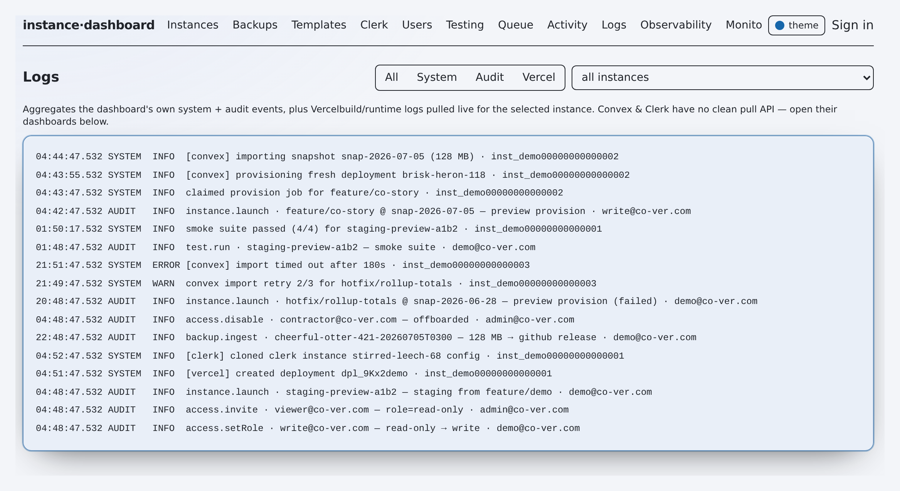

# Runbook: Provisioning / refresh failure

**TL;DR** — A provision / update / refresh / teardown **job** failed, rolled back, or is stuck. This is how to read the job state, decide auto-vs-manual recovery, retry or roll back through the saga's compensating steps, and requeue from the dead-letter queue.

**Status legend:** ✅ shipped · ◐ partial · 🔭 flag-gated / planned · ⚠️ caveat


*The queue view — where failed and stalled provision jobs surface (DLQ + stalled-reclaim).*

---

## Symptom

Provisioning is **async**: `POST /api/instances` only enqueues a `queued` job and returns `{jobId, instanceId}` immediately (`app/api/instances/route.ts:47`); the standalone worker (`scripts/worker.ts`) claims and runs it. A failure surfaces in one of these places:

- **Instance state** — the instance flips to `status:"failed"`, `health:"down"` (`lib/jobs.ts:663`, `:670`). Instance enums: `pending | provisioning | ready | failed | archived` and health `unknown | provisioning | healthy | degraded | down` (`lib/models/instances.ts:18-19`).
- **Job status** — the job ends `failed` (engine threw / reported failure) or `rolled_back` (saga unwound compensations). Job enum: `queued | running | succeeded | failed | rolled_back` (`lib/models/jobs.ts:14`). Read it at `GET /api/jobs/:id` (`app/api/jobs/[id]/route.ts:9`) or live via SSE `GET /api/jobs/:id/stream`.
- **Log line** — the consolidated `flotilla_logs` tail shows `provision FAILED (unwound): instance=…` (`lib/executor.ts:319`) and, per failed step, `✗ step: <name> — <detail>` plus any `↩ compensating: <name>` / `‼ compensation FAILED` (`lib/provision.ts:86,95,99`). Read via `GET /api/logs?instanceId=…` (`app/api/logs/route.ts:50`) or the job-scoped logs in `GET /api/jobs/:id`.
- **Proactive alert** — the worker fires a `job.failed` notification on a terminal `failed` / `rolled_back` outcome (`scripts/worker.ts:158`).
- **Stuck (no terminal state)** — the job sits `running` with no progress; the worker may have crashed mid-run. Surfaces on the queue panel as a **stalled** count (`GET /api/queue` → `stalledCount`, `app/api/queue/route.ts:40`).

---

## Preconditions & blast radius

The provisioning engine is a **linear saga**: each step may register a **compensating action**, and on an uncorrectable throw the runner unwinds executed steps in reverse, best-effort (`runSaga`, `lib/provision.ts:71-107`). What a failed run does and doesn't touch depends on **FRESH vs EXISTING** and on which step failed.

Saga steps (`lib/executor.ts`): `preflight` → `provision-convex` → `deploy-code` → `import-data` → `reset-auth` → `migrations` → `clerk-select` → `verify`.

- ✅ **Preflight is a hard safety gate** and fails **before** anything is touched. It blocks the prod Vercel project (`lib/executor.ts:157`), the prod Convex deployment (`:164`), and refuses an EXISTING/shared target without `dangerAck` (`:160`, `:172`). A best-effort email kill-switch check refuses any EXISTING target with `ALLOW_OUTBOUND_EMAIL=true` (`:198`). A preflight failure has **zero blast radius**.
- ⚠️ **Only `deploy-code` registers a compensator**, and only for a **fresh preview** — it deletes the Vercel deployment the tool just created (`lib/executor.ts:221`). So a FRESH failure unwinds cleanly: the created Vercel deployment is torn down, and the fresh Convex preview is disposable (auto-expires; reclaimed fully by teardown, `lib/executor.ts:401`).
- ⚠️ **An EXISTING refresh has NO data-restore compensator in the worker's HTTP engine.** `import-data` runs `replaceAll:true` (`lib/executor.ts:259`); if a later step throws there is nothing to restore the pre-import data. (The legacy CLI `provision()` snapshots-then-restores — `lib/provision.ts:199-217` — but the worker runs `executeProvision`, which does not.) **Blast radius of a failed EXISTING refresh = the target deployment may be left with newly-imported (masked) data and no automatic rollback.** Recover via snapshot restore (below).
- ✅ **`reset-auth` and `migrations` are best-effort, not fatal** — over HTTP they warn and defer rather than throw (`lib/executor.ts:273`, `:288`), so they do not by themselves trigger an unwind.
- ✅ **Nothing prod or shared is ever written or deleted** — the preflight/teardown guards (`SHARED_DEPLOYMENTS`, `PROTECTED_VERCEL_PROJECTS`) enforce that on every path (`lib/executor.ts:164-176`, `:349`, `:370-378`).
- ⚠️ **PII source safety still holds on failure** — a prod/staging-prod snapshot source forces masking on regardless of the `scrubPII` flag (`lib/executor.ts:248-251`), so a half-import never lands raw prod PII.

---

## Diagnosis



*The logs view — the merged system and audit stream for tracing a failed job.*

1. **Get the job + its logs** (fastest single call — status, steps, and consolidated log):
   ```bash
   # jobId from the POST /api/instances response, or the instance's currentJobId
   curl -s "$FLOTILLA_URL/api/jobs/$JOB_ID" | jq '{status: .job.status, error: .job.error, attempts: .job.attempts, steps: .job.steps}'
   ```
   - `status:"failed"` + `error` set → the engine **threw** (`lib/jobs.ts:669`).
   - `status:"rolled_back"` → a step failed and the saga **unwound** compensations (`lib/jobs.ts:657`); look for `steps[].rolledBack:true`.

2. **Find the failing step.** In `.job.steps`, the first `ok:false` entry's `name` + `detail` is the root cause (e.g. `preflight`, `provision-convex`, `deploy-code`, `import-data`). Preflight `detail` usually names the exact guard it hit.

3. **Read the consolidated log** for the human trace (Vercel build errors, Convex import errors, compensation results):
   ```bash
   curl -s "$FLOTILLA_URL/api/logs?instanceId=$INSTANCE_ID&limit=200" | jq -r '.entries[] | "\(.level)\t\(.source)\t\(.message)"'
   ```
   Look for `✗ step: …`, `↩ compensating: …`, `‼ compensation FAILED …`, and the final `provision FAILED (unwound)` / `succeeded` line.

4. **Check the instance's own view** (did it flip to `failed`/`down`, or is it still `provisioning`?):
   ```bash
   curl -s "$FLOTILLA_URL/api/instances/$INSTANCE_ID" | jq '.instance | {status, health, currentJobId, createdByTool, convexDeployment: .createdConvexDeployment, vercelDeploymentId}'
   ```

5. **If the job is stuck `running` (no terminal state), check the queue health** for stalled / dead-letter counts:
   ```bash
   curl -s "$FLOTILLA_URL/api/queue" | jq '{depth, oldestUnstartedAgeMs, stalledCount, dlqCount, lockTimeoutMs, maxAttempts, dlq: [.dlq[] | {id, type, deadReason, attempts}]}'
   ```
   A `running` job whose lock heartbeat is older than `lockTimeoutMs` (default **120s**, `lib/models/jobs.ts:178`) is presumed crashed and will be swept (see Remediation). Also confirm a **worker is actually running** — no worker means jobs sit `queued` forever:
   ```bash
   # is the worker process up? it logs "polling flotilla_jobs every …ms"
   ps aux | grep -F 'scripts/worker.ts' | grep -v grep
   ```

6. **Check the worker's own stdout** for the claim / outcome / sweep lines (`[worker] job … → failed`, `[worker] stalled-job sweep: …`) — these are console-only, separate from `flotilla_logs`.

---

## Remediation

Pick the path by what Diagnosis found.

### A. Stuck / crashed worker (job pinned `running`) — usually **automatic**
The worker's reclaim sweep runs every poll (flag `stalledReclaim`, default **ON**, `scripts/worker.ts:177`):
- A stale-locked job under `maxAttempts` (default **3**) is **reclaimed → `queued`** and re-run automatically (`lib/models/jobs.ts:206`).
- Once it has exhausted attempts it is **dead-lettered** (flag `deadLetterQueue`, default ON) into `flotilla_jobs_dead` (`lib/models/jobs.ts:228`), or terminal-`failed` if the DLQ is off.

✅ **Action: usually just wait** ~one lock-timeout (2 min) + a poll for the sweep. If no worker is running, start one — that alone drains reclaimed jobs:
```bash
npm run worker    # or: node --experimental-strip-types --env-file=.env.local scripts/worker.ts
```

### B. Requeue a dead-lettered job (DLQ)
If Diagnosis step 5 showed the job in `.dlq`, revive it — it re-enters the queue as a fresh `queued` row (attempts reset, same id/idempotencyKey) (`requeueDeadJob`, `lib/models/jobs.ts:314`):
```bash
curl -s -X POST "$FLOTILLA_URL/api/queue" \
  -H 'content-type: application/json' \
  -d "{\"action\":\"requeue\",\"id\":\"$DEAD_JOB_ID\"}"
```
Fix the underlying cause first (see C/D) — a requeue with no change just re-fails.

### C. Terminal `failed` / `rolled_back` — retry (primary)
For a FRESH provision the saga already tore down the Vercel deployment it created and the Convex preview is disposable, so retrying is safe.

⚠️ **Do not simply re-POST the same body.** Enqueue converges on `idempotencyKey` via `$setOnInsert` (`lib/models/base.ts:53-57`, `lib/jobs.ts:97`), so a re-submit with the **same** params returns the old **failed** row and does **not** re-run. Instead:

- **Re-provision a changed dimension via PATCH** (fresh idempotency key derived from the changed dims — `lib/jobs.ts:209`):
  ```bash
  # e.g. point at a fixed branch (code) or a different snapshot (data)
  curl -s -X PATCH "$FLOTILLA_URL/api/instances/$INSTANCE_ID" \
    -H 'content-type: application/json' \
    -d '{"branch":"fix/my-branch"}'
  ```
- **Or launch fresh with a distinct `idempotencyKey`** (`app/api/instances/route.ts` accepts `idempotencyKey`):
  ```bash
  curl -s -X POST "$FLOTILLA_URL/api/instances" -H 'content-type: application/json' \
    -d '{"branch":"main","kind":"preview","migrations":true,"scrubPII":true,"idempotencyKey":"retry-2026-07-07-a"}'
  ```
- **Overwriting a shared / pre-existing (EXISTING) target requires `dangerAck:true`** or preflight refuses it (`lib/executor.ts:160,172`).

### D. Rollback / cleanup
- **FRESH instance left broken** — tear it down to reclaim any residue (worker runs `executeTeardown` behind the same prod/shared guards; only `createdByTool` instances qualify, `lib/jobs.ts:280`):
  ```bash
  curl -s -X DELETE "$FLOTILLA_URL/api/instances/$INSTANCE_ID"          # add ?dryRun=true to preview
  ```
- ⚠️ **EXISTING refresh left with unwanted imported data** — there is **no automatic data rollback** in the HTTP engine. Restore the target Convex deployment from its pre-refresh snapshot: **see [snapshot-restore.md](./snapshot-restore.md)** (🔭).
- **Verify recovery**: re-run Diagnosis steps 1 & 4 — expect job `succeeded` and instance `status:"ready"`, `health:"healthy"` (`lib/jobs.ts:627-629`).

---

## Escalation

Escalate when:
- ⚠️ A **compensation FAILED** (`‼ compensation FAILED for <step>` in the log) — a resource may be orphaned (e.g. a Vercel deployment that wasn't deleted). Reconcile manually and page the owner.
- ⚠️ Preflight was **bypassed** or a job wrote toward a `SHARED_DEPLOYMENTS` / prod target — treat as a security incident.
- An **EXISTING** deployment holds unexpected or apparently-unmasked data after a failed refresh, or residual real emails were flagged (`residual-email scan flagged …`, `lib/executor.ts:461`).
- The DLQ keeps refilling after a clean requeue, or the worker crash-loops.

Owner / on-call and the security-response contract: **[../SECURITY.md](../SECURITY.md)** (⚠️ WHO-OWNS-WHAT / security escalation).

---

## Prevention

- ✅ **Dry-run first** for risky refreshes — `dryRun:true` records intent and skips the download/import (`lib/executor.ts:238`).
- ✅ **Keep `dangerAck` deliberate** — never script it as a default; the ack is the guardrail on overwriting shared/EXISTING deployments (`lib/executor.ts:172`).
- ✅ **Keep the reliability nets ON** — `stalledReclaim` + `deadLetterQueue` default ON and are the safety floor against silently-stuck provisions (`scripts/worker.ts:179,183`).
- ✅ **Run ≥1 worker with monitoring** — a dead worker turns every launch into a stuck `queued` job; watch `GET /api/queue` `oldestUnstartedAgeMs` as the "worker falling behind" signal (`lib/models/jobs.ts:461`).
- ◐ **Snapshot EXISTING targets before a refresh** so a failed import has a restore point (the HTTP engine won't do it for you) — track alongside [snapshot-restore.md](./snapshot-restore.md).
- **Follow-up after every incident**: capture the failing `steps[].name` + `detail` on the ticket; recurring same-step failures usually mean a config/credential fix, not a retry.

---

**Related:** [Operations index](./README.md) · [ARCHITECTURE](../ARCHITECTURE.md) · [CAPABILITY-MAP](../CAPABILITY-MAP.md)
