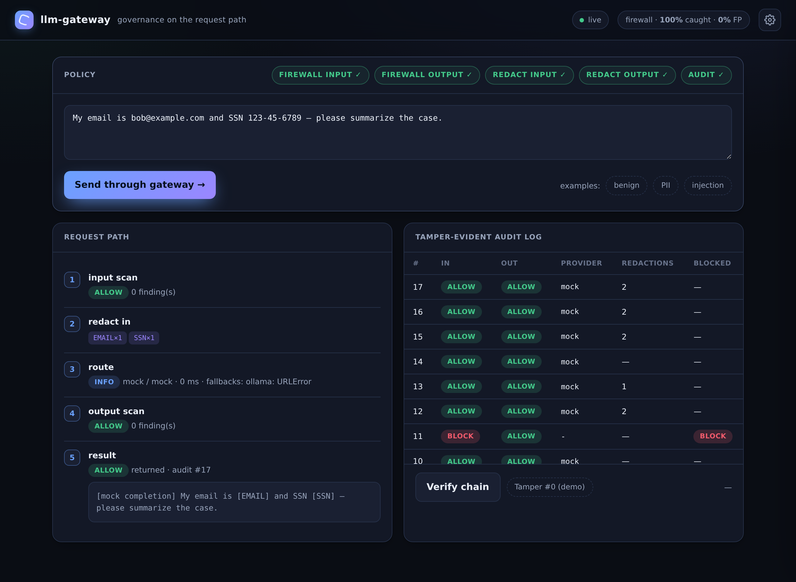

# llm-gateway

[](https://github.com/MarcBittner/ai-portfolio/actions/workflows/projects-ci.yml)
[](LICENSE)
[](https://www.python.org)
[](https://github.com/astral-sh/ruff)
[](https://fastapi.tiangolo.com)



**[▶ Live demo](https://llm-gateway-jwsq.onrender.com)**

A **provider-agnostic LLM gateway** that puts governance *on the request path* —
not in a wrapper a caller can forget. Every completion runs the same pipeline:
input firewall → redaction → routing → output firewall → redaction →
tamper-evident audit log. The guardrails are deterministic (no model, no
network); routing is the portfolio-standard chain — **paid (Anthropic → OpenAI)
→ local (Ollama) → free (OpenRouter) → a deterministic offline mock** — so it
runs (and the eval reproduces) with zero keys, and switches to real providers via
environment variables. It is the reusable substrate for shipping LLM features in
regulated settings (the demo data is a **regulated advisor copilot**):
vendor-neutral, governed by default, auditable.

> Offline by default — deterministic firewall + redaction and a mock provider,
> so reviewers need no keys and incur no cost. Real providers switch on via env.
> All eval/sample data is **synthetic and clearly fictional** (client names,
> accounts, and secrets are invented; **no real client data** ever touches it);
> the audit log stores **only redacted** text, and findings never echo a detected
> secret.

## Architecture

The gateway is a small set of single-responsibility modules. `gateway.complete`
is the only orchestrator; everything else is a pure, independently testable
stage it calls in sequence.

| Module | Responsibility |
|---|---|
| `gateway.py` | Orchestration. Runs the pipeline; finalizes + audits every call. |
| `firewall.py` | Direction-aware scan → verdict `allow`/`flag`/`block` + risk score. |
| `redact.py` | PII + secret detection/redaction; returns type + count, never values. |
| `llm.py` | Multi-provider router (paid → local → free → offline) + circuit breaker + latency. |
| `audit.py` | Append-only, hash-chained, tamper-evident log of redacted entries. |
| `policy.py` | Which governance layers enforce; default-ON, env-overridable. |
| `evaluate.py` | Scores the firewall on a labeled set (detection / false-positive). |
| `data.py` | Labeled, synthetic adversarial + benign prompts for the eval. |
| `api.py` | FastAPI surface + the governance console (`static/`). |
| `models.py` | Pydantic request/response shapes. |

### The pipeline

```
                                  gateway.complete(prompt, provider, policy)
                                                  │
  prompt ─▶ ① firewall.scan(input) ──block?──▶ [blocked: input] ──┐
                  │ allow/flag                                     │
                  ▼                                                │
            ② redact.redact(input)   PII/secrets → [TYPE]          │
                  │  (redacted prompt is what the provider sees)   │
                  ▼                                                │
            ③ llm.complete  ── anthropic▸openai▸ollama▸openrouter▸mock
                  │            (skip open breakers; mock is terminal; latency)
                  ▼                                                │
            ④ firewall.scan(output) ──secret leak?──▶ [blocked: output] ──┤
                  │ allow/flag                                     │
                  ▼                                                │
            ⑤ redact.redact(output)  PII/secrets → [TYPE]          │
                  │                                                │
                  ▼                                                ▼
            ⑥ audit.log.append  ◀────────────────────  ALL branches audited
              (hash-chained; redacted text only)
                  │
                  ▼
            GovernedResult { output, provider, model, latency_ms,
                             input_scan, output_scan, redactions,
                             blocked, audit_seq, routing_fallbacks }
```

### A `POST /v1/complete` request, stage by stage

1. **Input firewall** (`firewall.scan(prompt, "input")`). Regex rules match
   injection (`ignore previous instructions`, `disregard the system`, reveal-the-
   system-prompt), jailbreak (`DAN`, `developer mode`, role-override), and
   exfiltration (`print/leak … api_key/secret/password`), plus delimiter
   injection (`</system>`, ```` ```system ````). The verdict is the max severity
   weight across findings: `block` at ≥ 0.85, else `flag`, else `allow`. Inputs
   are *always* scanned for visibility; enforcement is gated on
   `policy.firewall_input`.

2. **Blocked-input branch.** If the policy enforces input firewall and the
   verdict is `block`, the gateway short-circuits: the provider is never called,
   output becomes `[blocked: input violated policy]`, and `blocked="input"`. The
   request still flows to stage ⑥ — **a blocked request is audited like any
   other.**

3. **Input redaction** (`redact.redact`). On an allowed/flagged request, PII
   (email, SSN, Luhn-validated card, phone, IP) and secrets (AWS / GitHub /
   Slack tokens, `sk-…` API keys, bearer) are replaced with `[TYPE]` labels
   *before the provider ever sees the prompt*. Gated on `policy.redact_input`.

4. **Routing** (`llm.complete`). The redacted prompt is sent through the
   portfolio-standard chain `anthropic → openai → ollama → openrouter → mock`
   (paid → local → free → offline). A provider appears only when it is
   *available* — its API key is set, or, for Ollama, a probe to `/api/tags`
   succeeds. Providers with an **open circuit breaker are skipped**; each attempt
   records latency and updates the breaker. `mock` is the terminal offline
   fallback, so routing never raises. The result carries `provider`, `model`,
   `latency_ms`, and any `fallbacks`. See [Routing](#routing) for the per-mode
   order.

5. **Output firewall** (`firewall.scan(text, "output")`). The response is scanned
   for leakage by running the redaction detectors: a secret hit is `critical`,
   PII is `medium`. A `critical` finding (weight 1.0) clears the block threshold.

6. **Output-leak branch.** If the policy enforces output firewall and the verdict
   is `block`, the shown output is replaced with `[blocked: output violated
   policy]` and `blocked="output"` — the model's leaking text is never returned.

7. **Output redaction** (`redact.redact`). Independently of the block decision,
   any residual PII/secrets in the output are redacted to `[TYPE]` before the
   text is returned *and* before it is logged. Gated on `policy.redact_output`.

8. **Audit** (`audit.log.append`, in `_finalize`). Every branch — allowed,
   input-blocked, output-blocked — appends one entry recording verdicts,
   redaction counts, provider/model/latency, the `blocked` reason, and **only the
   redacted** request/response (capped at 500 chars/side). The entry's `seq` is
   returned as `audit_seq`.

The same orchestration backs `POST /v1/extract`, which adds a JSON-only system
prompt and parses the (already governed, already redacted) output.

## Routing

The router (`llm.py`) is the portfolio-standard chain, identical in shape to the
other demos: a provider is *available* only when its key is set (or, for Ollama,
when a probe to `/api/tags` succeeds), so the chain self-selects from the
environment and `complete()` returns the first success, recording which providers
it fell through (and any skipped by an open circuit breaker). `LLM_MODE` (or the
per-request `provider`) pins a tier.

| mode | order |
|---|---|
| `auto` (default) | Anthropic → OpenAI → Ollama → OpenRouter → offline |
| `paid` | Anthropic → OpenAI → offline |
| `local` | Ollama → offline |
| `free` | OpenRouter → offline |
| `offline` | deterministic mock only |

`GET /providers` reports which providers are configured/reachable, the active
mode, the resolved default order, and the breaker state. The offline mock is
always terminal, so the service never fails for lack of a key — it degrades to
the deterministic mock, not to an error.

## Evals

`./run.sh eval` (or `GET /eval`) scores the firewall over the labeled set in
`data.py` and writes `eval-report.md`. The guardrails are rules-based and
deterministic, so the numbers reproduce with zero keys; **detection rate is the
safety metric** — a missed malicious input or leaking output is a governance
failure, and a weakened rule shows up here as a measurable regression.

| firewall | samples | detection rate | false-positive rate |
|---|---|---|---|
| input (injection / jailbreak / exfiltration) | 11 | 1.0 | 0.0 |
| output (client-PII / credential leakage) | 7 | 1.0 | 0.0 |

The labeled set reads like a regulated advisor copilot: benign advisor work vs.
prompt-injection on the way in, clean responses vs. client-PII/credential leaks
on the way out. Set provider keys or `LLM_MODE` to route the same governed
requests through a live model.

## Design decisions

- **Governance is the path, not a wrapper.** `gateway.complete` is the single
  entry point; there is no way to reach a provider while skipping the firewall,
  redaction, or audit. A caller cannot "forget" to govern a request because the
  govern *is* the request path.

- **No-leak guarantee, enforced twice.** PII and secrets are redacted **before
  the provider** sees the prompt and again **before anything is logged**.
  Detection findings carry only `type` + `count` + `category` — a matched value
  is *never* echoed back, not in an API response, not in a finding, not in the
  audit log. The firewall reuses the same detectors, so output leakage and log
  safety share one source of truth.

- **Tamper-evident by construction.** The audit log is a hash chain: each entry
  stores `prev_hash` plus a SHA-256 over its own hash-excluded body. Any later
  mutation, insertion, or deletion breaks the chain, and `verify()` reports the
  first broken `seq`. `demo_tamper` flips a stored decision *without* re-hashing
  so the console's "tamper" button makes verification visibly fail.

- **Circuit breaker for resilience.** A per-provider breaker opens after N
  consecutive failures (default 3) and stays open for a cooldown (default 30s),
  then allows a half-open trial. One flapping upstream can't stall every request;
  the chain simply skips it and moves on.

- **Mock terminal fallback (CONV-1).** `mock` is always last in the chain and
  always available, so a completion never fails and the whole system is
  reviewable offline with zero keys and zero cost.

- **Guardrails are tested, not asserted.** `evaluate.run_eval` scores the
  firewall against the labeled set in `data.py` — detection rate (recall on
  malicious/leaking) and false-positive rate (benign tripped). A weakened rule
  shows up as a measurable regression rather than a silent gap.

**What changes for production.** The audit log is in-memory per instance here; a
real deployment persists to an append-only / WORM store (the chain design
transfers unchanged). Policy is a single default; production would resolve it
**per tenant**. Routing is request/response; streaming responses would scan and
redact incrementally on the token stream.

## Data model & invariants

Each `audit.log` entry:

```
{ seq, ts, event, provider, model, latency_ms,
  input_verdict, output_verdict, blocked,
  redactions_in:[{type,category,count}], redactions_out:[…],
  request:"<redacted ≤500c>", response:"<redacted ≤500c>",
  prev_hash, hash }
```

Cardinal invariants:

- **Never logs a secret or PII value.** `request`/`response` are always the
  redacted text; `redactions_*` carry counts, never values. This holds on every
  branch, including blocked requests.
- **Chain integrity.** `entry.prev_hash == previous.hash` and
  `entry.hash == SHA256(body − hash)` for every entry; `verify()` walks from
  `GENESIS` and reports the first `seq` where either equality fails.
- **Routing never raises.** `mock` is terminal; `complete` always returns a
  `GovernedResult`.
- **Every governed request is audited** when `policy.audit` is on — allowed,
  flagged, or blocked alike.

## API

| Method | Path | Purpose |
|---|---|---|
| GET | `/health` | status, version, provider count, audit size, policy layers |
| GET | `/providers` | routing config: configured/reachable providers, active mode, default order, breaker state |
| GET | `/policy` | the active governance policy (layers on/off) |
| GET | `/rules` | firewall input rules + the output leakage rule |
| POST | `/v1/complete` | governed completion → output + per-stage governance |
| POST | `/v1/extract` | governed structured (JSON) extraction |
| GET | `/v1/audit` | the audit log (redacted entries) |
| GET | `/v1/audit/verify` | hash-chain integrity check |
| POST | `/v1/audit/_demo_tamper` | mutate an entry to show `verify` then fails |
| GET | `/eval` | firewall detection / false-positive rates on a labeled set |

`POST /v1/complete` body: `{ "prompt": "…", "provider": "auto" }` (`provider` ∈
`auto`/`paid`/`local`/`free`/`offline` or a concrete provider) → returns the
output plus `input_scan`, `output_scan`, `redactions`, `provider`/`model`/
`latency_ms`, `blocked`, `routing_fallbacks`, and the `audit_seq`.

## Code map

```
src/llm_gateway/
  gateway.py     the governed request path: firewall → redact → route → firewall → redact → audit
  firewall.py    direction-aware scan → allow/flag/block + risk score; value-free findings
  redact.py      PII + secret detection/redaction → [TYPE]; returns type + count, never values
  llm.py         multi-provider router (paid → local → free → offline) + circuit breaker, stdlib HTTP
  audit.py       append-only hash-chained log; verify() + demo_tamper(); redacted text only
  policy.py      which governance layers enforce; default-ON, GATEWAY_* env-overridable
  evaluate.py    ./run.sh eval → eval-report.md (firewall detection / false-positive)
  data.py        labeled synthetic prompts — regulated advisor copilot (benign / injection / leak)
  api.py         FastAPI service (port 8010); demo.py offline walkthrough; models.py request shapes
  static/        the governance console UI
tests/           unit (firewall, redact, gateway, audit, api) + live smoke
```

## Env

Runs fully offline with no `.env` (routing falls back to the deterministic mock).
Set any of these to route completions through a real model; never commit real
keys, and leave them unset on a public host. See `.env.example`.

| var | purpose |
|---|---|
| `LLM_MODE` | `auto` (default) · `paid` · `local` · `free` · `offline` |
| `ANTHROPIC_API_KEY` / `ANTHROPIC_MODEL` | paid path (tried first in `auto`) |
| `OPENAI_API_KEY` / `OPENAI_MODEL` | paid path |
| `OLLAMA_BASE_URL` / `OLLAMA_MODEL` | local models, autodetected via `/api/tags` |
| `OPENROUTER_API_KEY` / `OPENROUTER_MODEL` | free-tier models (`OPENROUTER_FREE_FALLBACKS` lists ≤3 retries) |
| `LLM_TIMEOUT` | per-request HTTP timeout, seconds (default 45) |
| `LLM_BREAKER_THRESHOLD` / `LLM_BREAKER_COOLDOWN` | open after N consecutive fails (3); skip for N s (30) |
| `GATEWAY_FIREWALL_INPUT` / `GATEWAY_FIREWALL_OUTPUT` | enforce the input/output firewall (default on) |
| `GATEWAY_REDACT_INPUT` / `GATEWAY_REDACT_OUTPUT` | redact PII/secrets in/out (default on) |
| `GATEWAY_AUDIT` | append every request to the hash-chained log (default on) |

## Quickstart

```sh
cd projects/llm-gateway
./run.sh setup
./run.sh demo            # offline: governed completions + audit verify + eval
./run.sh eval            # firewall detection / false-positive → eval-report.md
./run.sh serve           # API + governance console at http://127.0.0.1:8010
./run.sh test            # unit suite
./run.sh smoke           # live smoke/regression (local, or --url <deploy>)
```

## Deploy

Containerized (`Dockerfile`, non-root, `PORT` env, `/health` check) and deployed
on Render's free tier — the same image runs anywhere. **No provider keys are set
on the public host**, so the live demo runs the deterministic offline (mock)
path; the routing chain activates wherever keys/Ollama are present. Free
instances cold-start in ~30–50s.

Proprietary, offline-first, no secrets — conforms to the portfolio conventions
(CONV-1…5: zero-cost reviewability, no secrets, synthetic data, engineering
hygiene, local + remote smoke suite).
