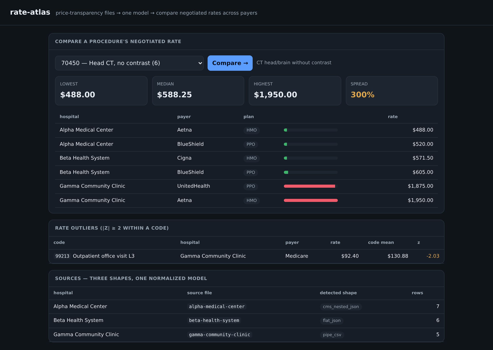

# rate-atlas

[](https://github.com/MarcBittner/ai-portfolio/actions/workflows/projects-ci.yml)
[](LICENSE)
[](https://www.python.org)
[](https://github.com/astral-sh/ruff)
[](https://fastapi.tiangolo.com)



**[▶ Live demo](https://rate-atlas.onrender.com)**

Normalize **inconsistent hospital price-transparency files** into one model and answer
the question that matters: *what does this procedure cost across payers and hospitals?*
Every CMS machine-readable file (MRF) is shaped differently — one hospital emits
CMS-style nested JSON, the next a flat JSON array, the next a pipe-delimited CSV. The
hard part isn't the query, it's that the inputs don't agree on structure. rate-atlas
detects each shape, maps it to one canonical record, loads the rows into SQLite indexed
by billing code, and serves a rate-comparison API with per-code outlier detection.

The thing hand-written adapters can't do, and where this demo earns its keep:

- **Real files arrive in formats you haven't seen.** The three adapters are written per
  *known* shape — a fourth file with columns like `billing_cpt,insurer,allowed_amt,
  facility` matches none of them. `POST /normalize/assist` samples the unknown file and
  an **LLM maps each column to the canonical schema** (`code · code_type · payer · plan ·
  rate · hospital · description`); the **mapping is then applied deterministically** to
  ingest it. The model proposes the crosswalk, code performs the ingest. The LLM routes
  **Anthropic/OpenAI → local Ollama → free (OpenRouter) → a deterministic synonym
  matcher**, so it runs (and the eval reproduces) with zero keys.

> Offline and deterministic core. SQLite (stdlib) stands in for Postgres — same schema,
> same index, same queries; swap the connection string in production. No secrets; runs
> fully offline (the LLM chain falls back to a deterministic matcher). All hospitals,
> payers, codes, and rates are synthetic and clearly fictional.

## Architecture

| Module | Responsibility |
|---|---|
| `data.py` | 3 synthetic MRFs generated from one base table into 3 real-world shapes (a deliberate CT-head outlier lives in the data) |
| `normalize.py` | Detect each file's shape by structure → dispatch to an adapter → emit canonical records. Adding a shape = adding one adapter |
| `store.py` | Load canonical rows into SQLite indexed by code; `compare(code)`, `procedures`, `sources`, `search` |
| `outliers.py` | Per-code z-score outlier detection over the canonical surface |
| `assist.py` | LLM-assisted column → canonical mapping for **unknown** file shapes; precision/recall eval |
| `llm.py` | Multi-provider routing (paid → local → free → deterministic offline) |
| `evaluate.py` | Reproducible eval → `eval-report.md` (`./run.sh eval`) |
| `api.py` | FastAPI service (port **8014**) + static comparison UI |
| `demo.py` | Offline end-to-end: ingest 3 shapes → compare → outliers → assist-map a 4th unknown file |

```
data.py: 3 price files, 3 shapes        normalize_source(name, raw)
┌───────────────────────────┐           ┌──────────────────────────┐
│ nested JSON  (CMS-style)  │──┐        │ json.loads succeeds?     │
│ flat JSON array           │──┼──raw──▶│   has standard_charge_…? ─┼─▶ _from_cms
│ pipe CSV                  │──┘        │   else list?             ─┼─▶ _from_flat
└───────────────────────────┘           │ JSONDecodeError?         ─┼─▶ _from_csv
                                         └──────────┬───────────────┘
                                                    ▼
                       canonical rows {hospital, code, code_type,
                                       description, payer, plan, rate}
                                                    ▼
                              SQLite  rates(...)  +  INDEX idx_code(code)
                                                    ▼
                  compare(code) ─▶ quotes sorted by rate + stats
                  outliers(thr)  ─▶ per-code z-score flags
```

### The three supported shapes → how each maps

| Source (synthetic) | Detected shape | Structure | Adapter pulls |
|---|---|---|---|
| Alpha Medical Center | `cms_nested_json` | `{hospital_name, standard_charge_information:[{billing_code, …, standard_charges:[{payer_name, plan_name, negotiated_dollar}]}]}` | `_from_cms`: walk codes, then nested charges per payer |
| Beta Health System | `flat_json` | `[{code, type, desc, payer, plan, rate}, …]` | `_from_flat`: one record per array element; hospital from filename |
| Gamma Community Clinic | `pipe_csv` | header `code\|code_type\|description\|payer\|plan\|negotiated_rate` | `_from_csv`: `DictReader(delimiter="\|")`; hospital from filename |

Detection is **structural**, not configured. `normalize_source` tries `json.loads`; a
`JSONDecodeError` means CSV; a `dict` carrying `standard_charge_information` is the CMS
shape; a bare `list` is the flat shape; anything else raises. The CMS file even names the
hospital internally (`hospital_name`), while the flat/CSV shapes don't — so those two
derive the hospital from the source name (`_pretty("beta-health-system")` → "Beta Health
System"). Every adapter funnels through `_rec(...)`, which coerces types (codes/payers to
`str`, `rate` to `float`, empty `plan` → `None`) so the canonical record is uniform no
matter which shape produced it.

### Ingest walkthrough

`store.ingest()` rebuilds the table from scratch: `DROP TABLE IF EXISTS rates`, recreate
`rates(hospital, code, code_type, description, payer, plan, rate)`, and
`CREATE INDEX idx_code ON rates(code)`. For each entry in `data.SOURCES` it calls
`normalize_source(name, raw)` to get `(records, shape)`, bulk-inserts with
`executemany`, and records a per-source summary `{source, hospital, shape, rows}` used by
`/sources`. Ingest is idempotent — re-running it yields the same table — which is why the
API can safely re-ingest on `/health` and on `POST /admin/reingest`.

### `GET /compare/{code}` walkthrough

`store.compare(code)` runs `SELECT hospital, payer, plan, rate, description FROM rates
WHERE code = ? ORDER BY rate` — served by `idx_code`, returning quotes already sorted
cheapest-first. It then computes stats over the rate column: `count`, `min`, `max`,
`median`, `avg` (`fmean`), `spread` (`max − min`), and `spread_pct` (`(max − min) / min`).
The API layer returns `404` when a code has no rows; otherwise it returns
`{code, description, quotes[], stats}`. Example: `GET /compare/70450` (CT head/brain) spans
**$488 → $1,950** across payers and hospitals — roughly a 300% spread — with the high
Gamma rates surfaced as outliers.

## Design decisions

- **Canonical model + one adapter per shape (open/closed).** Shape-specific parsing is
  isolated in `_from_cms` / `_from_flat` / `_from_csv`; everything downstream (store,
  compare, outliers, API) speaks only the canonical record. Onboarding a new hospital is
  *one adapter*, and nothing downstream changes. The model is the contract.
- **Structure-based shape detection, not config.** `normalize_source` infers the shape
  from the bytes (JSON vs. not; dict-with-marker vs. list), so there's no per-file config
  to maintain or drift. New real-world variants are distinguished by structure, not by a
  registry someone has to keep in sync.
- **SQLite as a Postgres stand-in.** An in-memory SQLite DB keeps the demo offline and
  deterministic, but the schema, the `idx_code` index, and every query are plain SQL that
  port to Postgres unchanged — production swaps the connection string, not the code.
- **Index on `code`.** Comparison and outlier passes are code-scoped lookups, so a single
  index on `billing_code` is the one that matters; `compare` reads it directly and returns
  rows pre-sorted by rate.
- **Z-score outliers on the canonical surface.** `find_outliers` groups canonical rows by
  code, and for any code with ≥3 rates and nonzero spread flags rates where `|z| ≥
  threshold` (`z = (rate − mean) / pstdev`), sorted by magnitude. Because it runs on
  canonical rows, it's **shape-independent** — a nested-JSON rate and a CSV rate are
  compared on equal footing.

**What changes for production.** Real Postgres (connection string only). More shapes —
XML MRFs, gzip'd payloads, streaming/chunked parse for multi-GB files — each still just a
new adapter (or, for a never-seen format, the assisted mapping below). Code crosswalks so
CPT↔HCPCS↔DRG describing the same procedure compare as one (today comparison is
exact-code). Trend-over-versions to track how a negotiated rate moves across successive MRF
publications.

## LLM-assisted column mapping

The three adapters are hand-written, one per *known* shape. Real payer/hospital files
arrive in formats nobody has seen — a CSV whose header is
`billing_cpt,insurer,network,allowed_amt,facility,proc_desc`, matching none of the
adapters. Writing a new adapter per variant doesn't scale. `POST /normalize/assist` takes
a *sample* of the unknown file (its header/keys + a few rows) and runs it through the
routing chain:

```
unknown file ─▶ _parse_sample(raw)                 # structural sniff: json_array | csv | pipe | tsv
                  → (columns, rows)
            ─▶ llm.complete(SYSTEM, sample, json_mode)
                  Anthropic / OpenAI → Ollama → OpenRouter → deterministic synonym matcher
            ─▶ {mapping: {source_col → canonical_field|null}}
            ─▶ apply_mapping(rows, mapping)         # DETERMINISTIC → canonical 7-field records
            ─▶ store.ingest_records(...)            # now first-class in /compare + /outliers
```

The model only ever **proposes the crosswalk** — it returns a `{source_col:
canonical_field}` mapping, never the rows themselves. `apply_mapping` builds the canonical
records deterministically (coerces `rate` to float, defaults missing `code_type`/`payer`,
skips rows with no code or rate), so the trust-critical normalization is identical to the
hand-written adapters. The offline matcher (`offline_map`) is a **synonym table** over
normalized header tokens — `cpt`/`hcpcs`/`billing_code` → `code`,
`allowed`/`negotiated_rate`/`price` → `rate`, `insurer`/`payor` → `payer`,
`facility`/`provider` → `hospital`, … — returning the same mapping shape. It's the
last-resort fallback: exact on the labeled set (so the demo and eval reproduce with zero
keys), while the LLM path is what generalizes to **unseen column names and phrasings** in
the wild, where no synonym table is complete.

## Routing

The LLM layer (`llm.py`) is the portfolio-standard chain, identical in shape to the other
demos: a provider is *available* only when its key is set (or, for Ollama, when a probe to
`/api/tags` succeeds), so the chain self-selects from the environment and `complete()`
returns the first success, recording which providers it fell through.

| mode | order |
|---|---|
| `auto` (default) | Anthropic → OpenAI → Ollama → OpenRouter → offline |
| `paid` | Anthropic → OpenAI → offline |
| `local` | Ollama → offline |
| `free` | OpenRouter → offline |
| `offline` | deterministic synonym matcher only |

`GET /llm` reports which providers are reachable and the active mode. The offline matcher
is always terminal, so the service never fails for lack of a key — it degrades to
deterministic, not to an error.

## Evals

`./run.sh eval` (or `GET /evals`) scores the column-mapping over a labeled set of synthetic
unknown-format headers and writes `eval-report.md`. A column mapped to its correct
canonical field is a true positive; **recall is the coverage metric** — a missed column is
a row that fails to ingest. The eval also asserts the normalization invariants (every shape,
including the assisted path, collapses to the 7-field schema).

| metric | offline matcher |
|---|---|
| precision | 1.0 |
| recall | 1.0 |
| F1 | 1.0 |
| headers scored | 5 |
| true positives | 23 |

Set provider keys or `LLM_MODE` to score a live model on the same labeled headers.

## Data model & invariants

Every shape collapses to one record:

```json
{"hospital": "Gamma Community Clinic", "code": "70450", "code_type": "CPT",
 "description": "Head CT, no contrast", "payer": "Aetna", "plan": "HMO", "rate": 1950.0}
```

Invariants:

- **3 shapes → 1 model.** Nested JSON, flat JSON, and pipe CSV all normalize to the same
  7-field record; downstream code never branches on source shape.
- **`compare` spans payers *and* hospitals.** A code's quotes are aggregated across every
  source that priced it, sorted by rate, so the spread reflects the whole market for that
  procedure — not one hospital's chargemaster.
- **Types are coerced at the boundary.** Codes/payers are strings, `rate` is a float,
  missing `plan` is `None` — guaranteed by `_rec`, so the store and stats never see a
  shape's idiosyncratic typing.
- **Ingest is idempotent.** Rebuilding the table reproduces the same rows and counts.

## API

| Method | Path | Purpose |
|---|---|---|
| GET | `/health` | status, source/procedure/row counts |
| GET | `/sources` | ingested files + detected shape + row counts |
| GET | `/procedures` | distinct billing codes with descriptions |
| GET | `/compare/{code}` | rates across payers/hospitals + min/median/max/avg/spread |
| GET | `/outliers?threshold=2.0` | rates that are statistical outliers within a code |
| GET | `/search?q=` | find codes/descriptions |
| POST | `/normalize/assist` | LLM-assisted column → canonical mapping of an **unknown-format** file, then deterministic ingest |
| GET | `/evals?mode=` | column-mapping precision/recall over the labeled header set |
| GET | `/llm` | configured/reachable providers + active routing mode |
| POST | `/admin/reingest` | rebuild the table from the synthetic sources |

`POST /normalize/assist` body: `{ "sample": "<raw file text>", "hospital": "Delta
Regional Hospital", "mode": "offline", "ingest": true }`. With no `sample`, the bundled
unknown-format file is used; `mode` pins the routing tier.

## Code map

```
src/rate_atlas/
  data.py        3 synthetic MRFs in 3 shapes (+ a 4th UNKNOWN-format sample for /assist)
  normalize.py   structural shape detection → per-shape adapter → canonical record
  store.py       SQLite (Postgres stand-in): ingest, compare, outliers, ingest_records
  outliers.py    per-code z-score outlier detection on the canonical surface
  assist.py      LLM column→canonical mapping for unknown shapes + precision/recall eval
  llm.py         multi-provider router (paid → local → free → offline), stdlib HTTP
  evaluate.py    ./run.sh eval → eval-report.md
  api.py         FastAPI service; models.py request/response models; static/ console UI
tests/           unit (normalize, store, outliers, assist, llm, api) + live smoke
deploy/          ILLUSTRATIVE platform wrapper: terraform/ · k8s/ · argocd/
docs/            observability.md (SLIs/SLOs) · deployment.md
```

## Env

Runs fully offline with no `.env` (the LLM chain falls back to a deterministic synonym
matcher). Set any of these to route the assisted column-mapping to a real model; never
commit real keys, and leave them unset on a public host. See `.env.example`.

| var | purpose |
|---|---|
| `LLM_MODE` | `auto` (default) · `paid` · `local` · `free` · `offline` |
| `ANTHROPIC_API_KEY` / `ANTHROPIC_MODEL` | paid path (tried first in `auto`) |
| `OPENAI_API_KEY` / `OPENAI_MODEL` | paid path |
| `OLLAMA_BASE_URL` / `OLLAMA_MODEL` | local models, autodetected via `/api/tags` |
| `OPENROUTER_API_KEY` / `OPENROUTER_MODEL` | free-tier models |
| `DATABASE_URL` | Postgres in production; unset → in-memory SQLite stand-in |

## Quickstart

```sh
cd projects/rate-atlas
./run.sh setup
./run.sh demo            # offline: ingest 3 shapes → compare → outliers → assist-map a 4th
./run.sh eval            # column-mapping precision/recall + invariants → eval-report.md
./run.sh serve           # comparison UI at http://127.0.0.1:8014
./run.sh test            # unit suite
./run.sh smoke           # live smoke/regression (local server, or --url <deploy>)
```

## Deploy

Containerized (`Dockerfile`, non-root, `PORT` env, `/health` check) and deployed on
Render's free tier — same image runs anywhere. **No provider keys and no database are set
on the public host**, so the live demo runs the deterministic path end-to-end (in-memory
SQLite + the synonym matcher); the LLM chain and Postgres activate wherever keys/
`DATABASE_URL` are present. Free instances cold-start in ~30–50s.

### Platform wrapper (illustrative — "what I'd build")

The role here is Platform Ops, so `deploy/` and `docs/` sketch the production envelope the
free-tier demo doesn't run — **clearly illustrative, not live**:

- **`deploy/terraform/`** — AWS skeleton: VPC, **EKS** (stateless API), **RDS Postgres**
  (the SQLite→Postgres swap is a connection string), IRSA so pods assume a scoped role and
  carry no long-lived keys; remote state in S3 + DynamoDB lock.
- **`deploy/k8s/rate-atlas.yaml`** — `Deployment` (non-root, requests/limits) + `Service`
  + `HPA` (2→8 on CPU) + `/health` readiness/liveness probes; DB/provider creds are
  *optional* Secrets, so pods start fine on the deterministic path.
- **`deploy/argocd/application.yaml`** — GitOps: Argo CD syncs `deploy/k8s` from `main`
  (prune + self-heal).
- **`docs/observability.md`** — SLIs/SLOs (ingest freshness & success, `/compare` p99,
  data-quality pass rate) with multi-window **burn-rate** alerts; **`docs/deployment.md`**
  — the full build/deploy story.

Proprietary, offline-first, no secrets, synthetic data only — conforms to the portfolio
conventions (CONV-1…5). Spec in `docs/spec/`.
