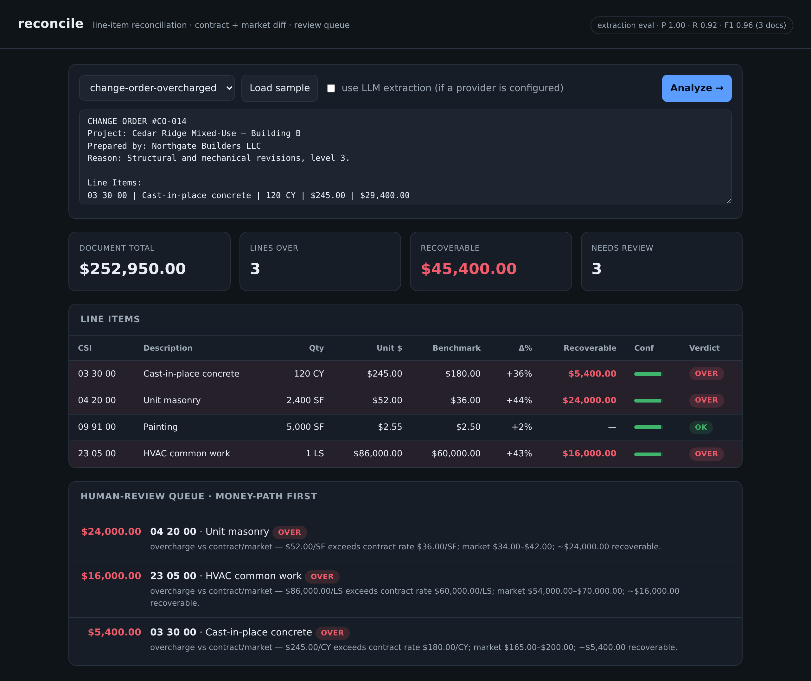

# reconcile



**[▶ Live demo](https://reconcile-gfuj.onrender.com)**

Document **line-item reconciliation**: extract the line items from a document
(change order, invoice, purchase order), diff each one against a **baseline
contract** and a **market-rate table**, flag overcharges with an estimated
**recoverable amount**, and route the money-path lines to a **human-review
queue** — with the extraction accuracy **measured by an eval set**, not asserted.

It collapses the slow part of an estimator's job — reading a multi-page change
order line by line and checking every rate against the contract and the market —
into a structured, scored report in seconds, while keeping a human on the
decisions that move money.

> Offline by default (deterministic table parser + mock LLM, no keys, no cost).
> With a provider configured (`ANTHROPIC_API_KEY`, Ollama, OpenAI/OpenRouter),
> the extraction step uses **schema-constrained structured outputs**; it falls
> back to the deterministic parser whenever no model is available. All fixtures
> are synthetic and clearly fictional — no real firms, projects, or PII.

## Architecture

Eight single-purpose modules under `src/reconcile/`, each doing one stage of the
pipeline. The deterministic core (`extract → variance → review`) needs no model
and no network; `llm.py` is an optional accuracy boost wired in at the extract
stage only.

| Module | Responsibility |
|---|---|
| `data.py` | Synthetic fixtures: baseline contract (6 CSI lines), market-rate table (low/typical/high, incl. new-scope codes), 3 change-order docs, labeled ground truth. |
| `llm.py` | Vendored stdlib-only multi-provider router. Local-first chain Ollama → Anthropic → OpenRouter → OpenAI → **deterministic mock**; `complete_json` strips fences and parses a JSON value; never raises. |
| `extract.py` | Two paths, one output shape: deterministic regex table parser, or opt-in LLM structured-output extraction. Confidence from `qty × unit_cost` vs stated total. |
| `variance.py` | Per-line verdict (`ok`/`over`/`under`/`new_scope`/`unknown`), recoverable-$ estimate, `needs_review` flag, human-readable rationale + summary. |
| `review.py` | Builds the human-review worklist from flagged lines, ordered by recoverable $ descending. |
| `evaluate.py` | Scores the deterministic extractor vs ground truth: line-level precision/recall/F1 (matched by CSI) + unit-cost exactness. |
| `models.py` | Pydantic request/response schemas (`AnalyzeRequest`, `HealthResponse`, …). |
| `api.py` | FastAPI service + static UI mount; thin orchestration over the modules above. |
| `demo.py` | Offline CLI: reconcile the overcharged sample, print findings + eval. |

### Request lifecycle — `POST /analyze`

```
                    POST /analyze {sample | text, use_llm, provider, model}
                                          │
                                   api.analyze()            validate provider,
                                          │                 resolve sample→text
                                          ▼
                              extract.extract_line_items()
                          ┌───────────────┴───────────────┐
                  use_llm + model available?         else / on failure
                          │                               │
                          ▼                               ▼
                  llm_extract()  ──parse fail──▶   parse_table()  (regex rows)
              (llm.complete_json,                  qty×unit_cost vs total
               schema-constrained)                 → consistency confidence
                          └───────────────┬───────────────┘
                                          ▼   list[LineItem]
                              variance.reconcile_items()
                          per line: BASELINE.get(csi), MARKET.get(csi)
                          → verdict · benchmarks · Δunit/Δ% · recoverable $
                          → needs_review  (money-path invariant)
                                          │  {lines, summary}
                                          ▼
                              review.build_queue()
                          keep needs_review lines, sort by recoverable $ desc
                                          │
                                          ▼
            { document, extraction{method,count}, routing, summary,
              lines[], review_queue{queue,count,recoverable_total} }
```

Walkthrough: `analyze()` validates `provider` against the known set, then resolves
the request to document text — a named bundled `sample` or a raw `text` body
(one is required). It calls `extract_line_items(text, use_llm, provider, model)`.
When `use_llm` is set, the LLM path runs first: `llm.complete_json` sends a
strict-JSON system prompt through the provider chain; if the terminal mock is hit
or the JSON doesn't parse, it returns `None` and extraction falls back to the
deterministic `parse_table` regex. Either way every row gets a consistency-based
confidence. The resulting `list[LineItem]` flows into `reconcile_items`, which
classifies each line against `BASELINE` and `MARKET`, computes Δ unit / Δ%, the
recoverable estimate, and the `needs_review` flag, and aggregates a summary.
`build_queue` then filters to the flagged lines and sorts them by recoverable
dollars, highest first. The response bundles the extraction method + routing
(which provider actually answered, and any fallbacks taken), the per-line
results, the summary, and the prioritized queue.

## Design decisions

- **Offline-first, deterministic core, optional LLM (CONV-1).** The whole
  pipeline runs with no model and no network: regex parser + mock provider, so
  the hosted demo is zero-cost and fully reviewable. The LLM path is a drop-in
  accuracy upgrade at the extract stage only — schema-constrained structured
  outputs mirroring the production approach — never a dependency. Trade-off: the
  default parser only reads well-formed table rows; prose line items are missed
  (by design, see eval).
- **Consistency-based confidence.** A row's confidence is down-weighted when
  `quantity × unit_cost` doesn't reconcile to its stated total. An internal
  arithmetic inconsistency is exactly the kind of thing a human should re-check,
  and it's a model-free, explainable signal — no calibration data needed.
- **Money-path review invariant.** Any `over` or `unknown` verdict, any line with
  material recoverable dollars (≥ `REVIEW_MONEY`), or any low-confidence
  extraction (< `REVIEW_CONFIDENCE`) is flagged `needs_review`. The cardinal
  rule: **any recoverable $ ⇒ needs_review**. Automation triages; a human owns
  the dollars.
- **Accuracy measured, not asserted.** One labeled fixture hides a line item in
  prose (the dewatering pump in the ambiguous doc), so the deterministic
  extractor's recall is intentionally `< 1.0`. The metric can fail, which means
  it would catch an extractor regression in CI — the eval has teeth.
- **Domain-generic.** The worked example is construction (CSI MasterFormat
  subcodes), but nothing in the pipeline is construction-specific. Swap the
  baseline contract and the rate table in `data.py` and the same engine
  reconciles invoices, POs, or any line-itemed document.
- **What changes for production.** PDF/scan ingest (OCR + layout) instead of
  pre-parsed text; fuzzy code matching and description-based alignment instead of
  exact CSI equality; persistence and audit trail for the review queue instead of
  the current stateless responses; and per-provider cost/latency budgets on the
  LLM path.

## Data model & invariants

The canonical unit is a line item, carried unchanged from extraction through
reconciliation:

```
LineItem        csi, description, quantity, unit, unit_cost, total,
                confidence, method ("table"|"llm"), start/end (provenance span)

ReconciledLine  LineItem fields + verdict, benchmark_unit_cost, baseline_unit_cost,
                market_low/high, delta_unit, delta_pct, recoverable,
                needs_review, rationale
```

Cardinal invariants:

- **Verdict is total** — every line resolves to exactly one of `ok` · `over` ·
  `under` · `new_scope` · `unknown`.
- **Money-path** — `recoverable ≥ REVIEW_MONEY ⇒ needs_review`; likewise every
  `over` / `unknown` line and every low-confidence line. Recoverable dollars
  never leave the queue silently.
- **Fair-ceiling recoverable** — recoverable = `(unit_cost − fair_ceiling) ×
  quantity` where `fair_ceiling` is the *most generous* defensible rate
  (max of contract rate and market high). Never over-claims an overage.
- **Lump-sum guard** — `LS` lines are never marked `under`; a unit-rate "below
  market" is meaningless for a lump sum.
- **Confidence reflects internal consistency** — a row whose `qty × unit_cost`
  drifts from its stated total is down-weighted, never silently trusted.

## API

| Method | Path | Purpose |
|---|---|---|
| GET | `/health` | status, version, baseline/market/sample counts |
| GET | `/providers` | LLM routing/config (offline-first, mock terminal) |
| GET | `/samples` | bundled synthetic change orders (name + text) |
| GET | `/baseline` | the original contract line items |
| GET | `/rates` | the market-rate table (low / typical / high) |
| POST | `/analyze` | reconcile a `text` or named `sample` → report + review queue |
| GET | `/eval` | extraction accuracy (precision / recall / F1) vs labeled docs |

`POST /analyze` body: `{ "sample": "change-order-overcharged" }` or
`{ "text": "<document>", "use_llm": false, "provider": "auto" }`.

## Quickstart

```sh
cd projects/reconcile
./run.sh setup
./run.sh demo            # offline: reconcile the overcharged sample + print the eval
./run.sh serve           # API + UI at http://127.0.0.1:8009
./run.sh test            # unit suite
./run.sh smoke           # live smoke/regression suite (local server, or --url <deploy>)
```

Proprietary, offline-first, no secrets — conforms to the portfolio conventions
(CONV-1…5: zero-cost reviewability, no secrets, synthetic data, engineering
hygiene, local+remote smoke suite).
