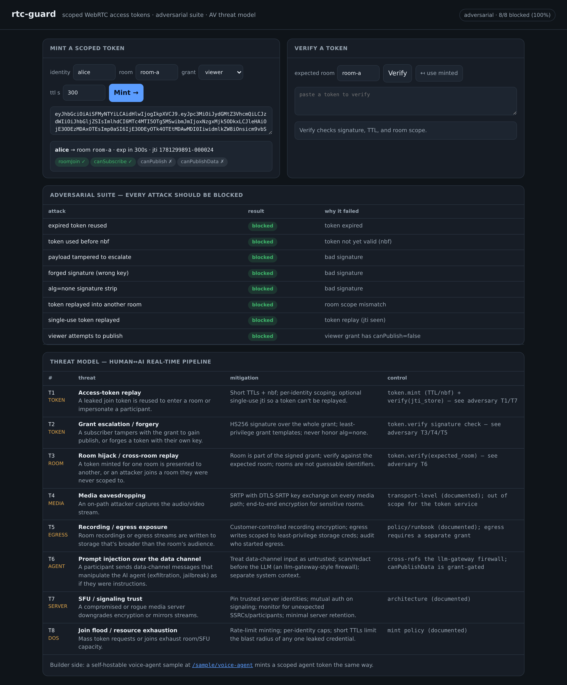

# rtc-guard



**[▶ Live demo](https://rtc-guard.onrender.com)**

Scoped real-time (WebRTC) access tokens, an adversarial test suite that tries to
break them, and an AV-pipeline threat model — the security layer under a voice
agent. **Builder and breaker:** the builder mints least-privilege signed grants;
the breaker forges, replays, escalates, and downgrades them and proves each
attack fails. The security core is offline, deterministic, and needs no secrets,
so it runs as the live demo; the voice agent is a documented self-host sample.

## Architecture

| Module | Responsibility |
|---|---|
| `token.py` | Hand-rolled HS256 JWT `encode`/`decode`; `mint` (least-privilege grant), `verify` (signature, window, room, optional single-use), `can` (capability check). Stdlib only. |
| `adversary.py` | Constructs 8 concrete attacks against `token.py`, asserts each is blocked, returns a `block_rate`. |
| `threat_model.py` | 8 AV-path threats, each mapped to a mitigation and the control that demonstrates it. |
| `api.py` | FastAPI service: mint, verify, run the suite, serve the threat model + token console. |
| `samples/voice_agent.py` | Self-host voice-agent reference (mic→STT→LLM→TTS) that mints a scoped agent token and firewalls data-channel input. |

### Token structure

A token is the classic three-part JWT, `header.payload.signature`, each part
base64url-encoded (no padding):

```
header     {"alg":"HS256","typ":"JWT"}
payload    {"iss","sub","iat","nbf","exp","jti","video":{ …grant… }}
signature  HMAC-SHA256( base64url(header) + "." + base64url(payload), key )
```

The `video` claim is the signed grant — the room plus the capability flags:

```
"video": { "room": "room-a", "roomJoin": true,
           "canSubscribe": true, "canPublish": false, "canPublishData": false }
```

Because the signature covers `header.payload`, the room and every capability
flag are inside the signed bytes. Flip any of them and the signature no longer
matches.

```
  identity, room, template, ttl
            │
            ▼
        ┌────────┐   header.payload.signature   ┌──────────┐
  mint  │ encode │ ───────────────────────────► │  verify  │
        └────────┘   (HS256 over header+payload) └──────────┘
            │                                          │
   grant from template                       sig ✓ · nbf ≤ now < exp ·
   + iat/nbf/exp + jti                        roomJoin · room scope ·
                                              optional jti single-use
                                                       │
                                                       ▼
                                               { valid, reason, claims }
```

### Grant templates

`mint` never takes raw capability flags from the caller — it takes a **template
name**, and the template fixes the least-privilege capability set:

| Template | roomJoin | canSubscribe | canPublish | canPublishData |
|---|---|---|---|---|
| `viewer` | ✓ | ✓ | — | — |
| `publisher` | ✓ | ✓ | ✓ | ✓ |
| `agent` | ✓ | ✓ | ✓ | ✓ |
| `data_only` | ✓ | ✓ | — | ✓ |

A `viewer` can watch and listen but never publish media or data; `data_only`
adds the data channel without media publish; `publisher` and `agent` are the
full-participant set. An unknown template name is rejected with `ValueError`.

### mint

`mint(identity, room, template, ttl, key, now)` looks up the template, builds the
grant as `{"room": room, **template_caps}`, and wraps it in a claim set:
`iss="rtc-guard"`, `sub=identity`, `iat=nbf=now`, `exp=now+ttl`
(default TTL **300 s**), and a `jti` of `f"{int(now)}-{seq:06d}"` from a
process-local counter, giving every token a distinct nonce. The whole thing is
`encode`d under the HS256 signing key. `now` is injectable so the suite and tests
run against a fixed clock.

### verify

`verify(token, key, expected_room, now, jti_store)` returns
`{valid, reason, claims}` and short-circuits on the first failure:

1. `decode` — split into 3 parts, recompute the HMAC, **constant-time compare**
   (`hmac.compare_digest`) against the presented signature; bad signature or a
   malformed token raises and is reported.
2. **Validity window** — reject if `now < nbf` (not yet valid) or `now ≥ exp`
   (expired).
3. **roomJoin** — reject if the grant lacks `roomJoin`.
4. **Room scope** — if `expected_room` is given, the grant's `room` must equal it.
5. **Single-use** — if a `jti_store` set is supplied, a `jti` already present is a
   replay and is rejected; otherwise the `jti` is recorded.

`can(claims, capability)` is the per-action check at use time, e.g.
`can(claims, "canPublish")` — it reads the flag straight out of the signed grant.

## The adversarial suite

`adversary.run()` constructs eight concrete attacks against `token.py` on a fixed
clock and asserts each is blocked, returning the `block_rate` (`/adversary` in the
API). This is the breaker half: not "we issue tokens" but "here is everything I
tried to forge, replay, or escalate, and exactly why it failed."

| # | Attack | Why it fails |
|---|---|---|
| 1 | Expired token reused | `now ≥ exp` — outside the validity window. |
| 2 | Token used before `nbf` | `now < nbf` — not yet valid. |
| 3 | Payload tampered to escalate (`canPublish→true`, original signature kept) | Signature is over `header.payload`; the edited payload no longer matches. |
| 4 | Forged signature (re-signed with an attacker key) | HMAC under the real key doesn't match the attacker's signature. |
| 5 | `alg=none` strip (header swapped to `none`, signature dropped) | `decode` always recomputes HS256; an empty signature fails the compare — `alg=none` is never honored. |
| 6 | Cross-room replay (room-a token presented to room-b) | Room is in the signed grant; `expected_room` mismatch. |
| 7 | Single-use replay (same token verified twice with a `jti_store`) | The `jti` is already in the store on the second use. |
| 8 | Capability confinement (a `viewer` tries to publish) | The `viewer` grant carries `canPublish=false`; `can()` returns false. |

The common thread: the **signature covers the entire grant**, the **TTL/`nbf`
window** bounds when a token is usable, the **room and capabilities live inside
the signed bytes**, the optional **`jti`** makes a token single-use, `alg=none`
is **never** trusted, and least-privilege templates **confine** what any grant
can do.

## Design decisions

- **Least-privilege grant templates.** Callers pick a role, not a flag set, so a
  token can only ever carry the capabilities that role needs. The blast radius of
  a leaked token is bounded by its template.
- **Short TTL + `nbf` + `jti`.** Default 300 s caps how long a leaked credential
  is useful; `nbf` rejects tokens presented before their window; the `jti` nonce
  enables optional single-use verification against a replay store.
- **Hand-rolled HS256, stdlib only (no PyJWT).** The signing/verifying path is
  ~10 lines of `hmac`/`hashlib`/`base64` you can read end to end — and it makes
  the security-critical choices explicit: verification **always recomputes** the
  HMAC and compares it **constant-time** with `hmac.compare_digest` (no timing
  oracle), and it **never** branches on the header's `alg`, so an `alg=none`
  downgrade can't strip the check. The cost: HS256 is a symmetric, demo-grade
  primitive — see "what changes for prod."
- **Security core is the shippable demo; the voice agent is a sample.** Mint /
  verify / adversarial suite / threat model are offline, deterministic, and
  secret-free, so they run as the hosted demo. `samples/voice_agent.py` needs a
  real-time server plus STT/LLM/TTS keys, so it is an opt-in self-host reference,
  not part of the hosted demo.
- **Responsible scope.** The demo signs with a clearly-labeled demo key
  (`RTC_GUARD_SIGNING_KEY` overrides it) and mints only throwaway tokens against
  rooms that don't exist — nothing real to leak.

**What changes for production.** Move to an asymmetric signature (**RS256 /
EdDSA**) with **JWKS key rotation** so verifiers never hold the signing secret;
add **revocation** (a deny-list or short-lived refresh) for credentials that must
die before `exp`; and **rate-limit minting** with per-identity caps so token
issuance itself can't be abused into a join flood.

## Threat model

The threat model lives in code (`threat_model.py`, served at `/threat-model`), so
it can be rendered and diffed instead of rotting in a doc. Eight threats on the
human↔AI audio/video path — access-token replay, grant escalation/forgery, room
hijack / cross-room replay, media eavesdropping, recording/egress exposure,
**data-channel prompt injection into the agent**, SFU/signaling trust, and
join-flood DoS — each mapped to a mitigation and the control that demonstrates
it. The prompt-injection entry is the AV-specific one: data-channel input is
treated as untrusted and firewalled before it reaches the LLM, and the data
capability is itself grant-gated (`canPublishData`).

## API

| Method | Path | Purpose |
|---|---|---|
| GET | `/health` | status, template + threat counts |
| GET | `/templates` | the least-privilege grant templates |
| POST | `/v1/token` | mint a scoped token → token + decoded grant |
| POST | `/v1/verify` | verify signature / TTL / room scope → valid + reason |
| GET | `/adversary` | run the adversarial suite (every attack blocked) |
| GET | `/threat-model` | the AV-pipeline threat model |
| GET | `/sample/voice-agent` | the self-host voice-agent reference |

`POST /v1/token` body:
`{ "identity": "alice", "room": "room-a", "template": "publisher", "ttl": 300 }`.

## Quickstart

```sh
cd projects/rtc-guard
./run.sh setup
./run.sh demo            # offline: mint + verify + adversarial suite + threat model
./run.sh serve           # token console at http://127.0.0.1:8013
./run.sh test            # unit suite
./run.sh smoke           # live smoke/regression (local server, or --url <deploy>)
```

Proprietary, offline-first, no secrets — conforms to the portfolio conventions
(CONV-1…5).
