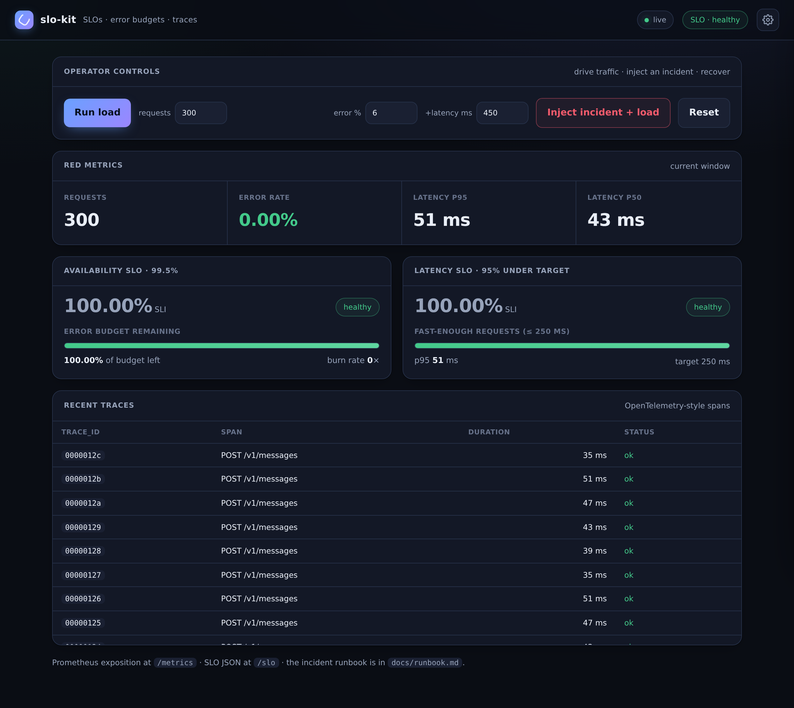

# slo-kit

[](https://github.com/MarcBittner/ai-portfolio/actions/workflows/projects-ci.yml)
[](LICENSE)
[](https://www.python.org)
[](https://github.com/astral-sh/ruff)
[](https://fastapi.tiangolo.com)



**[▶ Live demo](https://slo-kit.onrender.com)**

An **instrumented reference service** that demonstrates how I run boring, dependable
systems. A simulated outreach-API is wrapped in **RED metrics**, **SLIs/SLOs with an
error budget and burn rate**, and **OpenTelemetry-style traces**; an on-demand
**incident** can be injected to burn the budget and watch it recover. Around the
service sit the artifacts that make reliability shippable: **Terraform multiwindow
burn-rate alerts**, a **GitHub Actions** pipeline gated on a post-deploy smoke
check, and a one-page **runbook**.

The dashboards already expose the raw telemetry; the job an on-call engineer
actually has is *compressing* it into a sentence. So slo-kit adds an **LLM
incident-summary generator** — `POST /incident/summary` reads the live SLO
snapshot, RED metrics, and recent error spans and returns a concise on-call
summary, a severity, and the matching runbook steps. The model writes the
narrative; the **severity is classified deterministically from the SLO numbers**,
and the chain falls back to a deterministic drafter so it runs with zero keys.

Reliability is treated as an artifact, not an afterthought. Everything is offline,
deterministic, and secret-free — traffic and faults are simulated, so the SLO math
and the burn/recover demo are fully reproducible.

## Architecture

The codebase is small and layered: a stdlib instrumentation core, a deterministic
workload that exercises it, an SLO computation that reads a snapshot, and a thin
FastAPI surface plus a dashboard. No heavy observability client is pulled in — the
instrumentation shapes (RED counters, Prometheus exposition, OTel-style spans) are
reproduced directly so the dependency surface stays tiny and the call sites match
what a production handler would look like.

| Module | Responsibility |
|---|---|
| `metrics.py` | In-process RED registry (rate/errors/duration); bounded latency window for percentiles; Prometheus text exposition. Stdlib-only, lock-guarded. |
| `tracing.py` | OTel-shaped `Span` (trace/span id, name, duration, status, attributes) in a fixed-size ring buffer (`deque`, maxlen 200). |
| `slo.py` | Pure function: turns a metrics snapshot into SLIs, error budget consumed/remaining, burn rate, and per-SLO + overall status. |
| `service.py` | The instrumented "outreach-API". Simulates a send, instruments it (metric + span), applies a **deterministic** fault, and provides a load generator. |
| `incident.py` | LLM incident-summary generator: deterministic severity from the SLO numbers + on-call narrative + matching runbook steps; offline drafter is the terminal fallback. |
| `llm.py` | Multi-provider routing (paid → local → free → deterministic offline); stdlib HTTP, self-selecting from the environment. |
| `evaluate.py` | Reproducible eval → `eval-report.md` (`./run.sh eval`): SLO invariants + incident-summary accuracy. |
| `models.py` | Pydantic request/response models for the API. |
| `api.py` | FastAPI app: business endpoints, observability surfaces, operator controls, dashboard. |
| `demo.py` | Offline script: steady traffic → injected incident → incident summary → recovery, printing the SLO snapshot at each step. |

### Request path and the fault → burn → recover loop

```
                          ┌──────────────────── service.py ───────────────────┐
POST /v1/messages ─▶ api.send ─▶ send_message ─▶ _simulate(endpoint)
                                                     │  status + duration
                                                     ├─▶ metrics.record()  ── RED registry
                                                     └─▶ tracer.record()   ── span ring buffer
                          └────────────────────────────────────────────────────┘
                                                     │
   GET /slo ─▶ slo.compute(registry.snapshot()) ─────┘
       │  availability SLI, latency SLI, error budget, burn rate, status
       ▼
   dashboard ( / )   ·   /metrics (Prometheus)   ·   Terraform alerts (deploy/)

   ── incident loop ──────────────────────────────────────────────────────────
   POST /admin/fault {error_rate, latency_ms}  ─▶ deterministic 5xx + added latency
   POST /admin/loadtest {n}                     ─▶ drive traffic ─▶ budget BURNS
   POST /admin/reset                            ─▶ fresh window  ─▶ budget RECOVERS
```

**Walkthrough.** A `POST /v1/messages` lands in `api.send`, which calls
`service.send_message`. That delegates to `_simulate`, the single instrumentation
choke point: it decides a status and a duration under the current fault, then
records exactly one RED metric and one trace span — the same one-handler-one-metric
discipline a real service uses. `metrics.record` increments totals, per-status and
per-endpoint counters, tracks errors (`status >= 500`) and "fast enough" requests
(`duration <= 250 ms`), and appends to a bounded latency window used for
percentiles. `tracer.record` appends an OTel-shaped span to a ring buffer.

Reads are derived, never stored twice. `GET /slo` calls `slo.compute` over a fresh
`registry.snapshot()`, so the SLIs, error budget, and burn rate are always computed
from the same counters the dashboard and `/metrics` expose. The dashboard at `/`
polls these JSON surfaces; `/metrics` serves the same numbers in Prometheus text
format for a scraper.

The incident loop is what makes the SLO machinery observable. `POST /admin/fault`
sets a deterministic error rate and extra latency; `POST /admin/loadtest` fires
synthetic sends through the same `_simulate` path, so the budget burns in a way you
can watch in real time. `POST /admin/reset` clears the window and the fault, and the
budget recovers. Because nothing is random, every run burns and recovers identically
— which is what makes it usable as a demo and a test fixture.

### Ops artifacts

- `deploy/terraform/main.tf` — illustrative CloudWatch alerting policy. Encodes the
  multiwindow burn-rate alerts (fast 14.4×/1h → page, slow 6×/6h → ticket) plus a
  p95 latency alarm, reading the `slo_request_*` metrics the service exposes.
- `deploy/github-actions/deploy.yml` — merge → test → build → deploy → **post-deploy
  smoke gate**. The same smoke suite that runs locally verifies the live deployment's
  contract before a rollout is "done"; a failed gate is a rollback signal.
- `docs/runbook.md` — one-page incident runbook (confirm → triage → mitigate →
  verify → comms), executable against `/slo`, `/metrics/snapshot`, and `/traces`.

## Design decisions

**Error budget + burn rate as the ship/freeze signal.** The availability SLO of
99.5% implies a 0.5% error budget. `slo.py` reports how much of that budget is
consumed and how fast (burn rate = error_rate ÷ budget). Burn rate > 1× means the
budget will be exhausted before the window resets. This single number — not a raw
error count — is what decides whether the next release ships or freezes, and the
runbook's postmortem step ties the freeze decision back to budget spent.

**Multiwindow, multi-burn-rate alerting.** The canonical Google-SRE pattern, encoded
in Terraform. A single threshold forces a bad trade-off: tight enough to catch slow
burns means it flaps on blips; loose enough to ignore blips means it misses slow
leaks. Two windows resolve it — a **fast** alert (14.4× over 1h, budget gone in ~2
days) pages on-call, and a **slow** alert (6× over 6h) opens a ticket. Severity
tracks how fast the budget is actually leaking, not the instantaneous error rate.

**Smoke as a deploy gate.** The pipeline runs the same smoke/regression suite
against the live URL *after* deploy and treats failure as a rollback signal. The
deploy is only "done" when the live contract verifies — catching environment and
wiring failures that unit tests can't.

**Deterministic fault for reproducibility.** Errors are injected on a fixed cadence
(`_n % step == 0`) rather than sampled randomly, and latency is `base + small jitter
+ injected`. Burn and recover are therefore byte-for-byte reproducible, which makes
the incident usable as both a live demo and a deterministic test fixture.

**RED + Prometheus without a heavy client dep.** The metrics registry and Prometheus
text exposition are ~100 lines of stdlib. This keeps the install tiny and makes the
instrumentation contract explicit, at the cost of features a real client gives you
for free (histograms, exemplars, multiprocess aggregation).

**What changes for production.** This is a single-worker reference, not a fleet
service. For real use: swap `tracing.py` for the OTel SDK exporting OTLP to
Tempo/Jaeger (the call sites stay the same); replace the cumulative in-process
counters with rolling time-window metrics scraped by a real client, so SLIs reflect
a sliding window instead of "since reset"; and account for true concurrency — the
current lock around record/read is fine for one uvicorn worker but a multi-worker or
multi-instance deployment aggregates at the scrape/metrics layer instead.

## SLOs & invariants

Two SLOs are evaluated over the current window (`slo.py`):

- **Availability** — fraction of non-5xx requests. **SLO 99.5%** → error budget
  `1 − 0.995 = 0.5%`.
- **Latency** — fraction of requests under the **250 ms** target. **SLO 95%**.

Error-budget math (availability):

```
error_rate       = errors / total
budget           = 1 − 0.995 = 0.005
budget_consumed  = min(1, error_rate / budget)
budget_remaining = max(0, 1 − error_rate / budget)
burn_rate        = error_rate / budget        # > 1× ⇒ exhausts before window resets
```

Status transitions: availability is `healthy` while SLI ≥ 99.5%, `burning` once it
dips with budget left, `exhausted` when the budget is fully consumed, `no_data` at
zero requests. Latency is `healthy`/`violated` against the 95% target. `overall` is
`at_risk` unless both SLIs are `healthy` (or have no data).

**Invariants.**
- Every served request records exactly one RED metric and one span — instrumentation
  is centralized in `_simulate`, so they cannot drift apart.
- `/slo`, `/metrics`, and the dashboard are all derived from one `snapshot()`; the
  numbers can never disagree.
- A request counts as an error iff `status >= 500`; as "fast" iff `duration <= 250
  ms`. The same constants drive the metric, the SLI, and the Terraform alarm.
- The latency window (5000 samples) and the trace buffer (200 spans) are bounded —
  memory is constant regardless of traffic volume.
- Faults are deterministic and stateless across resets; `reset()` returns the service
  to a clean window with no fault.

## Incident summary (LLM)

`/slo`, `/metrics/snapshot`, and `/traces` expose the raw telemetry. At 3am the
on-call engineer's real job is compressing it: *what's burning, how bad, who's
affected, what to do next.* `POST /incident/summary` is that capability — it reads
the current state and returns a structured on-call summary:

```
current state ─┬─ /slo snapshot (availability, burn rate, budget, latency)
               ├─ /metrics/snapshot (error_rate, p95, by_status)
               └─ recent error spans (/traces)
                      │
                      ▼
        incident.classify(state)   ── DETERMINISTIC severity from the SLO numbers
                      │  burn rate + budget + latency → none | sev3 | sev2 | sev1
                      ▼
        llm.complete(SYSTEM, state, json_mode)
            Anthropic / OpenAI → Ollama → OpenRouter → deterministic drafter
                      │
                      ▼
        { summary, severity, suggested_steps[] }   ── steps mirror docs/runbook.md
```

The **severity decision never depends on the LLM** — it is computed in
`incident.classify()` from the same SLO math as the dashboard, then handed to the
model as context. The model only writes the narrative; the offline drafter
templates the same `{summary, severity, suggested_steps}` from the snapshot, so the
capability (and its eval) reproduce exactly with zero keys, while the live model
turns the snapshot into fluent on-call prose. The suggested steps are pulled from
`docs/runbook.md`, so the draft a responder gets matches the page they would open.

In the **demo flow**: steady state (SLOs green) → inject an incident (availability
exhausted, burn rate > 1×, budget drains) → open the runbook → **generate the
incident summary** (the on-call narrative + runbook steps) → reset and recover.

## Routing

The LLM layer (`llm.py`) is the portfolio-standard chain, identical in shape to the
other demos: a provider is *available* only when its key is set (or, for Ollama,
when a probe to `/api/tags` succeeds), so the chain self-selects from the
environment and `complete()` returns the first success, recording which providers
it fell through.

| mode | order |
|---|---|
| `auto` (default) | Anthropic → OpenAI → Ollama → OpenRouter → offline |
| `paid` | Anthropic → OpenAI → offline |
| `local` | Ollama → offline |
| `free` | OpenRouter → offline |
| `offline` | deterministic drafter only |

`GET /llm` reports which providers are reachable and the active mode. The offline
drafter is always terminal, so the service never fails for lack of a key — it
degrades to deterministic, not to an error.

## Evals

`./run.sh eval` (or `GET /evals`) writes `eval-report.md`. Two evals, both
reproducible offline:

- **SLO invariants** — the deterministic core. Driving 1000 requests at a fixed
  **5%** injected error rate against the 0.5% budget, the SLO math lands on the same
  numbers every run: steady → `healthy` (budget intact); during fault → `exhausted`,
  burn rate ≈ **10×**; after reset → `healthy`. This is the burn/recover loop as a
  reproducible assertion, not a claim.
- **Incident-summary accuracy** — over a set of labeled incident snapshots, does the
  generator pick the **right severity** and **runbook situation** with a non-empty
  summary and actionable steps? Severity is classified deterministically, so it is
  exact on either path (`1.0` offline); set provider keys or `LLM_MODE` to score a
  live model's narrative on the same snapshots.

| labeled snapshot | expected severity | situation |
|---|---|---|
| steady / healthy | none | healthy |
| budget draining but SLO still met | none | healthy |
| fast burn (budget exhausted) | sev1 | availability |
| latency violation only | sev3 | latency |
| availability + latency | sev1 | both |
| no data | none | no_data |

## API

| Method | Path | Purpose |
|---|---|---|
| GET | `/health` | status, version, window request count, SLO status, fault active |
| POST | `/v1/messages` | the instrumented business call (200, or 500 under fault) |
| GET | `/v1/messages` | recently sent (outbox) |
| GET | `/metrics` | Prometheus exposition (RED) |
| GET | `/metrics/snapshot` | JSON metrics for the dashboard |
| GET | `/slo` | SLIs, SLOs, error budget, budget remaining, burn rate, status |
| GET | `/traces` | recent spans (bounded buffer) |
| POST | `/incident/summary` | LLM on-call summary + severity + runbook steps from the live state |
| GET | `/evals` | incident-summary severity/situation accuracy over labeled snapshots |
| GET | `/llm` | configured/reachable providers + active routing mode |
| POST | `/admin/fault` | inject error rate + added latency (the incident) |
| POST | `/admin/loadtest` | fire N synthetic requests |
| POST | `/admin/reset` | clear metrics/traces/fault |

## Quickstart

```sh
cd projects/slo-kit
./run.sh setup
./run.sh demo            # offline: steady → incident burn → incident summary → recovery
./run.sh eval            # SLO invariants + incident-summary accuracy → eval-report.md
./run.sh serve           # dashboard at http://127.0.0.1:8011
./run.sh test            # unit suite
./run.sh smoke           # live smoke/regression (local server, or --url <deploy>)
```

## Env

Runs fully offline with no `.env` (the incident-summary chain falls back to a
deterministic drafter; the SLO math, metrics, and traces never depend on a
provider). Set any of these to route the summary to a real model; never commit
real keys, and leave them unset on a public host. See `.env.example`.

| var | purpose |
|---|---|
| `LLM_MODE` | `auto` (default) · `paid` · `local` · `free` · `offline` |
| `ANTHROPIC_API_KEY` / `ANTHROPIC_MODEL` | paid path (tried first in `auto`) |
| `OPENAI_API_KEY` / `OPENAI_MODEL` | paid path |
| `OLLAMA_BASE_URL` / `OLLAMA_MODEL` | local models, autodetected via `/api/tags` |
| `OPENROUTER_API_KEY` / `OPENROUTER_MODEL` | free-tier models |

In the dashboard: **Run load** for steady traffic, **Inject incident + load** to
burn the budget (availability goes `burning`/`exhausted`, latency `violated`),
**Generate incident summary** to compress the live state into an on-call summary +
runbook steps, then **Reset** to recover. The deploy/alerting artifacts live in
`deploy/terraform/`
(burn-rate alerts), `deploy/github-actions/` (smoke-gated pipeline), and
`docs/runbook.md` (incident runbook).

Proprietary, offline-first, no secrets, synthetic traffic only — conforms to the
portfolio conventions (CONV-1…5).
