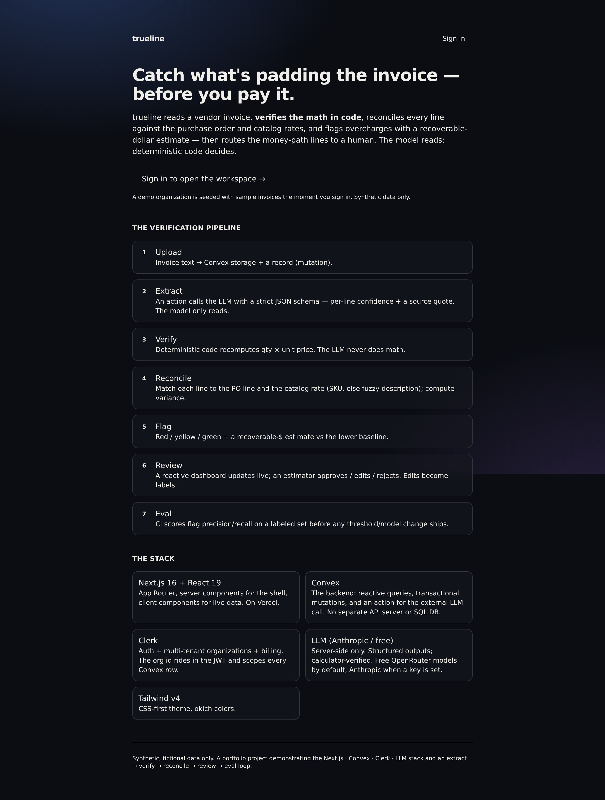

# trueline

[](https://trueline-moys.onrender.com)
[](https://nextjs.org)
[](https://react.dev)
[](https://convex.dev)
[](https://clerk.com)
[](https://tailwindcss.com)
[](https://www.typescriptlang.org)
[](LICENSE)

Invoice line-item verification: extract → verify math in code → reconcile vs purchase
order + catalog rates → flag recoverable overcharges → human review → eval. The LLM
reads the document into structured JSON; all arithmetic and every flag is deterministic
TypeScript.

**Live:** https://trueline-moys.onrender.com · synthetic data only.



---

## Stack

| Layer | Tech |
|---|---|
| Frontend | Next.js 16 (App Router, RSC), React 19, Tailwind v4 |
| Backend / DB / realtime | Convex (queries · mutations · actions · scheduler) |
| Auth / multi-tenancy | Clerk (orgs; JWT → Convex) |
| LLM | Anthropic · OpenRouter (free) · deterministic mock — selected by routing config |
| Host | Render (Next) + Convex Cloud + Clerk |

## Managed services — role & value

| Service | What it does here | Value it adds (vs rolling your own) |
|---|---|---|
| **Convex** | Document DB + serverless TS functions + **realtime subscriptions** + scheduler. Stores invoices/lines/PO/catalog/evals/logs/settings; runs the queries, mutations, and the extract action. | One TS-native platform in place of Postgres + an ORM + an API server + a websocket layer + a job queue. Reactive `useQuery` makes the review UI update live with zero polling; mutations are ACID with auto-retry; `action` + `scheduler` give a managed async job for the LLM call. No connection pools, migrations, or socket plumbing. |
| **Clerk** | Sign-in/sessions, **multi-tenant organizations**, billing; mints the JWT that Convex trusts. | Production auth (social, MFA, sessions) + a tenant model + a billing surface, drop-in. The org id rides in the JWT and scopes every Convex row — no hand-rolled auth/session/RBAC. |
| **OpenRouter** | One OpenAI-compatible endpoint onto many models, including a **free tier** (`gemma-4-31b-it:free`). | Zero-cost default for the public demo; swap models by changing a string (no SDK/code change); one key + billing surface across providers. |
| **Anthropic (Claude)** | The **paid** extraction model — highest structured-output fidelity for the money path. | Best accuracy when it matters; same `fetch` shape, chosen by routing config. |
| **Next.js / React / Tailwind** | App Router + RSC render the shell; client components subscribe to Convex; edge middleware gates `/app`. | One framework for routing + SSR + API + middleware; server components keep the bundle lean while live data stays client-side. |
| **Render** | Hosts the Next app: git-push build/deploy, managed TLS + CDN, env injection. | No servers to manage; an identical deploy story to Vercel (the canonical host for this stack). |

## Request lifecycle

```
client                                  Convex (giddy-marmot-130)                 external
──────                                  ─────────────────────────                 ────────
useMutation(createInvoiceFromText) ──▶ mutation: insert invoices{status:extracting}
                                        insert logs; scheduler.runAfter(0, extract.run)
                                          │ schedule
                                          ▼
                                        action extract.run
                                          runQuery extract._getRaw
                                          runQuery routing._forExtract  ──▶ {mode,model}
                                          extractLineItems(text,routing) ───────────────▶ Anthropic / OpenRouter
                                          reconcileLine() × N  (pure)        429/none ──▶  ↳ deterministic mock
                                          runMutation writeResults  ◀────────┘
                                            clear+insert invoiceLines (idempotent on _id)
                                            patch invoices{status,totals,latencyMs,costUsd}
useQuery(getInvoice) re-runs ◀── reactive push (no polling) ── appendLog{event:extract}
```

## Persistence layer (`convex/schema.ts`)

Every row is `orgId`-scoped (the active Clerk org, else `user:<subject>`); reads filter
through a `by_org*` index, so tenants are isolated. Auto fields: `_id`, `_creationTime`.

```ts
purchaseOrders { orgId, poNumber, vendor,
                 lines: [{ sku?, description, unit, quantity, unitPrice }] }
                 .index by_org [orgId]  .index by_org_po [orgId, poNumber]

catalog        { orgId, sku, description, unit, marketPrice, category? }      // market rates
                 .index by_org [orgId]  .index by_org_sku [orgId, sku]

invoices       { orgId, invoiceNumber, vendor, poNumber?, rawText,
                 status: "extracting"|"needs_review"|"approved"|"rejected",
                 claimedTotal?, recoverableUsd?,
                 extractionProvider?, extractionModel?, latencyMs?, costUsd?,
                 error?, uploadedBy? }
                 .index by_org [orgId]  .index by_org_status [orgId, status]

invoiceLines   { orgId, invoiceId→invoices, lineNo,
                 // LLM-read (it only reads):
                 description, sku?, unit, quantity, unitPrice, claimedExtension,
                 confidence (0..1), sourceQuote,
                 // code-decided:
                 computedExtension, mathOk, poUnitPrice?, catalogPrice?,
                 matchedBy: "sku"|"description"|"none",
                 varianceVsPoPct?, varianceVsMarketPct?,
                 flag: "green"|"yellow"|"red", reasons[], recoverableUsd,
                 // human-in-the-loop:
                 decision: "pending"|"approved"|"edited"|"rejected", reviewer? }
                 .index by_invoice [invoiceId]  .index by_org_decision [orgId, decision]

evalRuns       { orgId, provider, model, n,
                 extractionAccuracy, flagPrecision, flagRecall, createdBy? }  .index by_org
logs           { orgId, level: "info"|"warn"|"error", event, detail, latencyMs? }  .index by_org
settings       { orgId, mode: "auto"|"free"|"paid"|"offline", model? }  .index by_org
```

No ORM: types are generated from this schema (`convex/_generated`) and flow to the React
`useQuery`/`useMutation` hooks. Relationships are `v.id(...)` references resolved in code;
no SQL joins.

## API (Convex functions)

`query` = reactive read · `mutation` = ACID transaction · `action` = external I/O ·
`internal*` = not client-callable.

```
convex/invoices.ts
  query    listInvoices()                              → (Invoice & {lineCount,red,yellow,green})[]
  query    getInvoice({ invoiceId })                   → { invoice, lines[] } | null
  query    stats()                                     → { invoices, recoverableUsd, needsReview, latestEval }
  query    baseline()                                  → { hasPo, poLines, poNumber, vendor }
  query    recentLogs()                                → Log[]  (60, desc)
  mutation seedIfEmpty()                               → { seeded }
  mutation setBaselineFromText({ rawText, poNumber? }) → { poLines }     // parsePoText → PO + catalog
  mutation createInvoiceFromText({ invoiceNumber, rawText, poNumber? }) → Id  // schedules extract.run
  mutation reviewLine({ lineId, decision })            // approved | rejected
  mutation correctLine({ lineId, unitPrice, quantity? })  // re-runs reconcileLine, decision="edited"
  mutation setInvoiceStatus({ invoiceId, status })
  mutation resetDemo()                                 // clears the tenant
  internalMutation writeResults / markError / appendLog
convex/extract.ts
  internalQuery  _getRaw({ invoiceId })                → { rawText, invoiceNumber }
  internalAction run({ invoiceId, orgId })             // LLM → reconcile → writeResults (+ latency/cost/log)
convex/routing.ts
  query    get()    → { mode, model, keys:{free,paid}, defaultFreeModel, defaultPaidModel, activeMode }
  mutation set({ mode, model? })
  internalQuery _forExtract({ orgId }) → { mode, model }
convex/evals.ts        mutation runEval() → EvalRun · query listEvals() → EvalRun[]
convex/diagnostics.ts  action benchmark({ invoiceText }) → [{ mode, provider, model, latencyMs, lines, error }]
```

HTTP equivalents (used by the client + testable directly):
`POST {CONVEX_URL}/api/query` and `/api/mutation` with `{ path, args, format:"json" }` and a
`Authorization: Bearer <clerk-jwt>` header.

## LLM integration (`convex/lib/llm.ts`)

System prompt (verbatim):

```
You extract line items from a vendor invoice into strict JSON. You ONLY read values
that appear in the document — never invent or compute. Return a JSON object
{"lines": [...]} where each line is {"description": string, "sku": string|null,
"quantity": number, "unit": string, "unitPrice": number, "extension": number,
"confidence": number (0..1), "sourceQuote": string}. confidence reflects how
legible/certain the source was. sourceQuote is the verbatim snippet the numbers came
from. Output JSON only.
```

- User message: `Extract every line item from this invoice:\n\n<rawText>`.
- Transport: plain `fetch` (no SDK). Anthropic → `POST /v1/messages` (`x-api-key`,
  `anthropic-version: 2023-06-01`). OpenRouter → `POST /v1/chat/completions`
  (`Authorization: Bearer`). Response JSON is recovered with a fence/brace-tolerant
  parser (`parseJsonLoose`) and coerced/clamped (`coerceLines`) — numbers stripped of
  `$,`, confidence clamped 0..1, `sourceQuote` capped 280 chars.
- `extractLineItems(rawText, { mode, model })` returns `{ lines, provider, model }`.
  **The model never computes**: `extension` it returns is ignored — `reconcileLine`
  recomputes it. Output is never trusted for math or the flag decision.

## Routing config (`convex/routing.ts`, UI `app/app/settings`)

Per-tenant `settings{ mode, model }`. The extract action reads it via `_forExtract` and
passes it to `extractLineItems`, which sets the provider attempt order **explicitly** by
mode (deterministic mock is always the terminal fallback):

```
offline → []                         → mock
free    → [openrouter]               → mock
paid    → [anthropic]                → mock
auto    → [anthropic, openrouter]    → mock     (paid if keyed, else free, else offline)
```

A provider is attempted only if its key is present (`keyStatus()` reads env). `model`
overrides the default for the chosen provider. Defaults:
`OPENROUTER_MODEL=google/gemma-4-31b-it:free`, `ANTHROPIC_MODEL=claude-haiku-4-5-20251001`.
Keys live as **Convex deployment env vars** (server-side), never in the browser bundle.
OpenRouter free tier is 50 req/day; past that a run resolves to the mock (shown on the
review header + Diagnostics).

## Reconcile algorithm (`convex/lib/reconcile.ts`, pure)

```
computedExtension = round2(quantity × unitPrice);  mathOk = |computed − claimed| ≤ 0.015
match → PO line then catalog: by sku; else best description token-overlap ≥ 0.40 (FUZZY_MIN)
variance%(base) = (unitPrice − base) / base × 100,  for PO and market
flag: red   if !mathOk, or worst variance > 10% (RED_PCT)
      yellow if no match, or confidence < 0.60, or worst variance > 3% (YELLOW_PCT)
      green  otherwise
recoverableUsd = max(0, unitPrice − min(poUnitPrice, catalogPrice)) × quantity
```

## Evals (`convex/evals.ts`)

`runEval()` scores the engine on a labeled set (`lib/demoData.ts:DEMO_EVAL_LABELS`):
per labeled invoice, predicted = any red line, truth = should-flag → **flag
precision/recall**; plus **math-consistency** = share of lines with `mathOk`. Persisted to
`evalRuns`; shown at `/app/evals`. This is the CI gate before shipping a threshold/prompt/
model change.

## Auth & multi-tenancy

Clerk JWT (`convex` template, `aud=convex`) → `ConvexProviderWithClerk`
(`app/providers.tsx`) → validated by `convex/auth.config.ts` (`CLERK_JWT_ISSUER_DOMAIN`) →
functions derive `orgId` from `ctx.auth.getUserIdentity()`. `middleware.ts` gates `/app(.*)`.
Read queries use an `optionalOrg` helper (return empty instead of throwing while auth
settles) so the client never crashes; the extract action writes idempotently (keyed on the
invoice `_id`) because actions are not auto-retried.

## Code map

```
convex/  schema.ts auth.config.ts invoices.ts extract.ts routing.ts evals.ts diagnostics.ts
         lib/{ llm.ts reconcile.ts parse.ts demoData.ts }
app/     layout.tsx providers.tsx middleware.ts page.tsx(landing)
         app/page.tsx(dashboard·4-step) app/invoices/[id]/page.tsx(review)
         app/settings(routing) app/evals app/diagnostics(traces·log·benchmark) app/about
         components/{ nav.tsx ui.tsx }
```

## Env (`.env.example`)

```
NEXT_PUBLIC_CONVEX_URL            # set by `convex dev`/`deploy`
NEXT_PUBLIC_CLERK_PUBLISHABLE_KEY # public
CLERK_SECRET_KEY                  # Next server
CLERK_JWT_ISSUER_DOMAIN           # Convex deployment env (auth.config)
OPENROUTER_API_KEY / OPENROUTER_MODEL   # Convex deployment env (free LLM)
ANTHROPIC_API_KEY  / ANTHROPIC_MODEL    # Convex deployment env (paid LLM)
```

## Local dev

```bash
npm install
npx convex dev          # dev deployment + codegen + watch
npm run dev             # http://localhost:3000
npx convex env set OPENROUTER_API_KEY …   # the action runs server-side
```

## Deploy

Convex: `npx convex deploy`. Host: Render native Node (`npm install && npm run build` /
`npm run start`) — on Vercel the build command would be
`npx convex deploy --cmd 'npm run build'`. `convex/_generated` is committed so a git-based
build needs no Convex step. Set the Clerk + LLM env on Convex; set `NEXT_PUBLIC_*` on the host.

Part of the [ai-portfolio](https://github.com/MarcBittner/ai-portfolio).
