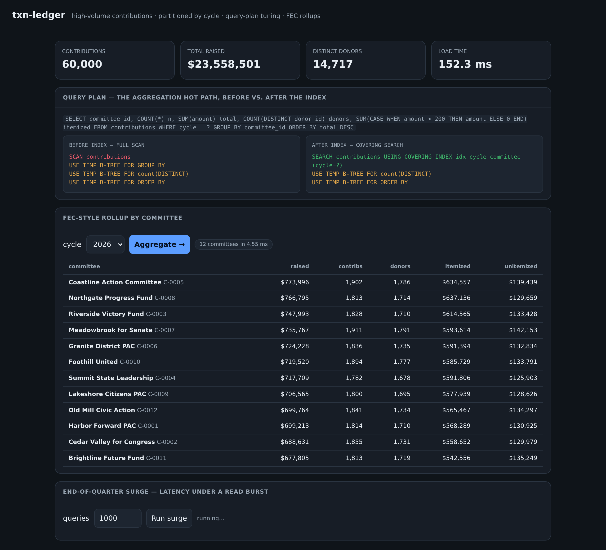

# txn-ledger

[](https://github.com/MarcBittner/ai-portfolio/actions/workflows/projects-ci.yml)
[](LICENSE)
[](https://www.python.org)
[](https://github.com/astral-sh/ruff)
[](https://fastapi.tiangolo.com)



**[▶ Live demo](https://txn-ledger.onrender.com)**

A high-volume contributions data service that makes database-centric infrastructure
work tangible: a seeded synthetic dataset of political donations, a schema whose
access pattern is partitioned by election cycle, FEC-style per-committee rollups,
and an end-of-quarter surge load test. The organizing idea is that **I treat the
query plan as a first-class artifact** — the hot-path aggregation's `EXPLAIN QUERY
PLAN` is captured before and after the index, version-controlled, and exposed over
the API, so a tuning decision is something you review rather than something you
intuit. SQLite (stdlib) stands in for Postgres; the schema, indexing, partitioning,
and plan reasoning port directly.

On top of that data layer sits the demo's LLM surface: **natural-language → SQL**.
A plain-English question ("total raised in the 2024 cycle") is translated by a
model into a query, but the generated SQL is never trusted — a **safety guard**
rejects anything that is not a single read-only `SELECT` (no INSERT/UPDATE/DELETE/
DDL/PRAGMA, no second statement, no comment-smuggling), and only a query that
survives the guard runs, against a `query_only` connection. The model writes the
query; trust-critical execution stays deterministic and guarded. The LLM routes
**Anthropic/OpenAI → local Ollama → free (OpenRouter) → a deterministic question
matcher**, so it runs (and the eval reproduces) with zero keys and zero cost.

> Donors, committees, and amounts are **synthetic and clearly fictional** —
> invented for this portfolio. No secrets; runs fully offline (the LLM chain falls
> back to a deterministic matcher).

## Architecture

| Module | Responsibility |
|---|---|
| `generate.py` | Seeded, reproducible synthetic contributions: `(id, donor_id, committee_id, cycle, amount, ts)`. Realistic amount skew around the $200 FEC itemization threshold. 12 fictional committees; cycles 2020/2022/2024/2026, weighted toward recent. |
| `db.py` | The contributions store. Builds the table, loads seeded rows, creates the covering composite index, and captures the aggregation plan **before/after** the index. Default 60k rows (`TXN_LEDGER_ROWS`). |
| `queries.py` | FEC-style rollups (total raised, distinct donors, itemized vs unitemized at $200), timed; `plan()`; `summary()`. |
| `loadtest.py` | End-of-quarter surge: fire N aggregation queries, report qps + p50/p95/p99. |
| `nl2sql.py` | Natural-language → SQL with the read-only `SELECT` safety guard; deterministic offline matcher; NL→SQL accuracy eval. |
| `llm.py` | Multi-provider routing (paid → local → free → deterministic offline), stdlib HTTP. |
| `evaluate.py` | Reproducible eval → `eval-report.md` (`./run.sh eval`): plan-regression + NL→SQL accuracy. |
| `api.py` | FastAPI surface (port 8016). Builds the dataset at startup. |
| `demo.py` | Offline walkthrough: build → plan diff → rollup → surge → NL→SQL. No network. |

### Schema and access pattern

```sql
CREATE TABLE contributions(
    id           INTEGER PRIMARY KEY,
    donor_id     TEXT,
    committee_id TEXT,
    cycle        INTEGER,
    amount       REAL,
    ts           TEXT);

CREATE INDEX idx_cycle_committee
    ON contributions(cycle, committee_id, donor_id, amount);
```

Every analytical query in this domain starts the same way: pick an election cycle,
then roll up by committee. That is a **partition-by-cycle** access pattern. In
production the table is declaratively partitioned by `cycle` so each cycle is its
own physical child table; here the leading-cycle composite index gives the same
effect — a query for one cycle becomes an index search over a contiguous range
instead of a scan of every cycle's rows. The index leads with `cycle` (the equality
filter), then `committee_id` (the GROUP BY key), then `donor_id` and `amount` (the
columns the aggregates need). Because every column the query reads is in the index,
it is a **covering** index: the query never touches the table heap.

```
generate.py ──▶ db.build(): load rows ──▶ CREATE INDEX ──▶ capture plan
  (seeded)          (timed)               (cycle,committee,        │ before/after
                                           donor,amount)           ▼
                                                        queries.aggregate() / loadtest.surge()
                                                          (timed rollup)   (qps + p50/95/99)
```

**Startup build.** `api.py` calls `db.build()` once at import. It creates the table,
`executemany`-inserts the seeded rows (timing the load), captures `plan_before` by
running `EXPLAIN QUERY PLAN` on the aggregation SQL, creates `idx_cycle_committee`,
runs `ANALYZE`, then captures `plan_after`. The connection, row count, load time,
and both plans are cached in `_meta` and served by `/schema` and `/plan`.

**`GET /aggregate?cycle=&committee=`.** Validates the cycle against the known set,
then runs the hot-path SQL: `WHERE cycle = ? GROUP BY committee_id ORDER BY total
DESC`, computing `COUNT(*)`, `SUM(amount)`, `COUNT(DISTINCT donor_id)`, and a
`SUM(CASE WHEN amount > 200 …)` for the itemized portion. The handler times the
query, derives `unitemized = total − itemized`, attaches committee names, and
returns the rows plus `elapsed_ms` and the itemization threshold.

## The query plan as an artifact

The same query, before and after the index:

```
-- BEFORE (no index)
SCAN contributions
USE TEMP B-TREE FOR GROUP BY
USE TEMP B-TREE FOR ORDER BY

-- AFTER (idx_cycle_committee)
SEARCH contributions USING COVERING INDEX idx_cycle_committee (cycle=?)
USE TEMP B-TREE FOR ORDER BY
```

Before the index, SQLite has no way to find one cycle's rows except to read all of
them — `SCAN contributions` — and no ordered structure to group by, so it builds a
**temporary B-tree** to collect rows per `committee_id`. With the index in place,
`cycle = ?` becomes a `SEARCH … USING COVERING INDEX` over a contiguous key range:
only the matching cycle's entries are visited, and because `committee_id` is the
next index column, the rows arrive already grouped — the GROUP BY is satisfied by
index order, so the temp B-tree for grouping disappears. "Covering" means `donor_id`
and `amount` live in the index too, so the engine never does a row lookup back into
the table. The remaining `ORDER BY total DESC` still needs a sort, because `total`
is a computed aggregate the index cannot pre-order. `GET /plan` returns both plans
side by side so the improvement is auditable.

## Natural-language queries (NL→SQL)

`POST /ask` takes `{question}` and answers it over the contributions data. The
model translates the question into SQL; the result is only ever returned after the
generated SQL clears the safety guard and runs read-only:

```
question ──▶ llm.complete(SYSTEM = schema + Q→SQL examples, question)
                 Anthropic / OpenAI → Ollama → OpenRouter → deterministic matcher
          ──▶ generated SQL  (model text — UNTRUSTED)
          ──▶ guard_sql(sql)            ── reject unless ONE read-only SELECT ──┐
          ──▶ run against PRAGMA query_only = ON connection                     │
          ──▶ { rows, sql, provider, model, latency_ms, cost_usd }    rejected ─┘
                                                                  { safe:false, error }
```

**The safety guard is the point.** Model output is never interpolated into a live
query unchecked. `guard_sql()`:

- strips ``` fences / `SQL:` labels and a single trailing `;`;
- **rejects SQL comments** (`--`, `/* */`) — the usual vehicle for smuggling a
  second statement past a naive parser;
- **rejects multiple statements** (any remaining `;`);
- requires the text to **begin with `SELECT`** and contain **no** forbidden
  keyword anywhere (`INSERT|UPDATE|DELETE|DROP|ALTER|CREATE|REPLACE|TRUNCATE|
  PRAGMA|ATTACH|DETACH|VACUUM|REINDEX|GRANT|REVOKE|BEGIN|COMMIT|…`);
- **allows only the `contributions` table** to be named in `FROM`.

Defense in depth: even a query that somehow passed the guard runs against a
connection with `PRAGMA query_only = ON`, so the engine itself refuses any write.
The injection test (`"SELECT 1 FROM contributions; DROP TABLE contributions"` and
friends) is asserted to be **rejected, never executed** — see `tests/test_nl2sql.py`.

The offline matcher maps a handful of question patterns (total raised, top-N by
itemized/total, donor counts under/over $200, itemized-vs-unitemized split) to
prebuilt parameterized queries, so NL→SQL works and the eval reproduces exactly
with zero keys; the LLM path is what generalizes to phrasings the matcher never saw.

## Routing

The LLM layer (`llm.py`) is the portfolio-standard chain, identical in shape to the
other demos: a provider is *available* only when its key is set (or, for Ollama,
when a probe to `/api/tags` succeeds), so the chain self-selects from the
environment and `complete()` returns the first success, recording which providers
it fell through. The offline matcher is always terminal — the service degrades to
deterministic, never to an error.

| mode | order |
|---|---|
| `auto` (default) | Anthropic → OpenAI → Ollama → OpenRouter → offline |
| `paid` | Anthropic → OpenAI → offline |
| `local` | Ollama → offline |
| `free` | OpenRouter → offline |
| `offline` | deterministic question matcher only |

`GET /llm` reports which providers are reachable and the active mode.

## Evals

`./run.sh eval` (or `GET /evals`) writes `eval-report.md` with two scores; both
reproduce to the digit on the offline path.

**Query-plan regression** — the highest-value check for this demo. The hot-path
rollup must still resolve through the covering index after tuning; a query that
quietly reverts to a full `SCAN` is the classic cause of a latency blow-up under a
filing-deadline surge, so this is pass/fail, not a soft metric.

| check | result |
|---|---|
| full SCAN before the index | True |
| SEARCH via INDEX after the index | True |
| covering (no heap lookups) | True |
| **regression passed** | **True** |

**NL→SQL accuracy** — over a labeled question set, each question is translated,
guarded, executed, and the rows compared to the expected answer computed directly
from the store. Safety is the gate: an unsafe translation is never run.

| metric | offline matcher |
|---|---|
| questions | 8 |
| passed the SQL guard | 8 |
| correct answer | 8 |
| accuracy | 1.0 |

Set provider keys or `LLM_MODE` to score a live model on the same set.

## Design decisions

- **Partition by cycle.** Every query filters on cycle first; partitioning matches
  the access pattern. Production: Postgres declarative partitioning (one child table
  per cycle, partition pruning on the `cycle` predicate). Here: the leading-cycle
  composite index emulates pruning by restricting the search to one cycle's keys.
- **Covering index to avoid table lookups.** Carrying `donor_id` and `amount` in the
  index turns the rollup into an index-only scan — no heap fetches, which is what
  collapses the temp B-trees and keeps latency flat.
- **Seeded generation.** A fixed seed makes the dataset, and therefore the query
  plans and the load-test numbers, reproduce exactly. Reproducible plans are what
  let you treat the plan as a reviewable artifact rather than a moving target.
- **FEC itemization modeling.** Amounts are skewed the way real contributions are:
  ~70% small unitemized gifts under $200, a tail toward the contribution limit. The
  rollup splits itemized vs unitemized at the $200 threshold, the line that actually
  matters for FEC reporting.
- **Surge test measures volume, not concurrency.** The load test fires N
  aggregation queries to model a filing-deadline read spike and reports qps and
  latency percentiles. SQLite serializes access, so this measures **query cost under
  volume**, not concurrent throughput. In production the same hot path sits behind
  Postgres + pgbouncer, where it is genuinely concurrent.

**What changes for production.** Real Postgres with declarative partitioning by
cycle (and partition pruning); a connection pool (pgbouncer) for true concurrency;
materialized or rolling rollup tables so the per-committee totals are precomputed
rather than aggregated on each request; and read replicas to absorb the surge.

## Schema & invariants

```sql
contributions(id, donor_id, committee_id, cycle, amount, ts)
INDEX idx_cycle_committee(cycle, committee_id, donor_id, amount)  -- covering
```

- **`itemized + unitemized == total`** for every committee row (`unitemized` is
  derived as `total − itemized`, so the two partitions of the threshold always
  reconcile to the total raised).
- **Seeded reproducibility.** Same seed and `TXN_LEDGER_ROWS` ⇒ identical rows ⇒
  identical query plans and load-test numbers.
- **12 committees, 4 cycles** (2020/2022/2024/2026); amounts skew around the $200
  itemization threshold; default 60k rows.

## API

| Method | Path | Purpose |
|---|---|---|
| GET | `/health` · `/summary` | status; row/donor/raised totals |
| GET | `/schema` | table, indexes, partitioning, load time |
| GET | `/plan` | the aggregation plan **before/after** the index |
| GET | `/aggregate?cycle=&committee=` | FEC-style rollup, timed |
| GET | `/cycles` · `/committees` | dimensions |
| POST | `/loadtest` | `{n}` surge → qps + p50/p95/p99 |
| POST | `/ask` | natural-language → guarded read-only SQL → rows + telemetry |
| GET | `/evals` | plan-regression + NL→SQL accuracy over the labeled set |
| GET | `/llm` | configured/reachable providers + active routing mode |

`POST /ask` body: `{ "question": "top 5 committees by itemized total in 2024" }`;
optional `"mode"` pins the tier. A guard rejection returns `{ "safe": false,
"error": …, "generated_sql": … }` and is never executed.

## Code map

```
src/txn_ledger/
  generate.py    seeded synthetic contributions (id, donor, committee, cycle, amount, ts)
  db.py          the store: build table, load rows, create covering index, capture plan before/after
  queries.py     FEC-style rollups (itemized vs unitemized at $200); plan(); plan_regression(); summary()
  loadtest.py    end-of-quarter surge → qps + p50/p95/p99
  nl2sql.py      NL→SQL: SYSTEM prompt, SQL safety guard, offline matcher, accuracy eval
  llm.py         multi-provider router (paid → local → free → offline), stdlib HTTP
  evaluate.py    ./run.sh eval → eval-report.md (plan-regression + NL→SQL accuracy)
  api.py         FastAPI service; models.py request models; static/ console UI
tests/           unit (generate, queries, loadtest, nl2sql, llm, api) + live smoke
```

## Env

Runs fully offline with no `.env` (the LLM chain falls back to a deterministic
question matcher). Set any of these to route NL→SQL translation to a real model;
never commit real keys, and leave them unset on a public host. See `.env.example`.

| var | purpose |
|---|---|
| `LLM_MODE` | `auto` (default) · `paid` · `local` · `free` · `offline` |
| `ANTHROPIC_API_KEY` / `ANTHROPIC_MODEL` | paid path (tried first in `auto`) |
| `OPENAI_API_KEY` / `OPENAI_MODEL` | paid path |
| `OLLAMA_BASE_URL` / `OLLAMA_MODEL` | local models, autodetected via `/api/tags` |
| `OPENROUTER_API_KEY` / `OPENROUTER_MODEL` | free-tier models |
| `TXN_LEDGER_ROWS` | dataset size seeded at build (default 60k) |

## Quickstart

```sh
cd projects/txn-ledger
./run.sh setup
./run.sh demo            # offline: plan before/after + rollup + surge + NL→SQL
./run.sh eval            # plan-regression + NL→SQL accuracy → eval-report.md
./run.sh serve           # dashboard at http://127.0.0.1:8016
./run.sh test            # unit suite
./run.sh smoke           # live smoke/regression (local, or --url <deploy>)
```

Dataset size is `TXN_LEDGER_ROWS` (default 60k; raise it locally to feel the plan
difference).

## Deploy

Containerized (`Dockerfile`, `PORT` env, `/health` check) and deployed on Render's
free tier — the same image runs anywhere. **No provider keys are set on the public
host**, so the live demo runs the deterministic offline NL→SQL path; the LLM chain
activates wherever keys/Ollama are present. Free instances cold-start in ~30–50s.

---

Proprietary, offline-first, no secrets, synthetic data only — conforms to the
portfolio conventions (CONV-1…5).
